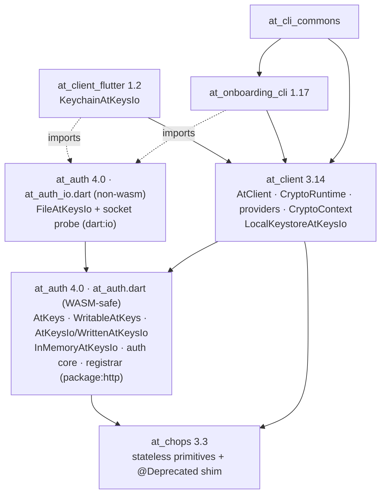
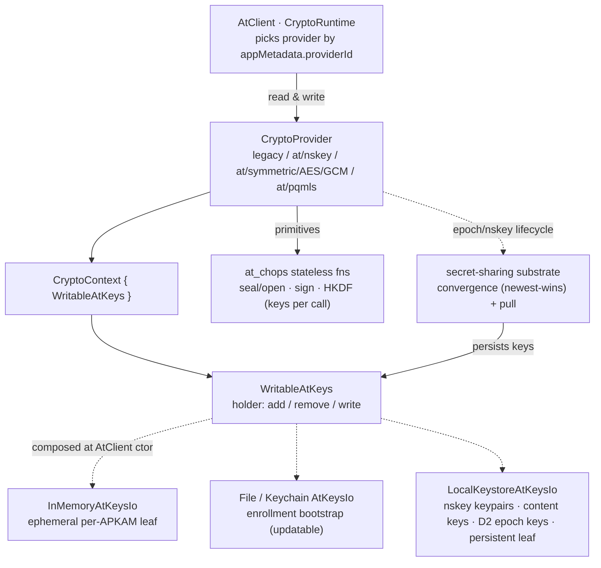

# Encryption / decryption roadmap

How the SDK moves from the legacy encryption schemes to post-quantum-safe,
group-based encryption with rotating keys — preserving every current
capability (encrypt/decrypt for other clients of the same atSign,
encrypt/decrypt for other atSigns), strengthened with two-lever key
rotation, and giving applications a bootstrap path to pq-mls groups.

> **This is the design source of truth** — goals, architecture, phasing, and
> the *why*. It has two companions, and the three docs share one shape (design →
> build → worked example):
>
> - **[crypto_impl_plan.md](crypto_impl_plan.md)** — the build plan: task
>   breakdown, ordering, dependencies, PR carving, acceptance (the *how* and
>   *when*).
> - **[crypto-walkthroughs.md](crypto-walkthroughs.md)** — worked end-to-end
>   examples (NoPorts, a large group, an `at_talk` chat) that exercise this
>   design.
>
> When a companion disagrees with this document on design intent, this document
> wins. See the [document map](#document-map) for how the sections pair up.

## Table of contents

- [Document map](#document-map)
- [The two major deliverables](#the-two-major-deliverables)
  - [Deliverable 1 — make Atsign Protocol messaging post-quantum safe](#deliverable-1--make-atsign-protocol-messaging-post-quantum-safe)
  - [Deliverable 2 — implement pq-mls](#deliverable-2--implement-pq-mls)
- [D1 — preserving legacy simplicity (single-tier: the nskey data path)](#d1--preserving-legacy-simplicity-single-tier-the-nskey-data-path)
  - [The nskey data path (D1's data path)](#the-nskey-data-path-d1s-data-path)
  - [Cold-start — bob has never run an at_talk app](#cold-start--bob-has-never-run-an-at_talk-app)
  - [Opt-in key rotation](#opt-in-key-rotation)
  - [Revocation, end to end](#revocation-end-to-end)
  - [`at/pqmls` is D2, not a D1 tier](#atpqmls-is-d2-not-a-d1-tier)
  - [Mixed-scheme `@alice` ↔ `@bob`](#mixed-scheme-alice--bob)
  - [What this reframes (M0–M4)](#what-this-reframes-m0m4)
- [Application migration & rollout](#application-migration--rollout)
  - [The invariant that makes independent upgrade safe](#the-invariant-that-makes-independent-upgrade-safe)
  - [Versioning contract — the legacy-encryption flag (3.x default off, 4.x default on)](#versioning-contract--the-legacy-encryption-flag-3x-default-off-4x-default-on)
  - [Steps (any client may sit at any step, within 3.x)](#steps-any-client-may-sit-at-any-step-within-3x)
  - [Capabilities by application code-change level](#capabilities-by-application-code-change-level)
- [Existing-client retrofit — auth upgrade & key distribution](#existing-client-retrofit--auth-upgrade--key-distribution)
  - [Conveying a named secret between clients](#conveying-a-named-secret-between-clients)
  - [The atSign-level PQ key — created once](#the-atsign-level-pq-key--created-once)
  - [Upgrading an existing client — the sequence](#upgrading-an-existing-client--the-sequence)
  - [Cardinality, legacy-key deletion, and revocation](#cardinality-legacy-key-deletion-and-revocation)
  - [atServer support this requires](#atserver-support-this-requires)
- [Starting point](#starting-point)
- [The end state](#the-end-state)
  - [Key inventory and rotation](#key-inventory-and-rotation)
- [Milestones and capabilities](#milestones-and-capabilities)
- [How it works — in brief](#how-it-works--in-brief)
- [Usability — a first-class constraint](#usability--a-first-class-constraint)
- [Foundations](#foundations)
- [What the atServer can and cannot see](#what-the-atserver-can-and-cannot-see)
- [Component responsibilities & WASM-readiness](#component-responsibilities--wasm-readiness)
  - [Responsibilities](#responsibilities)
  - [Key taxonomy → store routing](#key-taxonomy--store-routing)
  - [WASM-readiness — the `at_auth` barrel split](#wasm-readiness--the-at_auth-barrel-split)
  - [Component & dependency sketch](#component--dependency-sketch)
  - [Package versions & release sequencing](#package-versions--release-sequencing)
- [Phases](#phases)
  - [Phase 0 — land the foundations](#phase-0--land-the-foundations)
  - [Phase 1 — complete the PQ primitives (at_chops)](#phase-1--complete-the-pq-primitives-at_chops)
  - [Phase 2 — identity layer: per-APKAM KeyPackages and per-APKAM AtKeys](#phase-2--identity-layer-per-apkam-keypackages-and-per-apkam-atkeys)
  - [Phase 3 — the nskey data path (D1 self + shared)](#phase-3--the-nskey-data-path-d1-self--shared)
  - [Phase 4 — at/pqmls (D2): intra-atSign forward-secure groups (SecureGroup v1)](#phase-4--atpqmls-d2-intra-atsign-forward-secure-groups-securegroup-v1)
  - [Phase 5 — at/pqmls (D2): cross-atSign groups + Group Delivery Service](#phase-5--atpqmls-d2-cross-atsign-groups--group-delivery-service)
  - [Phase 6 — pq-mls engine (SecureGroup v2)](#phase-6--pq-mls-engine-securegroup-v2)
- [Retiring selfEncryptionKey (and shared_key.*)](#retiring-selfencryptionkey-and-shared_key)
- [Dependencies](#dependencies)
- [Upgrading NoPorts (with daemon-ping feature discovery)](#upgrading-noports-with-daemon-ping-feature-discovery)
  - [Admission UX — a new leaf never blocks on a manual step](#admission-ux--a-new-leaf-never-blocks-on-a-manual-step)
  - [User-visible delta — target: none](#user-visible-delta--target-none)
- [Known shape risks & corrective actions (assessment 2026-06-17)](#known-shape-risks--corrective-actions-assessment-2026-06-17)
  - [Connection model & the MLS leaf](#connection-model--the-mls-leaf)
- [atServer group Delivery Service (target design)](#atserver-group-delivery-service-target-design)
  - [One design, two placements (host = member, or dedicated)](#one-design-two-placements-host--member-or-dedicated)
  - [The group object (server-side, on the DS atSign)](#the-group-object-server-side-on-the-ds-atsign)
  - [Verbs](#verbs)
  - [Delivery model — wake, then pull](#delivery-model--wake-then-pull)
  - [Properties / invariants](#properties--invariants)
  - [expiresAt / availableAt and catch-up](#expiresat--availableat-and-catch-up)
- [Worked walkthroughs](#worked-walkthroughs)

## Document map

How the three docs line up — **design** (this doc, the source of truth) ↔
**build** (the plan) ↔ **worked example** (the walkthroughs). Find your row and
jump.

| Topic | Design (roadmap) | Build (plan) | Worked example |
|---|---|---|---|
| The two deliverables (D1 / D2) | [The two major deliverables](crypto-roadmap.md#the-two-major-deliverables) | [Current state (1)](crypto_impl_plan.md#1-current-state-2026-06-22) · [D1 acceptance (2)](crypto_impl_plan.md#2-d1-acceptance--what-done-means) | — |
| D1 — the nskey data path | [D1 — preserving legacy simplicity](crypto-roadmap.md#d1--preserving-legacy-simplicity-single-tier-the-nskey-data-path) | [D1-B (3)](crypto_impl_plan.md#d1-b--the-nskey-data-path-the-default-data-path) | — |
| Migration, rollout & versioning | [Application migration & rollout](crypto-roadmap.md#application-migration--rollout) | [D1-C / D1-D (3)](crypto_impl_plan.md#d1-c--migration--rollout-machinery) | — |
| Existing-client retrofit (auth + key dist) | [Existing-client retrofit](crypto-roadmap.md#existing-client-retrofit--auth-upgrade--key-distribution) | [D1-F (3)](crypto_impl_plan.md#d1-f--existing-client-retrofit--auth-upgrade--secret-conveyance) | — |
| Identity, KeyPackages, the nskey data path | [Phases 2–3](crypto-roadmap.md#phase-2--identity-layer-per-apkam-keypackages-and-per-apkam-atkeys) | [D1-E (3)](crypto_impl_plan.md#d1-e--atpqmls-provider-shape-corrections-fold-into-wp-gp) · [D2 (4)](crypto_impl_plan.md#4-d2--pq-mls-placeholders-detailed-planning-deferred) | — |
| Cross-atSign shared groups (D2) | [Phase 5](crypto-roadmap.md#phase-5--atpqmls-d2-cross-atsign-groups--group-delivery-service) | [D2 (4)](crypto_impl_plan.md#4-d2--pq-mls-placeholders-detailed-planning-deferred) | [C — `at_talk` chat](crypto-walkthroughs.md#walkthrough-c--a-two-atsign-chat-with-apkam-keypair-churn-at_talk) |
| pq-mls engine + Delivery Service | [atServer group Delivery Service](crypto-roadmap.md#atserver-group-delivery-service-target-design) | [D2 (4)](crypto_impl_plan.md#4-d2--pq-mls-placeholders-detailed-planning-deferred) | [B — a large group](crypto-walkthroughs.md#walkthrough-b--a-large-group-end-to-end) |
| NoPorts adoption | [Upgrading NoPorts](crypto-roadmap.md#upgrading-noports-with-daemon-ping-feature-discovery) | [Cross-repo & NoPorts (5)](crypto_impl_plan.md#5-cross-repo-pr--publish-sequence--noports) | [A — NoPorts](crypto-walkthroughs.md#walkthrough-a--noports-end-to-end) |
| Structural enablers / WASM split | [Component responsibilities & WASM-readiness](crypto-roadmap.md#component-responsibilities--wasm-readiness) | [D1-S (3)](crypto_impl_plan.md#d1-s--structural-enablers-prerequisite--lands-first) | — |
| Release order & work packages | [Starting point](crypto-roadmap.md#starting-point) | [Work packages (7)](crypto_impl_plan.md#7-delivery-plan--work-packages) | — |

## The two major deliverables

This roadmap delivers two distinct things. The second builds on the first and
they ship in sequence — but they deliver different security properties and have
different urgency, so they are worth naming separately.

### Deliverable 1 — make Atsign Protocol messaging post-quantum safe

Every message the SDK encrypts — self data, data shared with other atSigns, and
the enrollment-approval key conveyance — is protected with post-quantum / hybrid
primitives, so an adversary who records today's ciphertext cannot read it once a
cryptographically-relevant quantum computer exists. This is the **urgent**
deliverable: harvest-now-decrypt-later capture is a present-day threat, and PQ
confidentiality is the defense.

It does **not** require MLS. It is reached by routing every encryption path
through pluggable PQ providers — X-Wing hybrid KEM (ML-KEM-768 + X25519) for key
transport, AES-256-GCM for data — publishing a PQ enrollment-conveyance key,
then making the **nskey data path** the default for self and shared data and
retiring the classical-only `selfEncryptionKey` and `shared_key.*`. D1's data
path is the **nskey data path** — `at/nskey` conveys a symmetric content key
(CK) and `at/symmetric/AES/GCM` encrypts the data under it (see
[`pq-data-encryption.md`](pq-data-encryption.md)) — **not** the group engine.
Milestones **M0–M4** carry it; the nskey data path is PQ-native by
construction, so PQ-safe messaging does not wait on the MLS (group) work, which
is the separate D2 `at/pqmls` provider.

### Deliverable 2 — implement pq-mls

Replace the interim v1 group engine with a real MLS engine (RFC 9420 — TreeKEM,
forward secrecy, post-compromise security) on post-quantum ciphersuites, behind
the same `SecureGroup` interface and served by the atServer group Delivery
Service. D1 already gives *coarse* forward secrecy (CK rotation + delete) and
post-compromise security (nskey-keypair rotation); what D2 adds is
**robust/per-message FS** (ratcheted leaves, no standing master key, so a
compromised key does not expose past traffic at message granularity),
**scale** (O(log n) membership changes that make large groups practical), and
**decoupled membership** (groups whose membership is not tied to namespace
authorisation), with standardized and audited group semantics. This is the
**end-state architecture** for the *group* path. Milestones **M5–M6** carry it.

D1 makes the bytes quantum-safe (with coarse FS + PCS available); D2 makes the
*group* quantum-safe with robust/per-message forward secrecy, scale, and
decoupled membership. The roadmap is deliberately shaped so D2 is an engine
swap under D1's stable interface — not a second migration. NoPorts adoption
(the production payoff) is reachable as soon as D1 lands, and is strengthened —
not gated — by D2.

## D1 — preserving legacy simplicity (single-tier: the nskey data path)

D1's design objective is to keep the **legacy developer experience** — *Alice
shares with `@bob`; every bob client with namespace access, present and future,
decrypts it instantly, offline, with no ceremony* — while making it
post-quantum-safe and closing the cheap legacy weaknesses.

D1 ships as a **single tier: the nskey data path** — the only data path for
both self and shared data. The nskey data path is **two providers** —
`at/nskey` (which conveys a symmetric content key, sealing it once to an nskey
as a discrete record) and `at/symmetric/AES/GCM` (which encrypts the data under
that content key) — plus the built-in `legacy` provider (a value with no
`providerId` defaults to legacy). The "two tiers" framing of [ADR
0001](adr/0001-d1-simplicity-tiers.md) is superseded by [ADR
0002](adr/0002-d1-single-tier-nskey.md): the property that earlier framing
withheld to a "Tier 2" — forward secrecy — is a *rotation policy* of the single
nskey data path, not a separate provider, and D1 provides it **coarsely and
cheaply** (see [`pq-data-encryption.md`](pq-data-encryption.md)). The genuine
delta of the forward-secure (MLS) group model — robust/per-message forward
secrecy, O(log n) large-group scale, and groups whose membership is decoupled
from namespace authorisation — is **D2**, the `at/pqmls` provider, not a D1
tier.

What earlier framing treated as a tension — *"you cannot have both a future
device working instantly/offline and non-copyable per-device keys"* — was a
false dichotomy (ADR 0002). Data is encrypted under symmetric content keys
delivered **per-APKAM** (the secret-sharing substrate + push); there are no
per-device data keys, and a *future* device is served by **push** —
instant, offline — so instant/offline access and per-APKAM revocation coexist
without a second tier.

### The nskey data path (D1's data path)

Replace the one atSign-wide RSA default keypair (and `selfEncryptionKey`, and
`shared_key.*`) with a **pair of per-`(atSign, namespace)` X-Wing KEM keypairs** —
a **self nskey** (not published; you encapsulate your *own* content keys to it)
and a **public nskey** (`public:nskey.<ns>@<owner>`, published for external
senders). An nskey only ever *wraps a symmetric content key (CK)*; it never
encrypts application data directly. The CK is conveyed **once** — sealed to an
nskey and written as its own discrete `<ckKid>.__ck.<ns>@<owner>` record by the
`at/nskey` provider — and every data value just **cites it by `ckKid`** (no
sealed CK is embedded per value; this is decision (a) of
[`pq-data-encryption.md`](pq-data-encryption.md)). Two providers therefore make
up the path: `at/nskey` (the CK-conveyance record) and `at/symmetric/AES/GCM`
(the data, AES-256-GCM under the cited CK).

- **Self data** → wrap the value's symmetric CK by encapsulating the CK to *your
  own* **self nskey**, written once as an `at/nskey` CK-conveyance record; the
  data value is then `at/symmetric/AES/GCM` (AES-256-GCM under that CK, citing
  `ckKid`). **Shared data** → encapsulate the CK to the *recipient's* published
  **public nskey** (again, a discrete `at/nskey` record), and write the data
  with `at/symmetric/AES/GCM` citing `ckKid`. One mechanism, both directions —
  differing only in *which* nskey the CK is sealed to; `selfEncryptionKey` and
  `shared_key.*` both retire into "convey a content key once via `at/nskey`,
  then `at/symmetric/AES/GCM` the data under that CK, cited by `ckKid`". See
  [`pq-data-encryption.md`](pq-data-encryption.md) for the full model.
- **Enrollment-granular, copyable** (the legacy bargain, kept): every client of
  an `at_talk`-authorized enrollment holds the `at_talk` private key. A new
  client receives it at **enrollment approval** (the approver hands it over) or
  derives it (below). Future clients therefore read everything **instantly,
  offline, full history** — byte-for-byte legacy semantics.
- **Developer API unchanged**: `put`/`get`/AtCollection. No `SecureGroup`,
  `KeyPackage`, `members`, `clientId`, or single-owner lock anywhere in the
  app's face. Identity stays the *enrollment*, exactly as legacy.

What D1 closes vs legacy, at **zero developer-visible change**:

| Legacy weakness | D1 (nskey data path) |
|---|---|
| Not PQ-safe (RSA-2048) | **Closed** — X-Wing hybrid KEM |
| Crypto broader than transport (one key spans all namespaces) | **Closed** — per-namespace keypair mirrors enrollment authorization |
| `selfEncryptionKey` sits still forever, conveyed to every enrollment | **Closed** — per-namespace, **rotatable**; per-namespace blast radius, not atSign-wide |
| No per-device revocation granularity | **Closed** — per-APKAM future-data revocation: rotate the nskey keypair excluding the revoked keypair (the expensive lever, the successor nskey conveyed per-APKAM) |
| No rotation / forward secrecy | **Coarse FS** — rotate + delete the content keys (O(1) wrap to the shared nskey); robust/per-message FS is D2 (`at/pqmls`) |

### Cold-start — bob has never run an at_talk app

If no bob client has ever run `at_talk`, there is no `at_talk` public key for
alice to encrypt to (legacy never had this problem — its key is atSign-level and
exists from activation). Resolution: **alice uses the most specific key bob has
published, falling back to the atSign-level PQ key.**

1. Bob always has an atSign-level keypair; Phase 1 publishes a PQ sibling
   (`public:pqpublickey@bob`). With no `at_talk` public nskey, alice encapsulates
   the **content key** to **that** root key (the data is still AES-256-GCM under
   the CK; **data is never encrypted directly to the root key** — only the CK
   targets it) — every bob client can then unwrap the CK and decrypt, instantly,
   like legacy (how every bob client obtains the root key's *private* half is
   [Existing-client retrofit](#existing-client-retrofit--auth-upgrade--key-distribution)).
2. The first bob `at_talk` client mints/derives and publishes the `at_talk`
   public key; subsequent messages **upgrade** to namespace-scoped automatically.

Honest residual: during the cold-start window the crypto is namespace-*broad*
(any bob client holds the atSign-level key), though the data key
`@bob:<key>.at_talk@alice` is still **server-gated** to `at_talk` readers, so in
normal operation a non-`at_talk` client holds a key it cannot fetch ciphertext
for. This is strictly ≤ legacy exposure and self-heals on first `at_talk` run.
The tight alternative — **seal-and-hold** (don't send until bob publishes an
`at_talk` key) — sacrifices instant send for a namespace bob may never open, so
it is the **opt-in** choice for high-security namespaces; the default is
send-now with the atSign fallback. *Optional optimisation:* derive bob's
namespace nskey keypair deterministically (HKDF(master-seed, namespace) → X-Wing
seed), so any bob client derives the nskey private with **no distribution** —
this removes bob-side distribution but not alice's need for a published public
nskey, so the atSign fallback still covers true cold-start.

### Opt-in key rotation

D1 has **two distinct rotation levers**, at very different costs (see [ADR
0002](adr/0002-d1-single-tier-nskey.md) and
[`pq-data-encryption.md` §5.4](pq-data-encryption.md#54-ck-rotation--coarse-forward-secrecy)):

- **Content-key (CK) rotation — the routine, cheap (O(1)) lever; this is the
  coarse-FS lever.** Cut a new CK, wrap it **once** to the *shared* nskey, and
  write that one `<ckKid>.__ck.<ns>@<owner>` record (`at/nskey`) on ordinary
  sync; every authorised client unwraps it with the shared nskey private. New
  data uses the new CK. For forward secrecy, **delete** the old CK's `at/nskey`
  conveyance record and evict the cached CK — old-CK data is then undecryptable
  (decision (a) makes this possible: the CK was never embedded in the data
  values). The nskey keypair is unchanged; this is one record on the normal
  data path, **not** a substrate push.

- **nskey-keypair rotation — the expensive (O(n)) per-APKAM revocation +
  post-compromise-security lever.** A client mints a new namespace nskey
  keypair, supersedes the published `public:nskey.<ns>@<owner>`, and the new
  **private** half is conveyed **per-APKAM** through the secret-sharing
  substrate (`__ssenv` envelopes sealed to each authorised APKAM key package,
  pushed via `enroll:listfornamespace`; a client that missed the push pulls it
  via `requestSecret`; a *new* APKAM keypair receives it at enrollment
  approval). This is O(n) in authorised APKAM keypairs — costly precisely
  because, to **exclude** a revoked keypair, the successor cannot use the O(1)
  shared-nskey path (a revoked holder still has the old private). This reuses
  the **prototyped** secret-sharing substrate (`__ssenv`, `enroll:listfornamespace`,
  `excludeEnrollmentIds`) verbatim — the nskey private is just another secret
  on the channel.

- **CK rotation buys:** *coarse forward secrecy* — after rotate-and-delete, a CK
  captured before the cut reads nothing written after (subject to deletion
  discipline + eviction reachability, the FS TCB). Legacy's `selfEncryptionKey`
  could never rotate; this is a real, cheap, opt-in upgrade.
- **nskey-keypair rotation buys:** *post-compromise security at namespace
  granularity* — after the keypair rotates, a private captured before it reads
  nothing wrapped to the successor.
- **Neither buys** history re-encryption — by default clients **retain** old CKs
  / old nskey privates to read old data (history-on), so rotation changes the
  key for *new* data only unless FS-mode deletes the old CK.
- **nskey-keypair rotation is also the revocation primitive:** convey the
  successor nskey private to every authorised member **excluding** the revoked
  APKAM keypair(s).

### Revocation, end to end

Three composable moves, increasing cost:

1. **Revoke the enrollment / APKAM keypair — free, immediate.** The atServer
   stops authenticating that keypair → no new data, no new keys. Cuts *future
   access* with zero crypto work.
2. **Rotate the nskey keypair excluding that APKAM keypair — expensive (O(n)),
   opt-in.** This is the heavier lever: the successor nskey private is conveyed
   per-APKAM through the substrate to every member *except* the revoked one, so
   even a device with cached access gets no successor private. (Distinct from
   the cheap O(1) **CK rotation** above, which is the routine coarse-FS lever
   but cannot *exclude* a holder of the shared nskey private — that is exactly
   why excluding a keypair forces the costly per-APKAM keypair rotation.)
3. **Re-encrypt history — expensive, rarely needed.** The only way to revoke
   access to data the device *already pulled* — and the boundary where robust,
   per-message forward secrecy (D2's `at/pqmls`, per-APKAM ratcheted leaves)
   actually earns its complexity.

The nskey data path gives "stop future access" two ways: cheap **coarse FS** by
rotating + deleting the content keys (O(1)), and **per-APKAM future-data
revocation** by rotating the nskey keypair excluding the revoked keypair (the
expensive O(n) lever); robust per-message "scrub the past" is D2's job.

### `at/pqmls` is D2, not a D1 tier

The per-APKAM MLS group provider — `at/pqmls`, with KeyPackages, ratcheted leaf
keys (no standing master key → robust/per-message FS), TreeKEM (O(log n)
churn), and membership decoupled from namespace authorisation — is **D2**, not a
D1 tier. Most apps never touch it; the **nskey data path** serves both self and
shared data. Crucially the **secret-sharing substrate is shared**: the nskey
data path uses it to convey nskey **privates** per-APKAM (Layer 1); `at/pqmls`
uses the same substrate per-APKAM for its group messages. (Routine **CK
rotation** does *not* ride the substrate — a new CK is conveyed as one ordinary
`at/nskey` record on normal sync, O(1); only the heavier nskey-private
conveyance uses the per-APKAM substrate.) So the group work already prototyped
is not discarded — it is the plumbing under the nskey data path (D1) and the
data path of `at/pqmls` (D2). D2/MLS swaps `at/pqmls`'s engine for a full RFC
9420 MLS engine. (See [ADR 0002](adr/0002-d1-single-tier-nskey.md).)

### Mixed-scheme `@alice` ↔ `@bob`

The M0 provider seam lets schemes coexist per value, so the **sender encrypts in
the scheme the recipient can decrypt**, discovered from what the recipient
publishes (a published public nskey → the **nskey data path**, i.e. an
`at/nskey` CK-conveyance record plus `at/symmetric/AES/GCM` data; KeyPackages +
group advertised → `at/pqmls`; only an RSA pubkey → `legacy`);
`appMetadata.providerId` on each stored value tells the recipient which provider
to open it with — so a CK record carries `at/nskey` and a data value carries
`at/symmetric/AES/GCM` (there is no single `nskey` providerId to open with). The
developer writes the same `put`; the SDK negotiates per-destination, downgrading
to the recipient's best supported scheme. nskey-data-path clients **retain
legacy capability** for un-upgraded peers.

### What this reframes (M0–M4)

The milestones stand; the *delivery* shifts from "per-APKAM groups are the D1
data path" to "the **nskey data path** is D1's single data path; the per-APKAM
MLS group provider is **D2** (`at/pqmls`) and the secret-sharing substrate
underpins both":

- **M0 / M1** unchanged — the nskey data path's providers (`at/nskey` +
  `at/symmetric/AES/GCM`) are pluggable PQ providers; they use X-Wing + the
  Phase-1 enrollment-conveyance PQ key.
- **M2** (per-APKAM identity / KeyPackages) → the **substrate** (conveys nskey
  privates per-APKAM for D1; underpins `at/pqmls` for D2), not a separate D1
  data path; the single-owner lock is a D2 (`at/pqmls`) concern.
- **M3** (self encryption) → D1 ships the **nskey data path** (`at/nskey`
  conveying the CK + `at/symmetric/AES/GCM` encrypting data) as the default self
  *and* shared data path; the per-APKAM forward-secure group provider
  (`at/pqmls`) is D2, not the self path.
- **M4** (cross-atSign) → D1 ships nskey-data-path shared-encryption
  (legacy-shaped, the recipient's published public nskey targeted toward another
  atSign); the per-APKAM `(pair, namespace)` MLS group is D2 (`at/pqmls`).
- **D2 (M5–M6)** is `at/pqmls`'s MLS engine — unchanged.

## Application migration & rollout

Existing apps are all on legacy. The migration must let **each client upgrade
independently** (rebuild on its own schedule) while staying compatible with
peers — and other clients of its own atSign — that have not yet upgraded. The
M0 provider seam is what makes this work; the whole plan is one invariant plus a
gated rollout.

### The invariant that makes independent upgrade safe

> **A value is only ever *written* in a scheme every client that must *read* it
> supports. Reads are universal** — each value carries `appMetadata.providerId`,
> and an upgraded client keeps *all* older providers, so it decrypts anything
> ever written. A client hard-fails on a scheme it lacks
> (`CryptoProviderNotRegistered`).

So compatibility is asymmetric: **upgrading only ever adds read-capability; the
risk is writing too *new*, never reading too *old*.** Everything below is just
"gate the write scheme on the readers' published readiness." Readers, per value:

- **Shared** `@bob:<key>.at_talk@alice` → bob's at_talk clients (plus alice's
  own, for the self-copy). Write scheme gated by **bob's** readiness.
- **Self** `<key>.at_talk@alice` → alice's at_talk clients. Gated by **alice's**
  readiness.

These are independent — which is what lets each client, and each direction,
upgrade on its own.

### Versioning contract — the legacy-encryption flag (3.x default off, 4.x default on)

The rollout below is the **`at_client` 3.x** story: every change is **additive
and backwards-compatible** (minor/patch), so a 3.x client is PQ-*capable* but
remains legacy-*compatible* — it **may write legacy** when a reader isn't yet
PQ-ready, and that is how it stays compatible with un-upgraded peers. All of D1
lands within 3.x (say it all ships by `3.15.x`); all five steps and the whole
capability table describe 3.x.

The 3.x → 4.0 difference is **one construction-time flag**, not a hard internal
behaviour change:

- **`disallowLegacyEncryption`** (working name) — a flag on `AtClientPreference`
  meaning literally *"never write new data using the legacy provider for
  encryption."* When `true`, the SDK will not use the `legacy` `CryptoProvider`
  to encrypt; it uses a PQ path (the nskey data path's `at/nskey` +
  `at/symmetric/AES/GCM`, `at/pqmls`, or the atSign-level PQ fallback), or — if a
  reader can only be reached via legacy — **refuses the write** rather than fall
  back.
- **Defaults: `false` in 3.x, `true` in 4.0.** A 3.x app is legacy-compatible by
  default and may opt into PQ-only writes early; a 4.0 app is PQ-only by default
  and may opt back out (e.g. during a long migration tail).
- **Final at construction.** The value is fixed when the `AtClient` is created
  and **cannot be changed during the app's lifetime** — no mid-run flipping, so
  a client's write-safety posture is stable and inspectable.
- **Loud when off.** The SDK **always emits a `SHOUT`-level log at AtClient
  creation when the flag is `false`**, announcing that new data may be written
  with the non-PQ legacy provider — so a client permitting legacy writes is
  never silent about it.
- **Scope is literal.** The flag governs *only* use of the legacy provider for
  **encryption**. It does **not** touch legacy **read** (pre-PQ data stays
  decryptable in both 3.x and 4.x), nor the `shouldEncrypt=false`
  *no-encryption* path (already-sealed envelopes / public keys — see
  [What the atServer can and cannot see](#what-the-atserver-can-and-cannot-see)).

Consequences:

- Under the migration invariant ("write a scheme every reader supports"),
  `disallowLegacyEncryption=true` means **such a client can only write to
  PQ-capable readers** — a legacy-only reader must upgrade first. So flipping the
  *default* to `true` (i.e. cutting v4) is **gated on the ecosystem floor**
  having moved; it is retirement phase 4 expressed as a semver major. Cold-start
  to a never-ran-`at_talk` recipient still uses the atSign-level **PQ** fallback,
  never legacy.
- **v4 as a release** is a normal major bump that also removes deprecations and
  obsolete/dead code (e.g. the deprecated stream/file methods + their quarantined
  AES) — orthogonal housekeeping. The **legacy provider itself stays** (needed
  for reads always, and for writes when the flag is `false`); what changes at v4
  is only this flag's *default*.

In short: **3.x defaults to "PQ when it can, legacy when it must"; 4.x defaults
to "PQ — refuse rather than write legacy" — overridable either way, but never
silently (a `false` flag SHOUTs at startup).**

### Steps (any client may sit at any step, within 3.x)

0. **Baseline.** All legacy; every value legacy-encrypted (`providerId`
   absent / `legacy`).
1. **Rebuild, behaviour-neutral (the soak).** Rebuild any subset against the new
   AtClient. Rebuild *alone* adds the nskey-data-path providers (`at/nskey` +
   `at/symmetric/AES/GCM`) and `at/pqmls`, plus provider-routing on **read**
   (decrypts any future PQ data) but keeps **writing legacy**. Nothing
   observable changes; deploy client-by-client at will — a zero-risk soak.
2. **Publish the namespace nskey + capability marker (still writing legacy).**
   The first upgraded client of an atSign mints/derives the `at_talk` public
   nskey, and the nskey **privates** are conveyed **per-APKAM** to that atSign's
   `at_talk`-authorised APKAM keypairs through the secret-sharing substrate
   (`__ssenv` push + `enroll:listfornamespace`, pull backstop); each atSign
   publishes a per-`(atSign, namespace)` capability marker, **initially
   not-ready**. Reads can consume nskey-data-path values if any appear; writes
   stay legacy.
3. **Flip readiness (per atSign, per namespace).** When an atSign's at_talk
   fleet is fully upgraded — operator-declared, or auto-detected by "no legacy
   client has checked in" — mark it ready. Then, per-destination and
   automatically: senders writing **to** that atSign's at_talk switch new writes
   to the nskey data path; that atSign's **self** data switches to the nskey data
   path; peers still legacy elsewhere keep getting legacy.
4. **Both ends ready ⇒ end-to-end D1.** Once alice *and* bob are marked ready,
   alice↔bob at_talk runs the nskey data path (PQ + namespace-scoped) both
   directions. A mixed pair stays legacy *in that direction only*, automatically.
5. **Retire legacy (gradual, then the v4 default flip).** Lazy re-encrypt old
   values on touch; stop conveying `selfEncryptionKey` for at_talk — all within
   3.x. The final phase is **`at_client` 4.0**, which flips the **default** of
   `disallowLegacyEncryption` to `true` (legacy writes off by default — a
   `SHOUT` fires if an app re-enables them) and removes deprecated/dead code;
   gated on the ecosystem floor. v4 still **reads** legacy and the legacy
   provider remains. (See the versioning contract above and the four-phase
   retirement below.)

The Step-3 marker flip is the only operator judgement call: flipping it while a
legacy client of that atSign still runs is the one way to break a reader, so it
defaults off and the SDK can warn on a recent legacy check-in. Everywhere else,
a write only goes to the nskey data path when the readers' marker says all of
them can read it, so no client ever receives a value it cannot decrypt.

*Independence example.* alice1 upgrades alone → reads everything, writes legacy
to bob and legacy self (alice2 legacy) → nothing changes. alice2 upgrades →
alice marks at_talk ready → alice's *self* data goes to the nskey data path
(both alice clients read it) while *shared* to bob stays legacy (bob not ready).
bob1+bob2 upgrade, bob marks ready → shared flips to the nskey data path. At no
step does anyone lose access.

### Capabilities by application code-change level

Mental model: **rebuild makes you a universal reader; the flag makes you a PQ
writer/recipient; simple code lets you override the safety defaults.** This
table is the **3.x default** (`disallowLegacyEncryption=false`, legacy-write
-capable). With the flag `true` (the **4.x default**) the "auto-downgrade to
legacy" capability is off — the client downgrades only among PQ schemes and
refuses rather than write legacy (see the versioning contract).

| Capability | Rebuild only (no code) | Flag flip (minimal config) | Simple code changes |
|---|---|---|---|
| Read all legacy / pre-existing data | ✓ | ✓ | ✓ (incl. v4) |
| Read PQ (nskey-data-path) data from upgraded peers | ✓ | ✓ | ✓ |
| Stay compatible with un-upgraded **legacy** peers (auto-downgrade writes) | ✓ | ✓ | ✓ when `disallowLegacyEncryption=false` (3.x default); **off when `true`** (4.x default) |
| Per-destination auto-negotiation of scheme | ✓ | ✓ | ✓ |
| Your new writes are PQ + namespace-scoped | ◐ off by default¹ | ✓ (prefer-best + publish readiness) | ✓ |
| Be a PQ recipient (peers send you nskey-data-path values); self-data PQ | ✗ (still legacy-advertised) | ✓ (readiness marker) | ✓ |
| `selfEncryptionKey` retired for the namespace | lazy/auto as data migrates | ✓ (accelerated) | ✓ |
| Coarse FS — CK rotation + delete (the cheap O(1) lever) | ✗ | ✓ (enable in `CryptoConfig`) | ✓ (+ own rotation triggers) |
| Post-compromise security — nskey-keypair rotation (namespace-granular) | ✗ | ✓ (enable in `CryptoConfig`) | ✓ (+ own rotation/revocation triggers) |
| Strict cold-start: refuse legacy fallback, require PQ | ✗ (defaults to fallback) | ◐ (policy toggle: hold vs send) | ✓ (custom seal-and-hold / error / notify) |
| Per-APKAM future-data revocation — D1 (nskey-keypair rotation, the expensive lever) | ✗ | ✓ (rotate the nskey keypair excluding the revoked keypair) | ✓ (+ own revocation triggers) |
| Robust/per-message forward secrecy / MLS — D2 (`at/pqmls`) | ✗ | ✗ | ✗ (future; opt-in when shipped) |
| Consent hooks / custom membership policy | ✗ | ✗ | ✓ |

¹ ◐ = available but recommended off so rebuild stays behaviour-neutral; an
aggressive deployment *can* default to "prefer the best scheme the recipient
advertises," moving this to ✓ at rebuild — at the cost of rebuild no longer
being observably a no-op.

**Headline for an app author:** *rebuild and ship* — you instantly read
everything, stay fully compatible, and become PQ-ready. *Flip one readiness
flag* when your fleet is upgraded and your data becomes post-quantum-safe and
namespace-scoped, negotiated down automatically for anyone still on the old
build. Reach for *code* only to refuse legacy (strict PQ), drive your own
rotation/revocation, or opt into robust forward-secure groups (D2, `at/pqmls`).

## Existing-client retrofit — auth upgrade & key distribution

[Application migration & rollout](#application-migration--rollout) covers how an
*encryption scheme* rolls out per value. This section covers the **one-time retrofit**
of an existing atSign whose clients onboarded before PQ: how each already-enrolled
client gains the two PQ keypairs it needs — a **PQ APKAM** keypair (authentication)
and the **atSign-level PQ encryption key** (`public:pqpublickey@alice`, the
[Cold-start](#cold-start--bob-has-never-run-an-at_talk-app) fallback) — without
re-onboarding and without any RSA-tainted shortcut.

**Goal.** Existing atSigns reach PQ-safety for both auth and encryption with no
re-onboarding, *closing* the last harvest-now-decrypt-later hole rather than inheriting
it. Only existing clients run this retrofit; two populations never do:

| Population | Gets `pqpublickey` via | Gets its PQ APKAM via |
|---|---|---|
| **Existing atSign, existing client** (this section) | **pull** from a peer client | mints its own (one per host) |
| **New atSign** | generated at onboarding | generated at onboarding |
| **New enrollment** (post-PQ) | **pushed** by the approver via enroll/approve | set up by enroll/approve |

So the client-to-client *pull* below is fundamentally the retrofit path; in steady state
PQ keys arrive at onboarding or by enroll/approve push.

### Conveying a named secret between clients

Every retrofit pull is one instance of a single primitive, **`requestSecret`**:

> A client (an APKAM keypair) needs a *named secret*; at least one of its sibling APKAM
> keypairs holds it. The requester asks; a holder **`pqSeal`s** the secret to the
> requester's APKAM
> [`KeyPackage`](#phase-2--identity-layer-per-apkam-keypackages-and-per-apkam-atkeys)
> (X-Wing public key); the requester opens it with its local private half.

PQ-safe by construction — the seal is X-Wing to a public key whose private half never
transited, so nothing in the path depends on RSA-2048. **Secrets are namespaced, and the
namespace is the authorisation boundary**: a holder serves a namespaced secret only to a
requester whose enrollment is authorised for that namespace (the scope the atServer's
APKAM already enforces), and never to a revoked enrollment. This reuses the
secret-sharing [Foundations](#foundations) substrate (`requestSecretsFromNamespace` /
`waitForSecret` / `shareSecretWith` / `excludeEnrollmentIds`), generalised from
request-by-namespace to request-by-name. The same primitive carries every non-derivable
secret in D1 — nskey private keys (self and public nskey), successor nskey privates on
keypair rotation, the atSign-level PQ key — so it is the reusable core, not a one-off.
(Routine content-key rotation does *not* use this primitive: a new CK rides ordinary sync
as one `at/nskey` record.)

**Why not the obvious shortcut.** Wrapping the secret under the shared `selfEncryptionKey`
and storing it server-side is *not* PQ-safe: the self key is conveyed at enrollment under
the `apkamSymmetricKey`, which is **RSA-2048-wrapped** in transit — so a harvester who
breaks RSA later recovers the self key and anything wrapped under it. The per-requester
X-Wing seal is what avoids re-inheriting that hole.

### The atSign-level PQ key — created once

`public:pqpublickey@alice` is the **root (no-namespace)** encryption key — the universal
fallback of [Cold-start](#cold-start--bob-has-never-run-an-at_talk-app), the PQ sibling of
legacy `public:publickey@alice`. Because it is the broad fallback, its private half is
conveyed to **every** non-revoked client (like the legacy default encryption private key),
not gated by namespace.

It is **created exactly once** using the atServer's **immutable / create-if-absent** write:
the first client to try wins and publishes the public half (which can never be
overwritten); every other client finds it present and *pulls* the private half via
`requestSecret`. No election, no race — the immutable write is the coordinator. (Naming:
the key must be `pqpublickey`, not `publickey.pq`, or the `.pq` suffix would place it in a
namespace called `pq`.)

### Upgrading an existing client — the sequence

Each upgrading client bootstraps both keypairs with one uniform sequence; whether it is the
*creator* or a *requester* of `pqpublickey` is decided by the immutable create, not known
in advance:

1. authenticate on the existing legacy connection;
2. **mint-once per keyfile** a PQ APKAM keypair (or reuse the one already in this
   keyfile) and publish its public half as an immutable per-APKAM record;
3. verify PQ APKAM authentication works;
4. **delete the legacy RSA APKAM public key** — only after step 3 confirms PQ auth;
5. save AtKeys; store its per-APKAM KeyPackage (a self key, not published);
6. **attempt create** `pqpublickey`: won → generate, hold, and serve the private half;
   exists → pull, verify public/private correspondence, store;
7. once the roster holds the key, advertise PQ readiness (atSign-wide, once).

The three "which client" cases — first client, a second on the *same* enrollment, a third
on a *different* enrollment — differ in exactly one place: step 6 (the first creates
`pqpublickey`; the rest pull it). For the APKAM keypair they are identical; the enrollment
distinction only re-emerges for *namespaced* secrets, where a namespace-restricted
enrollment is served a subset.

### Cardinality, legacy-key deletion, and revocation

- **APKAM cardinality is per (host, AtKeys file), not per client.** Many
  clients/processes sharing one keyfile on one host share **one** minted PQ APKAM keypair.
  The atServer allows **multiple APKAM keypairs per enrollment**, so a copy of the keyfile
  on another host mints its own, different key. The new revocation granularity this unlocks
  is therefore **per-APKAM**, not per-client — sitting alongside the
  [Phase-2](#phase-2--identity-layer-per-apkam-keypackages-and-per-apkam-atkeys) split of
  copyable credential vs device-local material.
- **Delete the legacy APKAM key by default** (the auth key only — keep the legacy
  *encryption* key for reading history). It is both quantum-vulnerable and **shared across
  every copy** of the keyfile; while it remains, per-APKAM revocation is bypassable through
  it. Deletion enforces "one enrollment's private APKAM key lives in exactly one keyfile" —
  a copy that has not upgraded gets locked out and must re-enroll, the correct outcome for
  copying we advise against. A grace period is available as a softer deployment knob.
- **Revocation is two axes:** *auth* (per-enrollment, or — new — **per-APKAM keypair** by
  deleting that keypair's PQ APKAM key, contingent on the legacy key being gone; since one
  host's keyfile holds one APKAM keypair, this is per-APKAM granularity) and *encryption*
  (per-namespace nskey-keypair rotation, [Revocation](#revocation-end-to-end)), which
  controls new-data access and is orthogonal to auth.
- **Where the PQ APKAM key lives.** No universal way to *cryptographically* bind it to a
  host exists today (TPM/Secure Enclave lack PQ support). Default to storing it in the
  keyfile/keychain that bootstrapped it (clean for dev/test — a reused keyfile doesn't
  re-mint); offer OS-keychain/hardware as an opt-in for single-host high-security. Per-APKAM
  management/revocation comes from a **distinct labelled record per APKAM keypair** plus
  **server-side TTL / usage-based eviction** of unused APKAM keys, which also self-cleans
  dev/test and abandoned hosts.

### atServer support this requires

This retrofit reuses the atServer's **existing immutable write** (`Metadata.immutable`) for
mint-once, plus **four new** atServer capabilities (detailed in the plan's
[D1-F](crypto_impl_plan.md#d1-f--existing-client-retrofit--auth-upgrade--secret-conveyance)):
multiple APKAM public keys per enrollment with auth
against any; **PQ (ML-DSA) APKAM authentication**; deletion of a specific public key
(legacy on upgrade, a host's PQ key on revocation); and TTL/usage-based eviction of APKAM
keys (needing a per-key "last authenticated" timestamp).

## Starting point

This design builds on `trunk`. Delivery is **trunk-based** — each work package
is a short-lived branch merged to `trunk` when complete and published to pub.dev
as needed in dependency order. The current build status, branch model, and the
dependency-ordered publish sequence are the build plan's responsibility: see the
implementation plan's
[current state (section 1)](crypto_impl_plan.md#1-current-state-2026-06-22) and
[delivery plan & work packages (section 7)](crypto_impl_plan.md#7-delivery-plan--work-packages).

## The end state

The end state has **two data paths**, not one (see [ADR
0002](adr/0002-d1-single-tier-nskey.md)):

- **The nskey data path (D1) — the default for self *and* shared data.** Per
  `(atSign, namespace)` X-Wing nskey keypairs (self + public) convey symmetric
  content keys; `at/symmetric/AES/GCM` encrypts the data under them. This is
  *not* a group abstraction — Alice's self data and her shares to `@bob` both
  ride it, differing only in which nskey the CK is sealed to.
- **`at/pqmls` groups (D2) — robust/per-message FS, scale, decoupled
  membership.** "The clients of @alice" and "@alice's and @bob's clients" are
  *groups* here, with a deliberately MLS-shaped interim engine; "bootstrap to
  pq-mls" is an engine swap under the stable `SecureGroup` interface rather than
  a redesign. Most apps never need it; the nskey data path covers the common
  case.

The two share the **per-APKAM secret-sharing substrate** as plumbing. The key
hierarchies differ per path.

**The nskey data-path hierarchy (D1):**

```
enrollment approval ceremony (human/policy decision)
  └─ APKAM keypair                    (per keyfile — auth root; ≥1 per enrollment)
      └─ nskey privates               (per (atSign, namespace) — self + public; conveyed per-APKAM via the substrate)
          └─ content key (CK)         (per (atSign, namespace) per epoch — X-Wing-sealed to an nskey; the FS lever)
              └─ data values          (AES-256-GCM under the CK, cited by ckKid)
```

**The `at/pqmls` group hierarchy (D2):**

```
enrollment approval ceremony (human/policy decision)
  └─ APKAM keypair                    (per keyfile — auth root; ≥1 per enrollment)
      └─ leaf identity                (per APKAM keypair — KeyPackage: KEM init keys + leaf signing key)
          └─ group membership          (per scope — commits)
              └─ epoch secrets         (per group — lever A)
                  └─ exported secrets  (per use — ephemeral)
```

Each tier anchors the one below; rotating a tier invalidates downward,
never upward.

**Rotation levers per path:**

- **D1 nskey data path — two levers:** **CK rotation** (cheap, O(1) — wrap a new
  content key once to the shared nskey; the coarse-FS lever) and **nskey-keypair
  rotation** (expensive, O(n) per-APKAM — a fresh nskey conveyed via the
  substrate; the revocation + post-compromise-security lever).
- **D2 `at/pqmls` groups — two levers, independently pullable:** **Lever A
  (fast/cheap): data-key epochs.** Rotate the symmetric key a group encrypts
  under — mandatorily on every membership change, by policy on time/volume.
  Pre-MLS: distribute a new epoch key; in MLS: a commit. **Lever B
  (slow/identity): leaf-key rotation.** A client retires its KEM or signing
  keypair and publishes a fresh KeyPackage; peers encapsulate to the new key
  thereafter. In MLS: a leaf Update. Neither lever forces the other.

**What becomes obsolete**: `selfEncryptionKey` (one symmetric key for all
self data, held identically by every client, never rotated, re-conveyed to
every new enrollment forever) and the static per-pair `shared_key.bob@alice`
keys. Both retire into the **nskey data path** — a content key wrapped to an
nskey via `at/nskey`, the data AES-256-GCM under it via `at/symmetric/AES/GCM` —
on the four-phase path in
[Retiring selfEncryptionKey](#retiring-selfencryptionkey-and-shared_key).

### Key inventory and rotation

The first block is shared by both paths; the **D1** block is the nskey data
path; the **D2** block is the `at/pqmls` group engine.

| Key                        | Scope                 | Role in the end state                                                       | Rotation                                                                              |
|----------------------------|-----------------------|------------------------------------------------------------------------------|----------------------------------------------------------------------------------------|
| APKAM keypair              | per keyfile (= per APKAM) | atServer auth + trust root for everything the client publishes (`_apsk`); the recipient/identity unit (≥1 per enrollment) | Rare; rotation ≈ revoke + re-enroll                                              |
| Default encryption keypair | per atSign            | Shrinks to enrollment-approval conveyance + legacy interop                    | Rare; blast radius shrinks as legacy data migrates. Gains a PQ sibling `public:pqpublickey@<owner>` (phase 1) |
| apkamSymmetricKey          | per enrollment        | Approval conveyance                                                           | n/a — lives and dies with the enrollment                                                 |
| **D1 — self nskey keypair**   | per (atSign, namespace) | **not published**; owner encapsulates her own CKs to it; private conveyed per-APKAM via the substrate | Keypair rotation = the expensive per-APKAM revocation lever                          |
| **D1 — public nskey keypair** | per (atSign, namespace) | `public:nskey.<ns>@<owner>`; external senders encapsulate CKs to it; private conveyed per-APKAM | Keypair rotation = the per-APKAM revocation + PCS lever                              |
| **D1 — content key (CK)**     | per (atSign, namespace), per epoch | AES-256-GCM data encryption; X-Wing-sealed to an nskey, cited by `ckKid` | CK rotation = the cheap O(1) coarse-FS lever (rotate + delete, conveyed as one `at/nskey` record on sync) |
| **D2 — leaf KEM init keys**   | per-APKAM             | The KeyPackage; what others encapsulate to                                    | Lever B, frequent and cheap — scheduled with bundle TTL, after use as join material      |
| **D2 — leaf signing key**     | per-APKAM             | Signs KeyPackages/envelopes (v1: = APKAM key; MLS: per-leaf, APKAM-certified) | Lever B, months / on compromise                                                          |
| **D2 — device storage master key** | per device      | Encrypts local dynamic state (epoch table, ratchet state)                     | Local decision, on compromise; re-encrypt local store only                               |
| **D2 — group epoch secret**   | per group             | Group-message data encryption                                                 | Lever A: every membership change (mandatory) + schedule/volume (policy)                  |
| selfEncryptionKey          | per atSign            | Legacy self data only                                                         | **Retired** into the nskey data path — see below                                         |
| shared_key.\<atSign\>      | per pair              | Legacy shared data only                                                       | **Retired** into the nskey data path — same path                                         |

## Milestones and capabilities

The path to the end state, framed by capability. Each milestone is usable on
its own; later ones build on earlier. (Phase numbers cross-reference the
[Phases](#phases) section.)

| Milestone | Capability added | Why it matters |
|-----------|------------------|----------------|
| **M0 · Pluggable crypto seam** (Phase 0) | Per-value `CryptoProvider` routing via `AppMetadata`; legacy + new schemes coexist | The migration machinery — old data stays readable forever, new schemes drop in as providers, no flag-day. Everything rides this seam. |
| **M1 · PQ primitives** (Phase 1) | X-Wing hybrid KEM, AES-256-GCM, HKDF in at_chops; PQ enrollment-conveyance pubkey | Post-quantum/hybrid building blocks; closes the last harvest-now-decrypt-later hole (enrollment); the crypto-agile base. |
| **M2 · Per-APKAM identity / KeyPackages** (Phase 2) | Each APKAM keypair = a leaf (X-Wing leaf keys + signing) as an APKAM-signed KeyPackage; per-APKAM AtKeys (per-client AtKeys storage retired) | The MLS identity layer + the substrate beneath the nskey data path; per-APKAM granularity + revocability; the one-leaf-per-APKAM-keypair correctness precondition. |
| **M3 · the nskey data path** (Phase 3) | The nskey data path — `at/nskey` conveys the content key + `at/symmetric/AES/GCM` encrypts the data — ships as D1's default self **and** shared encryption; coarse FS via CK rotation; per-APKAM future-data revocation + PCS via nskey-keypair rotation; retires `selfEncryptionKey`/`shared_key.*` | **Completes Deliverable 1** — PQ-safe self + shared messaging, no group machinery in the app's face. No `at/pqmls`. |
| **M4 · `at/pqmls` intra-atSign groups (D2)** (Phase 4) | `SecureGroup` v1 epoch engine (`seal/open/rotate/export`); per-APKAM leaves; two-lever rotation | First forward-secure (intra-atSign) group encryption with rotating keys + revocation; the stable interface MLS later swaps under. |
| **M5 · `at/pqmls` cross-atSign groups + Group Delivery Service (D2)** (Phase 5) | `(pair, namespace)`-scoped groups; `at/pqmls` serves shared group keys (cross-atSign shared data otherwise rides the nskey data path); retires static `shared_key.*`; the ciphertext-only Group Delivery Service (`seq`, log, ack, fetch; wake-then-pull; ordering/catch-up/retention) | First cross-atSign group encryption + the delivery service that makes *large* groups scale; precursor to NoPorts sessions. |
| **M6 · pq-mls engine** (Phase 6) | Swap the v1 engine for MLS (TreeKEM, RFC 9420 FS/PCS, PQ ciphersuites) behind the same interface + DS | O(log n) commits, standardized + audited group security — the actual end state. |
| **NoPorts adoption** (finish line) | Session keys via `SecureGroup.export`; daemon-feature-gated tiers 0–2 | The production payoff: PQ-safe NoPorts, derived (not transmitted) session keys, fleet management. |

In deliverable terms (see
[The two major deliverables](#the-two-major-deliverables)): **M0–M3 are
Deliverable 1** (PQ-safe messaging via the nskey data path) and **M4–M6 are
Deliverable 2** (the `at/pqmls` group provider through to the pq-mls engine).
The authoritative build status is the plan's
[phase status](crypto_impl_plan.md#phase-status); in brief — M1 (X-Wing/GCM/HKDF)
and the at_chops-sole-security-crypto-dependency record (a separate
impl-plan numbering, unrelated to these crypto phases) are in trunk; the
M0 seam is in flight (#1930); the per-APKAM KeyPackage framing (M2) and the
v1 `at/pqmls` group provider are **prototyped on the spike, not yet landed**;
the nskey data path is the remaining D1 piece and the cross-atSign groups, the
MLS engine, and the DS are the D2 build ahead. The group-provider parts of the
M3–M4 rows describe the **per-APKAM group** capability; per
[D1 — preserving legacy simplicity](#d1--preserving-legacy-simplicity-single-tier-the-nskey-data-path)
that is **D2** (`at/pqmls`) and the shared secret-sharing substrate — D1's data
path (self *and* shared) is the simpler **nskey data path** (`at/nskey` +
`at/symmetric/AES/GCM`), with the same milestones reframed.

## How it works — in brief

Two shapes, one `SecureGroup` interface — each with a design section and a
worked trace:

- **Small groups (NoPorts: @client↔@daemon, ±@srvd for relay).** Member-atSign
  count is 1–2, so there is **no Delivery Service** — delivery stays pairwise, as
  today. Daemon-ping `supportedFeatures` gates three tiers (transport-PQ-safe →
  derive-don't-transmit → fleet self-group), each backwards-compatible with old
  peers. Design:
  [Upgrading NoPorts](#upgrading-noports-with-daemon-ping-feature-discovery);
  trace: [Walkthrough A](crypto-walkthroughs.md#walkthrough-a--noports-end-to-end).
- **Large groups.** Run against a dedicated **ciphertext-only Delivery Service
  atSign**: it holds the group object (roster + monotonic `seq` + TTL'd
  ciphertext log), sequences commits as the MLS total order, and fans out
  **wake-then-pull, O(member-atSigns) not O(member-clients)** — it orders and
  routes but never decrypts and cannot forge membership. Design:
  [atServer group Delivery Service](#atserver-group-delivery-service-target-design);
  trace: [Walkthrough B](crypto-walkthroughs.md#walkthrough-b--a-large-group-end-to-end).

## Usability — a first-class constraint

`AtCollection` / `at_client` exists so application authors — **human and AI**
— can build on the Atsign Platform with minimal footguns. The group/PQ
migration must not erode that: the guiding constraint is that **the user sees
no new task and the app author writes no new code in the common case.** Every
milestone is held to that bar; the UX mechanisms elsewhere in this doc all
exist to keep it true. The promises, each linking to where it's realised:

- **No per-invocation identity tax.** A program is never told *which* APKAM
  keypair it is. The SDK resolves the APKAM keypair (and hence its leaf) by
  label (resume / fork-to-fresh-APKAM / mint), so many CLI programs (sshnp, npt)
  and the desktop app run under one atSign with **zero `--client-id` args and no
  clones** (ephemeral CLI runs use throwaway per-APKAM keypairs). →
  [Phase 2 · Client identity resolution](#phase-2--identity-layer-per-apkam-keypackages-and-per-apkam-atkeys)
- **No manual "add to group" step.** Admission is a *consequence* of decisions
  already made — self-group membership is derived from enrollment
  authorisation; session/cross-atSign admission rides the existing accept
  policy (a request *is* the join). →
  [NoPorts admission UX](#admission-ux--a-new-leaf-never-blocks-on-a-manual-step)
- **Apps supply nothing.** The identity resolver, `SecretStorePersistence`,
  and `loadClientKeys` / `saveClientKeys` ship default implementations over
  the existing keychain / biometric / file plumbing.
- **Old data stays readable forever; migration is lazy.** The `CryptoProvider`
  seam routes per value by `AppMetadata`, so legacy and new schemes coexist,
  re-encryption is on-touch, and there is never a flag-day. →
  [Foundations](#foundations)
- **Backwards-compatible, per-destination rollout.** Feature discovery
  (daemon-ping `supportedFeatures`) gates new behaviour per peer; an old peer
  silently keeps the legacy path. →
  [Upgrading NoPorts](#upgrading-noports-with-daemon-ping-feature-discovery)
- **Safety is automatic.** The single-owner lock prevents cloning of an APKAM
  keypair's leaf without the user knowing it exists; a duplicate same-identity
  launch forks (to a fresh APKAM keypair) or refuses deterministically rather
  than corrupting state.
- **For NoPorts the target is _zero_ user-visible delta** — same commands,
  args, setup and authorisation — contingent on the port mapping existing
  identifiers onto the new machinery. →
  [NoPorts user-visible delta](#user-visible-delta--target-none)

**Usability acceptance test for any milestone:** does it add a flag a user
must pass, a file a user must manage, a step an operator must perform, or a
peer-by-peer break? If yes, it isn't done. Two standing requirements carry
most of the weight: **identity is derived from identifiers the program already
has** (program/device name, an `.atsign-client` context file — never a forced
arg), and **admission stays per-atSign** (any validly-credentialed leaf — one
per APKAM keypair — of an authorised atSign is accepted; per-APKAM granularity is
only an *optional* refinement for revocation and audit). The corresponding
builder-facing surface is the
`SecureGroup` interface plus sensible `CryptoConfig` defaults — the same
"LLM-friendly verbs, explicit semantics, no hidden invariants" goal as the
rest of `AtCollection`.

## Foundations

Three building blocks the rest of this design composes. For which are landed, in
flight, or still prototyped, see the build plan's
[current state](crypto_impl_plan.md#1-current-state-2026-06-22).

**The provider seam.** `CryptoProvider { id; encrypt(CryptoContext, AtKey,
String) → String; decrypt(CryptoContext, AtKey, String) → String }` —
**stateless**, with the per-operation `CryptoContext` (the client) handed in per
call. Providers are declared in `AtClientPreference.crypto`
(`CryptoConfig { defaultProviderId, providers }`); `CryptoRuntime` resolves each
put/get/notify/sync against the live config by `appMetadata.providerId`, falling
back to the built-in `LegacyCryptoProvider`. The wire carries
`Metadata.appMetadata = AppMetadata{providerId, additional}`; the SDK stamps
`providerId` + `isEncrypted` after a successful encrypt, so a provider only
contributes `additional`. `PutRequestOptions.cryptoProviderId` overrides per
operation. **This seam is the migration machinery itself**: legacy and new
schemes coexist per-value, old data stays readable forever, re-encryption can be
lazy.

**PQ primitives.** ML-KEM-768 and X25519 (pure-Dart and OpenSSL-FFI), the
`AtKemAlgorithm` interface, AES-256-GCM, and HKDF/HMAC — in at_chops. HPKE
`pqSeal`/`pqOpen` is the one audited public-key-encryption primitive the
providers seal through.

**Secret sharing — identity + same-atSign delivery.** Per-APKAM identity
(X-Wing keypair) carried as an APKAM-signed `KeyPackage`. KeyPackages are
**never published** — each is **enrollment-internal**, registered in that APKAM
keypair's enrollment record alongside its ML-DSA APKAM public key, and
discovered only via the gated **`enroll:listfornamespace:<ns>`** verb (≥`r` on
`<ns>`; see [`pq-secret-push.md`](pq-secret-push.md)). Store-and-forward
encrypted envelopes (`<msgId>.<kpid>.__ssenv.<ns>@<owner>`) addressed by `kpid`
(per-APKAM) and scoped by application namespace; the atServer gates delivery by
namespace; `SecretStore` with newest-wins merge (`putIfNewer`);
enrollment-approval sharing; race-free `waitForSecret`; crypto-agile formats
(`{kid, use, alg}` key lists, `{keyAlg, kid, encAlg}` envelopes) so algorithms
upgrade by id with no schema change. PQ-native: `x-wing` key transport +
`aes-256-gcm` payloads. **This substrate is the shared transport beneath both
D1 and D2:** it conveys the **nskey privates** per-APKAM (Layer 1 of the nskey
data path — `__ssenv` push via `enroll:listfornamespace`, with `requestSecret`
pull as the offline backstop; see
[`pq-data-encryption.md`](pq-data-encryption.md)), and it carries `at/pqmls`
group messages per-APKAM in D2. The durable app-facing surface for the group
path will be `SecureGroup`.

**Get-path invariants** (both the secret-sharing and pluggable-crypto paths
touch get):

- `get` respects the `isEncrypted` tri-state: explicit `false` skips
  decryption and returns the raw value; absent (legacy data) takes the
  try-decrypt fallback; `true` decrypts via the routed provider.
- `PutRequestOptions.shouldEncrypt = false` is a true no-crypto path on both
  write and read — secret-sharing envelopes and key-package copies are stored
  that way.

## What the atServer can and cannot see

The confidentiality invariant the whole design rests on: **every secret *value*
the SDK writes to an atServer is encrypted on the device before transmission,
and the atServer holds no key to decrypt any of it.** Private key material is
never stored server-side at all. This is a security property, not a
performance one — it is *why* value-level server-side filtering is
architecturally impossible, and why a self-hosted or breached atServer leaks no
plaintext.

Precisely scoped — it is a guarantee about *secret values*, not about names,
metadata, or public keys:

**Encrypted before it reaches the atServer (server holds no key):**

| What | How |
|------|-----|
| Application data — self keys, shared keys | `at/symmetric/AES/GCM` (AES-256-GCM under a content key cited by `ckKid`); `isEncrypted` metadata tracks it. End-to-end: the server never holds the content key. |
| Content-key conveyance — `at/nskey` records (`<ckKid>.__ck.<ns>@<owner>`) | The CK is X-Wing-sealed to an nskey *before* the put; written `shouldEncrypt=false` *because* the value is already ciphertext. The server holds only the sealed CK, never the plaintext CK or the nskey private. |
| Secret-sharing envelopes — nskey privates (D1, Layer 1), `at/pqmls` group epoch keys (D2, `__rk`), pairwise payloads | `pqSeal` (X-Wing-encapsulated + AES-256-GCM) *before* the put; written `shouldEncrypt=false` because the value is already ciphertext. |
| Enrollment conveyance — `apkamSymmetricKey`, `selfEncryptionKey` hand-off | RSA / X-Wing-wrapped to the recipient's encryption public key. |

**Never on the atServer at all:**

| What | Where it lives |
|------|----------------|
| Plaintext content keys (CKs) and nskey privates | Local `SecretStore` / keystore (in-memory / app-pluggable persistence). A CK reaches the server only as a sealed `at/nskey` record; an nskey private only as a sealed `__ssenv` envelope. |
| Raw `at/pqmls` epoch keys (`__rk.<epoch>.<kid>` plaintext) | Local `SecretStore`. Reaches the server *only* as a sealed envelope. |
| Private keys — PKAM / APKAM private, encryption private, nskey privates, leaf KEM seed | Device-local (`.atKeys` / device-local section). The roadmap explicitly *rejects* server-side leaf secrets (Phase 2). |

**Plaintext on the atServer — by design, and not secret values:**

- **Key names and metadata** — the atKey structure (`@bob:<key>.at_talk@alice`),
  TTL, timestamps, `isEncrypted`. Visible because regex sync + notification
  routing depend on it; the server can filter by plaintext key *structure*,
  never by *value*. This leaks structure (who shares which namespace with
  whom), not content.
- **Public keys / KeyPackages** — published as `public:` keys (e.g.
  `public:__sskb-…@atsign`): a client's X-Wing/encryption/signing *public* key
  plus a signature. The secret is the private half, which stays on the device.

**Two exceptions, by design:**

- **`shouldEncrypt=false` is an app-accessible escape hatch.** The SDK uses it
  only for already-sealed envelopes and public KeyPackages, but it is a real
  no-crypto path on the public API — so the guarantee is "the SDK's own
  secret-handling paths always encrypt," not "the atServer can never hold a
  plaintext an *application* forced in by calling `put(…, shouldEncrypt:false)`
  with its own cleartext."
- **CRAM onboarding (legacy activation) is the one server-held shared secret.**
  Modern PKAM/APKAM store only the server-verifiable *public* key — no client
  secret server-side — but CRAM is a challenge-response that needs shared auth
  material at activation. That is server auth config, not a client data value,
  and its at-rest form is an `at_server`-repo concern.

## Component responsibilities & WASM-readiness

The structural target for the crypto layer (settled 2026-06-20), and the package
moves it implies — including making `at_auth`'s core compile under `dart2wasm`.

### Responsibilities

- **AtClient chooses the provider.** `CryptoRuntime` already selects a
  `CryptoProvider` for each read/write by `appMetadata.providerId` — unchanged.
- **CryptoProviders are stateless** and encrypt/decrypt via stateless AtChops
  primitives; everything they need arrives in the per-operation `CryptoContext`.
  A **`WritableAtKeys`** (working name; deferred — read as "the APKAM keypair's
  updatable `.atKeys` keystore") holder — the single in-memory holder of every
  key the client knows (per-enrollment *and* per-APKAM), which providers read
  keys from and **mint/add (and occasionally remove) keys through and have them
  *written*** (the backing `.atKeys` file, keychain entry, or local keystore
  updated) — is added as a `CryptoContext` field alongside its first consumer
  (D1-S). Today the context carries the client. *(It should subclass at_auth's
  `AtKeys`, not wrap an `AtChops`.)*
- **AtChops is fully stateless** — a grab-bag of primitive functions
  (sign/verify/encrypt/decrypt/HKDF/HMAC/…) that take keys as arguments and hold
  no key material. A `@Deprecated` stateful `AtChopsImpl` shim ships for one
  release so the ~65 existing construction sites migrate gradually.

### Key taxonomy → store routing

`WritableAtKeys` is the unified access surface; persistence is **explicit named
stores**, routed by key-class (no magic router). The stores are *dumb*
key-value backends — all convergence (newest-wins / pull recovery) stays in the
secret-sharing substrate.

| Key class | Store | Persistence |
|---|---|---|
| Enrollment bootstrap (encryption/PKAM/APKAM keypair, selfEnc, apkamSym) | `.atKeys` file **or** keychain | persisted, now **updatable** (today write-once) |
| Distributed / rotating (nskey namespace keypairs, content keys, D2 epoch `__rk`, persistent leaf) | local keystore (Hive) | persisted, per-key |
| Ephemeral per-APKAM leaf (npt/sshnp throwaway keypairs) | in-memory | write-only; regenerated each run |

`WritableAtKeys` is **born at AtClient construction**, composed with the stores
then available (the auth-loaded bootstrap bundle as seed + the local keystore +
in-memory), and immutable after.

### WASM-readiness — the `at_auth` barrel split

`at_auth`'s core must compile under `dart2wasm` (the running client, incl. web,
authenticates via at_auth; only onboarding/setup is desktop/CLI). `dart2wasm`
errors on any `dart:io` *reachable from the entry point*, so the three `dart:io`
sources move behind an injection seam or a non-wasm barrel:

- **`at_auth.dart`** (main barrel, WASM-safe): `AtKeys` / `WritableAtKeys`, the
  `AtKeysIo` / `WrittenAtKeysIo` interfaces, `InMemoryAtKeysIo`, the auth core,
  and the registrar **migrated to `package:http`** (was `dart:io HttpClient`).
- **`at_auth_io.dart`** (new non-wasm barrel): `FileAtKeysIo` + the `dart:io`
  socket-probe default. The CLI imports it; `at_client_flutter`'s `file_picker`
  imports it too (it already uses `dart:io`) — so **`FileAtKeysIo` never leaves
  `at_auth`**: no relocation, no new package, no UI→CLI arrow.
- Two *inline*-`dart:io` bits in `at_auth_impl.dart` are **extracted** (a
  non-wasm barrel can only hide whole files): the `atKeysIo ??= FileAtKeysIo()`
  default is dropped (require explicit injection), and `_defaultProbeSocket`
  (`SecureSocket`) moves to the io barrel, leaving only the injected
  `probeSocket` hook in the core.

Store homes: interfaces + `InMemory` in `at_auth` (main barrel); `FileAtKeys` +
io-probe in `at_auth_io.dart`; `LocalKeystore…` in `at_client` (needs
at_persistence, injected down); `Keychain…` in `at_client_flutter`. A web build
selects `InMemory` or an injected IndexedDB store and never reaches `dart:io`.

### Component & dependency sketch

Two views: **package dependencies** (what imports what; the WASM split) and
**runtime composition** (who constructs/uses what when the client runs).

**View 1 — package dependencies.** Solid = compile dependency. `at_auth 4.0`
ships two library entries: the WASM-safe `at_auth.dart` core and the
`dart:io`-carrying `at_auth_io.dart`; only CLI/Flutter import the latter, so a
web build of `at_client`/`at_auth` never reaches `dart:io`.



**View 2 — runtime composition.** Solid = constructs/uses; dotted = "composed
at AtClient construction" / lifecycle. The stores are dumb; the secret-sharing
substrate owns epoch/nskey convergence and persists *through* `WritableAtKeys`.



### Package versions & release sequencing

Only **`at_auth` takes a major** (the breaking WASM barrel split); everyone else
stays minor — additive features behind the AtChops shim plus the `at_auth`
constraint bumps. The `at_auth` work is **split into an additive minor then a
breaking major** so the `WritableAtKeys` API lands and bakes *before* the
breaking barrel cut, removing the lockstep crunch.

This **`at_auth 4.0`** (structural / WASM) is **independent of the eventual
`at_client 4.0`** (the `disallowLegacyEncryption` default flip + dead-code
removal, gated on the ecosystem floor) — different majors, different times.

The per-package bump table and dependency-ordered publish steps are the build
plan's job: see
[package versions & release sequencing (section 7)](crypto_impl_plan.md#package-versions--release-sequencing).

## Phases

### Phase 0 — land the foundations

The pluggable-crypto seam, the PQ primitives, and the secret-sharing substrate —
see [Foundations](#foundations). Build status is the plan's
[phase status](crypto_impl_plan.md#phase-status).

### Phase 1 — complete the PQ primitives (at_chops)

- **X-Wing hybrid KEM** (draft-connolly-cfrg-xwing-kem-10): X25519 +
  ML-KEM-768 with the SHA3-256 combiner; 32-byte seed secret keys expanded
  via SHAKE-256 (pointycastle, already a dependency). **Done on
  `gkc-pqmls-spike`** (`XWingPureDartAlgo`), verified byte-exact against
  the draft's Appendix C vectors including derandomized encapsulation.
  ~150 lines composing existing pieces. **Preferred long-term home:
  upstream in `pqcrypto`** (which already provides ML-KEM and experimental
  ML-DSA) — offer the implementation as a contribution; the
  `AtKemAlgorithm` seam makes the swap invisible to callers. ML-DSA
  (needed around phase 6 for PQ signatures) is likewise pqcrypto's domain;
  register interest, adopt when it stabilizes against FIPS 204 vectors.
- **AES-256-GCM AEAD** — **done on `gkc-pqmls-spike`**
  (`AesGcm256EncryptionAlgo`, NIST-vector verified). **HKDF** (via
  `cryptography`) — adapter only, when its first consumer (the rotating
  provider's `export()`) arrives in phase 4.
- **PQ public key for enrollment conveyance.** The enrollment flow is the
  last harvest-now-decrypt-later hole: `encryptedAPKAMSymmetricKey` is
  RSA-wrapped to `public:publickey@alice`, and everything the approval
  conveys hangs off it. Fix without server changes: publish an X-Wing
  public key alongside (`public:pqpublickey@alice` or a key-list format);
  new enrollees prefer it for wrapping; approvers accept either.

### Phase 2 — identity layer: per-APKAM KeyPackages and per-APKAM AtKeys

The identity/recipient unit is the **APKAM keypair** (one per keyfile/install,
≥1 per enrollment), not a client process. Each APKAM keypair carries exactly one
KeyPackage and (in D2) one MLS leaf. KeyPackages are part of the D1
secret-sharing substrate as well as the D2 identity layer, and are
**enrollment-internal** — registered in the per-APKAM enrollment record,
discovered only via the gated `enroll:listfornamespace` verb, never published
(see [`pq-secret-push.md`](pq-secret-push.md)).

- **Frame bundles as KeyPackages.** **Done on `gkc-pqmls-spike`**, and
  more strongly than originally planned: since `jt-pq` merged before PR
  #1976 shipped, the classical interim was deleted outright — the identity
  layer is **PQ-native from day one** (`KeyPackage` carries a single
  `x-wing` key; envelopes carry the KEM encapsulation ciphertext and seal
  payloads with `aes-256-gcm` under the encapsulated secret; nothing
  rsa-2048 ever shipped). The Dart types use the KeyPackage naming so the
  phase-6 MLS join is mechanical; the API surface is marked
  `@experimental` pending the `SecureGroup` reshaping in phase 4.
- **Evolve AtKeys for per-APKAM persistence.** Today's `.atKeys` file is
  per-credential and routinely copied across devices; leaf keys must not be
  (copying would clone the APKAM keypair's leaf identity). The D1 requirement to
  store *per-client* AtKeys no longer exists — AtKeys are stored **per-APKAM**.
  Split:
  - *Shareable credential section* (today's content): PKAM/APKAM keypair,
    encryption keypair, apkamSymmetricKey. Copyable as today.
  - *Device-local section* (new; marked section or sibling file, keyed to the
    APKAM keypair): leaf KEM private keys, leaf signing key, storage master key,
    plus the nskey privates the substrate conveys. Never copied; importing a
    credential file without one mints/uses a fresh APKAM keypair.
    **This is an MLS correctness precondition, not just key hygiene.** MLS
    gives each member one ratchet-tree leaf with exclusive, linearly-evolving
    send/commit state, so two instances sharing one APKAM keypair's leaf keys
    cannot both act as that leaf: concurrent sends collide on the per-leaf
    generation counter (receivers drop the duplicate as a replay, or lose the
    key to forward secrecy) and concurrent commits race on the epoch. v1's
    stateless `seal()` (epoch key + random IV, no per-sender ratchet) masks
    this — leaf-sharing clones "work" on v1 and break on the MLS swap. The
    rule: **one leaf per APKAM keypair, leaf keys never copied.** Two machines
    that should share an identity each mint their own APKAM keypair and join as
    two leaves of the same group, not one shared leaf.
  Dynamic state (epoch tables, ratchet state) stays out — it churns per
  commit and lives in provider-owned storage encrypted under the
  storage master key. *(The early `CryptoStorage` seam was removed; a
  provider-storage mechanism is re-introduced when D2 needs it.)* The existing `loadClientKeys`/`saveClientKeys` and
  `SecretStorePersistence` hooks get default SDK implementations over the
  existing keychain/biometric/file plumbing, so apps supply nothing.

  **Rejected alternative — per-APKAM leaf secrets on the atServer.** AtKeys
  themselves are stored per-APKAM device-local; this rejects a *different* move
  — storing the per-APKAM **leaf private keys + storage master key**
  server-side (instead of device-local). To be usable they must be
  wrapped under a *locally-held* key, and the only local material here is the
  *portable* enrollment credential — so the leaf becomes reconstructable by
  any enrollment-holder. That (1) makes **cloning the default** rather than a
  rare misuse (every device sharing the enrollment pulls the same leaf →
  concurrent clones → the MLS send/commit breakage above), forcing the
  single-owner lock/lease just to make the *normal* case safe; (2) opens a
  **harvest-now-decrypt-later hole on the PQ leaf KEM key** — wrapping it
  under today's RSA-2048 enrollment key leaves a recorded ciphertext a future
  quantum adversary can open; (3) **couples the data and key blast radii**
  through the most-copied credential (server breach alone reveals nothing
  today; this makes the enrollment key the single secret that unlocks
  server-resident data); and (4) if dynamic state's unwrapping root is also
  centralized, **breaks forward secrecy / PCS** (deletion is no longer final)
  and the **linear send-ratchet** (server newest-wins ≠ a monotonic counter),
  and adds an online dependency that breaks local-first seal/open. Note the
  design *already* keeps dynamic state server-side — but wrapped under the
  *device-local* storage master key, which is exactly why it's safe; moving
  that root to the server is the qualitative regression. The convenience it
  buys (recoverable/stable leaf) is already provided more cheaply by
  fork-to-new-leaf + cheap lever-B rotation; server-mediated single-ownership
  needs only a lease *token*, not the secrets. If a leaf-recovery feature is
  ever wanted, the only defensible shape is narrow and opt-in: back up the
  **static leaf keypair only** (never dynamic state), **PQ-wrapped** (not
  RSA-2048), as a **recovery operation gated by the single-owner
  acquisition** — eyes open that it still leaves a server-resident PQ-key
  ciphertext and complicates lever-B (superseded leaf keys linger
  server-side until actively deleted).
- **APKAM-keypair identity resolution (multi-program UX).** Requiring every CLI
  invocation to pass `--client-id` is a usability fail; the SDK should
  *determine* the APKAM keypair (and hence its leaf). Each device-local keyset
  is `{APKAM keypair, label (local selection metadata), leafKeys, lockfile}`,
  stored per-atSign. Default `label` = program-set, falling back to the
  executable basename. Resolution at startup:
  - explicit `--client-id` → claim it (lock; error if already live);
  - else scan keysets, filter to **claimable** (not locked by a live owner):
    a claimable label-match → **resume** it (the common case); a label-match
    that is **locked** (another instance of me) → **fork** to a *fresh,
    ephemeral APKAM keypair* (not persisted, so no keyset proliferation); no
    label-match → **mint** a persistent APKAM keypair for the label; keysets
    exist but none is mine and no label to go on → an **actionable error**
    listing the APKAM keypairs and how to pick.
  The owner lockfile (the single-owner advisory lock) doubles as the
  resolver's liveness check — it both prevents clones and drives
  resume-vs-fork. *Prefer resume* (fork/mint APKAM keypairs are brand-new and
  must join groups first — see Phase 5). Intentional multi-instance (a daemon
  fleet of stable members) uses **distinct labels / keyset dirs** (persistent
  APKAM keypairs), not forks. Ephemeral one-shot clients (npt/sshnp) are
  throwaway per-APKAM keypairs minted fresh each run. Per-workspace identity, if
  wanted, comes from a discoverable `.atsign-client` file (cwd/ancestor, like
  `.git`/`.env`), not raw cwd. Ships as the default
  `loadClientKeys`/`saveClientKeys` implementation, so apps supply nothing;
  zero-argument for the normal multi-program case, never clones, asks for an id
  only when genuinely ambiguous.
- **Cross-machine single-owner (atServer lease).** The device-local lock above
  only catches duplicates on *one* machine. To stop the same logical identity
  coming live on *two* machines — e.g. an `sshnpd` labelled `device1` deployed
  on host A and then, by accident, on host B — adopting a persistent leaf for a
  label also takes an **atServer-resident lease keyed on `(atSign, label)`**: a
  reserved key (`__leaflock.<label>`) holding a random **fencing token** under
  a short **server-evaluated TTL** (server clock → no skew), refreshed by
  heartbeat. If a *fresh* lease with a different token already exists, another
  instance is live → **the second instance throws at runtime** (a daemon
  refuses to start; a short-lived client may fork ephemeral). The TTL
  self-heals a crashed holder (a genuine failover/standby takes over after
  expiry), while an accidental duplicate against a *live* holder fails
  immediately; the token fences a paused-then-resumed holder (on heartbeat it
  sees a foreign token and yields). Keying on **label** (not the APKAM keypair)
  catches the duplicate whether host B copied A's keyset or fresh-installed —
  both are trying to be the one logical `device1`; active/standby HA falls out
  (the standby waits for the lease to lapse). The secret the lease protects is
  the APKAM keypair's leaf — two instances driving one keypair's leaf is the
  clone, not two processes per se. This needs **no atServer code change** — an
  ordinary TTL'd key used as a lease, honoured by the SDK (rule of thumb:
  client-side coordination via an existing primitive). A fully-authoritative
  variant — the atServer asserts `(enrollment, APKAM keypair)` on connect and
  rejects/evicts a duplicate session — closes the TTL window and covers
  non-SDK clients, but it is a real server change, so it is an *optional*
  escalation. (Local file lock + atServer lease compose: same-machine vs
  cross-machine.)
- **Cross-atSign KeyPackage discovery**: KeyPackages are **not** published as
  public keys — they are enrollment-internal. Another atSign discovers a
  counterparty's per-APKAM KeyPackages only via the gated
  `enroll:listfornamespace` verb (≥`r` on the namespace), then verifies them by
  signature chain to the publishing enrollment's `_apsk` / the atSign's public
  key, with pubkey-hash pinning as today (see
  [`pq-secret-push.md`](pq-secret-push.md)).
- **Per-enrollment vs per-APKAM differences**: `.atKeys` files, keychain
  entries, and future portable key implementations contain only copyable
  enrollment-scoped material. Rotating `nskey` keypairs and persistent
  per-APKAM keys (the leaf, the nskey privates conveyed to it) live in the
  local keystore (`LocalKeystoreAtKeysIo`); ephemeral one-shot clients (`npt`,
  `sshnp`) are throwaway per-APKAM keypairs that keep their leaf keys in memory
  only and mint fresh keypairs on the next run. A NoPorts Desktop reinstall
  likewise mints a fresh APKAM keypair rather than recovering the old one.

### Phase 3 — the nskey data path (D1 self + shared)

D1's default data path — for **self and shared data alike** — is the **nskey
data path**, two providers plus `legacy`. It is fully specified in
[`pq-data-encryption.md`](pq-data-encryption.md); this is the roadmap summary.
It does **not** involve `SecureGroup`, KeyPackages, or group membership in the
app's face — `put`/`get`/AtCollection are unchanged.

**The three layers** (the seam routes each stored value by its
`appMetadata.providerId`):

- **Layer 3 — data** (`at/symmetric/AES/GCM`): the value is AES-256-GCM
  ciphertext under a symmetric content key (CK) and references that CK by
  `ckKid` — no asymmetric crypto, no sealed key embedded per value.
- **Layer 2 — CK conveyance** (`at/nskey`): the CK is X-Wing-sealed to an nskey
  and written **once** as its own `<ckKid>.__ck.<ns>@<owner>` record; every
  Layer-3 value under that CK just cites `ckKid` (decision (a)).
- **Layer 1 — nskey bootstrap** (the secret-sharing substrate, beneath the
  seam): the nskey **private** is delivered **per-APKAM** to each authorised
  APKAM keypair's keystore (`__ssenv` push via `enroll:listfornamespace`, with
  `requestSecret` pull as the offline backstop) — transport, not a value-level
  provider.

**Two nskeys per `(atSign, namespace)`:** a **self nskey** (not published; the
owner encapsulates her own CKs to it) and a **public nskey**
(`public:nskey.<ns>@<owner>`, published; external senders encapsulate CKs to
it). An nskey only ever wraps a CK; its private only ever **decapsulates** CKs —
neither encrypts application data.

**Self and cross-atSign use one identical flow**, differing only in which nskey
the CK is sealed to (self → own self nskey; shared → recipient's published
public nskey). `selfEncryptionKey` and `shared_key.*` both retire into it.

**Forward secrecy / revocation — two levers, very different costs:**

- **CK rotation — cheap (O(1)), the coarse-FS lever.** Cut a new CK, wrap it
  once to the shared nskey, write one `at/nskey` record on ordinary sync; for FS,
  delete the old CK's conveyance record and evict the cached CK (decision (a)
  makes old-CK data undecryptable). Bounded by deletion discipline + eviction
  reachability (the FS TCB). Cross-atSign FS is bilateral — the inbound CK is
  cut and owned by the sender, so the recipient cannot unilaterally scrub it.
- **nskey-keypair rotation — expensive (O(n) per-APKAM), the revocation + PCS
  lever.** Mint a fresh nskey keypair, supersede the published public nskey, and
  convey the successor private per-APKAM through the substrate **excluding** the
  revoked keypair (the O(1) shared path cannot exclude a holder of the old
  private).

**Cold-start.** With no `public:nskey.<ns>@<recipient>` yet, the sender seals the
**CK** to the recipient's atSign-level `public:pqpublickey@<recipient>` (root) as
a bootstrap target; **data is never encrypted directly to the root key** — only
the CK is. Once the namespace publishes its public nskey, new CKs target it; the
root-keyed conveyance is the transient bridge.

This retires `selfEncryptionKey` and `shared_key.*` (see
[Retiring selfEncryptionKey](#retiring-selfencryptionkey-and-shared_key)). The
forward-secure group provider `at/pqmls` is **D2**, not this path — see Phase 4.

### Phase 4 — at/pqmls (D2): intra-atSign forward-secure groups (SecureGroup v1)

One interface, two implementations over time:

```dart
abstract class SecureGroup {
  String get groupId;            // deterministic, e.g. self:<atSign>:<ns>
  Set<LeafIdentity> get members;
  int get epoch;
  Future<Sealed> seal(plaintext);          // -> {epoch, kid, iv, ct}
  Future<dynamic> open(Sealed sealed);
  Future<void> add(KeyPackage member);
  Future<void> remove(LeafIdentity member);
  Future<void> rotate();                   // lever A
  Future<Uint8List> export(String label);  // app secrets bound to the epoch
}
```

- **v1 `PairwiseGroup`**: the committer generates the new epoch key and
  encapsulates it pairwise (X-Wing) to every member's KeyPackage, delivered
  over the secret-sharing channel as `__`-reserved system secrets
  (`__rk.<epoch>.<kid>` immutable entries + a `__rk.current` pointer that
  converges by newest-wins). **`kid` is the truth, `epoch` an ordering
  hint** — concurrent rotations both survive and every ciphertext stays
  resolvable; no coordination protocol. O(n) per commit; forward secrecy on
  rotation; PCS via full rotation. Its state — member KeyPackages, epoch
  keys, delivery channel — is exactly MLS bootstrap material.
- **`at/pqmls` CryptoProvider** (the **D2** forward-secure group data path —
  *not* D1's self/shared path, which is the nskey data path; see [ADR
  0002](adr/0002-d1-single-tier-nskey.md)): encrypts group messages.
  `AppMetadata(providerId: 'at/pqmls', additional: {groupId, epoch, kid, enc,
  iv})`. Scope = **(atSign, namespace)** — the group key topology must
  mirror the server's enrollment authorization topology, or the crypto
  layer is more permissive than the transport layer (one atSign-wide group
  would hand a `chess`-only enrollment the keys to `banking` data). Default
  one self group per application namespace; `scopeSelector` hook for
  coarser/finer.
- **Membership lifecycle** (derivable rule: members = registered clients
  whose enrollment is authorized for the namespace):
  - *Creation*: lazy, leaderless — first authorized writer creates;
    deterministic groupId makes concurrent creation converge.
  - *Enrollment approval*: the approver adds the new client's leaf to the
    self group of every namespace it granted.
  - *Late-appearing clients* (second client on an enrollment; restarted
    ephemeral identity): any member that sees a validly-credentialed
    KeyPackage for the scope adds it; the requester side uses the pull flow
    below.
  - *Revocation*: remove leaf + rotate (`excludeEnrollmentIds` so the
    revoked enrollment's still-published bundles are skipped). Protects
    future writes; old epochs the revoked client held are not retroactive.
- **Substrate additions** (deferred from the secret-sharing work by design):
  `kind:'request'`/`'response'` envelope flow with an answer policy (pull
  recovery: "send me `__rk.current`", then specific epochs on decrypt
  miss); `onNewClientDiscovered` roster watch; `excludeEnrollmentIds`
  filters; `SecretStore.listSecrets(namePrefix:)`; and a provider-side
  decrypt-failure hook (apps choose throw/skip/retry-after-sync) — a
  policy mechanism to be re-introduced when needed (the early `CryptoPolicy`
  hook was removed in the slim-API refactor).
- **selfEncryptionKey retirement phases 1–2** begin here (below).

### Phase 5 — at/pqmls (D2): cross-atSign groups + Group Delivery Service

- **Pair groups** scoped to **`(pair, namespace)`** — `groupId` e.g.
  `pair:@alice:@bob:at_talk` — not merely per atSign pair. The namespace
  component is mandatory, for the same reason self groups carry it (Phase 4):
  the group key topology must mirror the server's enrollment authorization
  topology. A shared key `@bob:<key>.at_talk@alice` is gated on *both* sides by
  `at_talk` enrollment access, so its group must be (a) **distinct from either
  side's self group** — sharing under `self:@alice:at_talk` would hand bob
  alice's *private* self data — and (b) **per-namespace per-pair** — a single
  `pair:@alice:@bob` group spanning all namespaces would hand a bob client
  authorized only for `at_talk` the keys to alice→bob `banking` shared data,
  re-introducing the crypto-more-permissive-than-transport bug at the pair
  level. Members = alice's `at_talk` clients + bob's `at_talk` clients;
  per-APKAM leaves give cross-atSign data the same per-APKAM granularity and
  revocability as self data (vs. legacy `shared_key.bob@alice` — one static key
  decryptable by every bob client, any namespace, forever).
- **Add flow for another atSign's client**: discover + verify their per-APKAM
  KeyPackages (via the gated `enroll:listfornamespace` verb, not a public
  fetch) → consent hook on the invitee's side (apps may auto-accept
  for namespaces they manage) → Add + Commit by any current member →
  Welcome delivered by ordinary cross-atSign notification (a Welcome is
  already encrypted to the KeyPackage init key; transport needs integrity
  only) → invitee joins at the current epoch. Commits fan out to every
  member atSign; the invitee's own enrollments gate which of *its* clients
  can see the traffic — symmetric with self groups.
- **The namespace-authorization gate is enforced by the atServer on the
  epoch-key envelopes, not chosen by the sender.** Epoch keys travel as
  secret-sharing envelopes whose key carries the application-namespace suffix
  (`<msgId>.<recipientKpId>.__ssenv.at_talk@…`), so **the atServer gates
  their deliverability by `at_talk` enrollment access — the same gate as the
  shared data key itself.** The sender therefore does **not** need to (and
  cannot) evaluate bob's per-APKAM authorization: the committer encapsulates
  the epoch key (X-Wing) to every counterparty KeyPackage that namespace
  discovery returns (`discoverClients(namespace:)` already lists only clients
  whose enrollment is approved for the namespace), and even if it pushed to a
  client that *lacks* `at_talk`, that client could not read its envelope (the
  server blocks it) — so least privilege is server-enforced, not sender-chosen.
  This is what makes "members = both sides' `at_talk` clients" hold without
  either side leaking its enrollment structure. Distribution is **push + pull**,
  exactly like the self group: the committer pushes to discovered members;
  any client missing the key (undiscovered, offline at commit time, or
  late-published) **pulls** it via `requestSecretsFromNamespace` and a current
  member answers — gated, again, by the server's namespace authorization.
  - **First-share bootstrap.** On the very first alice→bob share, alice writes
    the shared data key under the current epoch **and** pushes that epoch key
    to every bob KeyPackage discovery returns; online `at_talk` bob clients
    read immediately, and any bob client not yet reached pulls. The sender
    never blocks on a recipient join, and no bob client outside `at_talk` can
    obtain the key — so first contact is eventually-consistent (bounded by the
    recipient coming online + at most one pull round-trip), never synchronous.
- The `at/pqmls` provider's group scope now widens from a self group to a
  cross-atSign group with one code path: the scope key goes from `(atSign,
  namespace)` to `(memberSet, namespace)` (self group = `{atSign}`, shared group
  = `{alice, bob}`), for the first time. (This is D2's forward-secure group path;
  D1's self *and* shared data path is the nskey data path — see [ADR
  0002](adr/0002-d1-single-tier-nskey.md).)
- Static `shared_key.*` retirement follows the same four-phase path as
  selfEncryptionKey.

### Phase 6 — pq-mls engine (SecureGroup v2)

- **Engine decision**: pub.dev `openmls` wrapper (ships an experimental
  X-Wing ciphersuite; third-party Rust binary — supply-chain and
  pure-Dart-host caveats) vs an Atsign-owned `mls-rs` binding vs pure Dart
  (multi-month). If native, ship as a separate package so `at_client`
  stays pure Dart.
- **Bootstrap**: create the MLS group from the *same member set* (their
  per-APKAM KeyPackages are already registered in MLS-compatible shape), flip
  `groupId`/`providerId` on new writes, lazily re-encrypt old values on
  touch. Welcome/Commit ride the same delivery channels (phase 4 within an
  atSign, phase 5 across atSigns). Apps see an engine swap under the same
  `SecureGroup` interface; the consent/membership hooks are unchanged.
- Gains over v1: TreeKEM (O(log n) commits), real forward secrecy and
  post-compromise security per RFC 9420, standardized group semantics, and
  PQ ciphersuites tracking the IETF drafts (draft-mahy-mls-xwing /
  draft-ietf-mls-pq-ciphersuites).
- selfEncryptionKey retirement phases 3–4 complete here.

## Retiring selfEncryptionKey (and shared_key.*)

"Obsolete" means three different things at different times; four phases:

1. **Stops being used for new writes** — the default data path flips to the
   **nskey data path** (`at/nskey` conveys the content key; `at/symmetric/AES/GCM`
   encrypts the data under it — there is no single `'nskey'` provider to flip
   to). Old values keep routing to `LegacyCryptoProvider` via `AppMetadata`;
   zero breakage.
2. **Stops protecting old data** — lazy re-encryption on touch plus an
   optional background sweep; migration progress is observable per atSign.
3. **Stops being conveyed** — the real kill. `enroll:approve` today always
   ships `encryptedDefaultSelfEncryptionKey` and the enrollee's
   `waitForApproval` expects it; once an atSign's data is migrated,
   approval omits it and new enrollments never receive the key. Small,
   compatible at_auth change (tolerate absence, both sides); must be
   sequenced after phase 2 of the retirement.
4. **Stops existing** — onboarding no longer generates it for new atSigns;
   dropped from the AtKeys model. Gated on ecosystem floor versions (old
   SDKs and sibling apps reading the same atSign), so last and unhurried.

End state: the only symmetric key that ever sat still is gone; every
long-lived secret is either per-enrollment (rare rotation, anchored in an
approval ceremony) or per-APKAM (the nskey privates, or — in D2 — leaf keys on
routine lever-B rotation). What actually encrypts data is epochal and rotates as
a matter of course: in the **nskey data path** that is the symmetric **content
key (CK)** (rotated cheaply, conveyed via `at/nskey`); in D2 groups it is the
epoch secret.

## Dependencies

```
0 (foundations: provider seam + PQ primitives + secret-sharing substrate)
└─► 1 (X-Wing, GCM, HKDF, PQ enrollment pubkey)
    └─► 2 (per-APKAM KeyPackages PQ-native, per-APKAM AtKeys, KeyPackage discovery)
        └─► 3 (the nskey data path: at/nskey + at/symmetric/AES/GCM, self + shared)  ─► retire sEK / shared_key 1–2
            └─► 4 (at/pqmls D2: SecureGroup v1 + group provider, intra-atSign)
                └─► 5 (at/pqmls D2: cross-atSign pair groups + Delivery Service)   ─► retire shared_key
                    └─► 6 (pq-mls engine, bootstrap)       ─► retire sEK 3–4
```

## Upgrading NoPorts (with daemon-ping feature discovery)

NoPorts is the canonical consumer: it already has the many-clients-per-
atSign problem (multiple sshnpd daemons per device atSign), already signs
envelopes (its `validation_utils` is the ancestor of the SDK's
`EnvelopeSigning`), and its main harvest-now-decrypt-later exposure is the
session-key exchange (sshnpd RSA-2048-wraps AES session keys to sshnp's
per-session ephemeral keypair).

Backwards compatibility rides NoPorts' existing **feature discovery**: the
daemon's ping response carries `supportedFeatures: {name: bool}`
(`sshnpd_impl.dart`), clients read it null-tolerantly (a missing map means
an old daemon), and features gate behavior per session — exactly how
`twinKeys` rolled out. Two new `DaemonFeature`s:

| Feature         | Daemon advertises that it...                                                  |
|-----------------|-------------------------------------------------------------------------------|
| `groupCrypto`   | can decrypt notifications encrypted by the SDK's `at/pqmls` provider          |
| `pqSessionKeys` | supports deriving session keys from a pair-group `export()` (none in flight)  |

The crucial subtlety: a client must NOT flip its default provider for
traffic to a daemon that can't decrypt it. `PutRequestOptions.cryptoProviderId`
(per-operation override, from the M0 seam) is the gate: choose the provider per
destination based on the ping response.

Three feature-gated tiers, each strictly compatible with un-upgraded peers:

- **Tier 0 — transport becomes PQ-safe (no protocol change).** Daemons upgrade
  first (the new SDK decrypts both legacy- and group-encrypted values via
  `AppMetadata` routing) and advertise `groupCrypto`; clients then route
  per-destination through `at/pqmls` or fall back to `legacy`. The RSA-wrapped
  session keys travel *inside* these payloads, so tier 0 alone closes the
  harvest-now hole — a recorded exchange can no longer be peeled open later.
- **Tier 1 — derive session keys, never transmit them.** Gated on
  `pqSessionKeys`: both sides resolve the same pair group and `export()` the
  session keys independently — no key material in flight; deletes the
  per-session RSA-2048 keypair (a startup win on small devices). The srvd
  relay-auth key involves a third atSign, so it stays transmitted, protected by
  tier 0.
- **Tier 2 — fleet management via the self group.** Many daemons on one device
  atSign plus the policy service are a self group; config secrets are shared
  once and read by all daemons (joined automatically at enrollment); revoke →
  leaf removed + rotate → a stolen daemon reads nothing after.

**Rollout order**: (1) ship dual-stack daemons that advertise the features —
safe, nothing changes on the wire; (2) ship clients that prefer the features
when advertised; (3) once the deployed-daemon floor includes `groupCrypto`, flip
the client default, keeping the legacy fallback for stragglers; (4) the
`pqSessionKeys` path retires `genBundle`/ephemeral-keypair code when the floor
allows. Consolidation bonus: NoPorts can replace `validation_utils` signing with
the SDK's `EnvelopeSigning` (its descendant), moving verification onto the
per-enrollment `_apsk` trust chain — strictly better for multi-daemon
deployments.

The session trace and the Dart for each tier are in
[Walkthrough A](crypto-walkthroughs.md#walkthrough-a--noports-end-to-end).

### Admission UX — a new leaf never blocks on a manual step

A freshly-minted or forked leaf must publish its KeyPackage and be admitted
before it can do group work. For *shared cross-atSign collaboration* groups
that admission is an explicit admin Add + consent — real friction, and
appropriate there. **NoPorts escapes it**, because its "groups" are only ever
two shapes, both with automatic / policy-driven admission:

- **Fleet = a self group (derived membership).** A new sshnpd leaf is a member
  the moment its enrollment is authorized for the namespace — existing members
  add its validly-credentialed KeyPackage (the late-appearing-clients flow),
  no human "add to group" action. Admission is **bound to the enrollment
  approval NoPorts already requires**, and a reinstalled daemon (new
  device → new leaf, since leaf keys never copy) **auto-rejoins** under its
  still-authorized enrollment.
- **Session = a pair group, admitted by the daemon's accept policy.** The
  "admin admitting" is just the daemon's existing connect-accept decision
  (its allow-list). The session *request* and the *join* are the **same
  event**: a fresh client leaf publishes its KeyPackage and requests, and the
  accept forms the pair group on the spot — so a new leaf is never stuck
  before "doing group work"; its first request *is* the join.

So "admitted by an admin" reduces to authorizations NoPorts already performs
(enrollment approval; the daemon allow-list) — no new manual step. **Three
design requirements keep it that way:** (1) enrollment approval auto-admits
the leaf to the self-groups for the namespaces it grants (one approval, not
two steps); (2) self-group membership stays *derived* (authorized
enrollment → auto-member), so installs/reinstalls auto-(re)join; (3) session
admission stays the daemon's accept policy, evaluated at request time. If
"add a leaf to a group" ever became a separate manual action, the friction
returns — so admission must be a *consequence* of decisions NoPorts already
makes.

**Role-aware concurrency** (from the client-identity resolver): a short-lived
client may **fork to an ephemeral leaf** under accidental concurrency — fine,
each `sshnp` run forms its own session. A long-running **daemon** should
instead **refuse-to-start (or use a distinct persistent label)** — an
ephemeral daemon leaf has no stable self-group membership.

### User-visible delta — target: none

Once the NoPorts programs are updated, **nothing a user types, runs, or
authorises changes.** This holds even with many client programs (sshnp, npt,
the desktop app) and many service instances all under one atSign:

- **Many client programs as `@client`:** each program gets its own stable
  leaf by **label** (`sshnp`, `npt`, `noports-desktop`), resumed across
  launches; concurrent instances of the same program fork to ephemeral
  leaves. All run simultaneously, no clones, zero args — as they coexist
  today. Five concurrent `sshnp` tunnels → five working tunnels, same as now.
- **`@daemon` (N):** each daemon is a distinct fleet leaf, transparent because
  the daemon derives its label from the **device name it already has**.
- **`@relay` / srvd:** essentially untouched (relay-auth stays transmitted,
  protected by Tier 0; relays are transit for opaque blobs, not group
  members).
- **`@policy` / `@events`:** unchanged so long as their interactions stay
  pairwise or self-group (derived membership), not explicit cross-atSign
  groups.
- **Shared self-data across a user's client programs** still works — all
  `@client` leaves are co-members of `@client`'s self-group (derived
  membership); a brand-new leaf may do a one-time epoch-key fetch on first
  access (invisible in practice).

**The critical condition: admission stays per-atSign, not per-leaf.** A
daemon admits any *validly-credentialed leaf of an authorised atSign* — the
allow-list still lists `@client`, and any of its leaves (sshnp/npt/desktop/
ephemeral forks) is accepted by verifying its KeyPackage chains to `@client`'s
enrollment. Per-leaf granularity is only an *optional* refinement for
revocation and audit. If admission ever became per-leaf (allow-list each
instance), that is a severe regression.

**Genuinely new, but additive (not a workflow change):** optional per-leaf /
per-device revocation (revoke the lost laptop's `noports-desktop` leaf without
nuking all of `@client`); finer `@events` audit (attribute activity to a
leaf/device).

**Residuals (the under-the-hood changes):** more SDK-managed key files
(one persistent leaf keyset per APKAM keypair + transient, non-persisted
ephemerals); transient short-TTL KeyPackage churn on `@client`'s atServer
(self-cleaning); deterministic behaviour on a duplicate same-identity launch
(fork/refuse instead of silent coexistence — visible only at the misuse
boundary); and invisible wins (faster session setup, harvest-now-decrypt-later
closed, stronger revocation).

**Acceptance criteria for the port** (meet these → user-invisible): device
name → resolver **label**; daemon **allow-list** → **per-atSign** session
admission; **enrollment approval** → self-group admission. Failing any of
these leaks as a new `--client-id`/label arg or a manual "add to group" step —
the exact usability fails being designed out.

## Known shape risks & corrective actions (assessment 2026-06-17)

A review of the secret-sharing + group work against the MLS end state,
taken after the all-in-MLS decision. The early classical interim
(RSA-2048 key transport + AES-256-CTR) is gone — the substrate is
PQ-native (X-Wing + AES-256-GCM), so the "legacy-plus" secret-sharing
mechanisms that predated this decision have already been superseded.

The primary decisions hold and carry forward to MLS as an engine
swap: the provider seam, PQ-native KeyPackages, the `SecureGroup`
`seal/open/rotate/export` interface, `(atSign, namespace)` scoping that
mirrors server authorization, and lazy `AppMetadata`-routed migration.
What carries forward is the **interface + identity (KeyPackage) + delivery
layers**; what does **not** is the v1 `PairwiseGroup` epoch engine and its
leaderless convergence model (`kid`-is-truth, concurrent epochs coexist) —
TreeKEM replaces it wholesale. So do not over-invest in hardening v1
concurrency; invest in the interface/identity/ordering decisions that
survive the swap.

Risks, ordered by how much cheaper they are to fix now than later:

1. **Membership is implicit — a Phase-4-only shape.** The implemented
   `SecureGroup` is `groupId / currentEpoch / seal / open / rotate /
   export`; it dropped the `members` / `add` / `remove` that the Phase 4
   sketch above lists. v1 self-groups *derive* membership (`rotate()`
   re-runs `discoverClients(namespace)`), which works only because one
   server is the authority on authorization. Cross-atSign groups (Phase 5)
   and MLS are explicit-roster, so the interface must grow membership ops
   there — and adding methods to a published abstract is a breaking change.
   **Action: lift `members` / `add` / `remove` into the durable
   `SecureGroup` interface now, with v1 implementing them by derivation, so
   the app surface is stable across Phases 4→5→6.** (Cheap now.)

2. **The delivery channel is a KeyPackage directory + best-effort secret
   channel, not an ordered MLS Delivery Service.** Epoch keys and envelopes
   converge newest-`createdAt`-wins, with no ordering guarantee; the v1
   model embraces forks. MLS requires agreement on commit *order*.
   **Action: before Phase 6, decide where commit ordering comes from —
   atServer sequencing, a designated per-group committer, or per-epoch
   compare-and-set — and record it in the Phase 6 plan.** The v1 "forks are
   fine" assumption must not leak into MLS expectations.

3. **Phase 4 → Phase 5 is the real discontinuity.** The code is solidly
   Phase 4 (`GroupCryptoProvider.encrypt` hard-rejects shared keys).
   Cross-atSign pair groups — what NoPorts actually needs — require
   cross-atSign KeyPackage discovery+verify, a consent hook, explicit
   membership, and group state not derivable from one server. That is
   mostly greenfield; the substrate covers identity + transport only.
   **Action: scope Phase 5 as the major build it is — treat
   membership/consent/group-state as new, not as an extension of the
   self-group path.**

4. **`GroupCryptoProvider` corrupts binary values.** It does
   `utf8.encode(plaintext.toString())` / `utf8.decode(...)`; the legacy
   path honours `isBinary` but the `at/pqmls` provider does not.
   **Action: make the `at/pqmls` provider seal/open bytes (binary-safe)
   before any binary value relies on it.**

5. **Naming collision.** The v1 self engine is `PairwiseGroup` ("pairwise"
   = the X-Wing encapsulation method), but Phase 5's cross-atSign groups
   are also called "pair groups" above. **Action: rename the v1 engine
   (e.g. `SelfGroup`) to free "pair group" for the cross-atSign meaning.**

### Connection model & the MLS leaf

at_client uses several physical connections to the atServer (monitor /
request-response / sync) that collectively act as one logical client. This
is **not** the cloning hazard: the MLS leaf binds to the **APKAM keypair**,
not to a connection or a process — a process driving an APKAM keypair acts as
that keypair's single leaf, and the `AtClientImpl` instance exclusively owns
the mutable crypto state for it (it owns `atChops`, `cryptoRegistry`, and the
`at/pqmls` provider via `CryptoRuntime`). MLS rides above transport, so N
connections under one instance = one leaf, by construction. The default
makes this safe out of the box: an ephemeral one-shot client mints a fresh
APKAM keypair per run (it lives until the process ends), so each such instance
is a fresh leaf regardless of socket count. If anything, the model is a
*positive* — it hands MLS a single APKAM-keypair leaf to anchor identity and
group state on; multiplexing connections (fewer or more) is orthogonal.

The model is safe *because* one instance owns the state, which turns into
three obligations:

- **Serialize crypto-state mutation within the instance** (engine, Phase 6).
  Connections drive concurrent async work — the monitor can deliver a Commit
  (epoch change) while a request connection is mid-`seal()`. MLS generation
  /ratchet/epoch transitions are not reentrancy-safe; a mutex/sequencer must
  guard seal/open/apply-commit. Intra-instance lock, cheap — not distributed.
- **Apply inbound handshake before sealing under the new epoch** (engine,
  Phase 6). Commits/Welcomes arrive on the notification connection; data on
  get/notify; sync on its own — all converge on one epoch/ratchet that must
  advance in order. Handshake and data are one state machine, not independent
  streams.
- **One live owner per persisted APKAM keypair** (identity, Phase 2). The sharp
  edge is `loadClientKeys`, not connections: handing the same stored APKAM
  keypair + leaf keys to two *concurrent* instances (two apps, app + daemon,
  overlapping restart, HA pair) is the clone bug regardless of socket count.
  Rule: a persisted APKAM-keypair leaf has exactly one live owner at a time —
  mint-fresh by default (today's behavior) or persist-with-an-exclusive
  runtime lock. That lock is two layers: a device-local file lock
  (same-machine) and an **atServer lease keyed on `(atSign, label)`**
  (cross-machine) — see Phase 2's "Cross-machine single-owner (atServer
  lease)". A second machine claiming a live identity throws at runtime.

What it is **not**: never "one connection per leaf"; connection count never
forks or merges a leaf. The only thing that forks a leaf is more than one
runtime owner of the same crypto state — a process/instance/identity-
persistence decision, never a socket decision.

## atServer group Delivery Service (target design)

Group-addressed delivery on the pairwise substrate — taken straight to the
end state, not via incremental half-measures. A group's Delivery Service
(DS) is operated as a dedicated, **ciphertext-only** service atSign (e.g.
`@my_org_groups`), run as critical infrastructure, whose atServer gains a
first-class **group** object. The DS never holds group secrets — it stores
plaintext routing metadata + an opaque ciphertext log it can order but not
read — so E2E and the MLS leaf model are untouched. It can order, route,
and (mis)deliver, all detectable via the MLS transcript hash; it cannot
read content or forge membership (members reject any commit not signed by
an authorised owner leaf).

**This section is the one place we deliberately extend the atServer.** The
standing rule of thumb is: *anything that can be done in a client application
is done there; the atServer is extended only when essential.* The group
object, its verbs, per-group sequencing, the ciphertext log, the
membership-gated read, and the redact-on-expiry tombstones below are the
accepted MLS-specific exception — at scale the atServer is unavoidably central
to group delivery (cross-atSign ordering, fan-out, and membership-gated
retention/catch-up are not achievable in the client), and every addition stays
**ciphertext-only**, so they buy delivery without buying trust. Everything that
*can* live in the client — the crypto, the `SecureGroup` engine, identity
resolution — stays there.

### One design, two placements (host = member, or dedicated)

This is **one** design; "small self-hosted group" and "large dedicated-DS
group" are the same group object + verbs + wake-then-pull below, differing
only in *where the DS role is hosted and whether that host also
participates*:

- **Dedicated (large groups):** the DS-hosting atSign (e.g.
  `@my_org_groups`) is *neither* an admin nor a member — a pure service.
- **Self-hosted (small groups):** the DS role runs on an atSign (e.g.
  `@alice`) that *also* is an admin and *also* contributes member leaves.
  Same verbs, same log, same sequencing — just co-located with a
  participant. A sole-admin group never produces a `seq` conflict, but the
  sequencer is present either way. (Tiny groups — a NoPorts @a↔@b session —
  *may* skip the group object and peer-fan-out, but they don't have to.)

The DS **atServer holds only ciphertext in both placements** — invariant.
The DS role never needs plaintext: sequencing is an arrival-order counter,
fan-out targets the plaintext roster, retention keys off `expiresAt`/`msgId`,
read-auth off roster membership. The member *clients* hold the group keys
and decrypt on-device — that is the member role, not the DS role, and not
the atServer.

So the only substantive consequence of the placement is **whether the DS
operator can read group content**: self-hosted, the operator (Alice) can,
because its atSign contributes member leaves; dedicated, it cannot, because
`@my_org_groups` has none. That follows entirely from membership, not from
the DS role. (Plus the orthogonal operational point: a dedicated DS can run
as HA infrastructure; a member-hosted DS rides that member's availability.)

### The group object (server-side, on the DS atSign)

A named object in the DS atSign's reserved namespace (`__group.<groupId>`):
- `ownerAcl` — atSigns permitted to administer/sequence. Coarse anti-spam
  gate only; the real membership authority stays the cryptographic in-group
  owner policy that member clients validate.
- `members` — the plaintext **delivery roster** (fan-out + read-auth set). A
  soft projection of the encrypted ratchet tree; transient divergence from
  it is benign.
- `seq` — monotonic per-group counter; the commit-ordering authority.
- `log` — a TTL'd append-only **ciphertext** log keyed by `seq`, doubling as
  the delivery payload store **and** the catch-up store.

### Verbs

- `group:create:{group, ownerAcl}` — provision the object.
- `group:add:{group, atSign}` / `group:remove:{group, atSign}` — mutate the
  roster (owner-ACL gated; carried as a delta alongside the membership
  commit).
- `group:members:<group>` — read the roster.
- `group:append:{group, value:"<b64 ciphertext>", msgId, ttl}` — **write
  path.** The atServer atomically assigns the next `seq`, appends ciphertext
  to the log, dedupes on `msgId` (idempotent resubmit), and fans out a
  **minimal wake** to each member atSign carrying only `{group, seq}` —
  never the payload. Returns the assigned `seq` (a concurrent admin that
  lost the race rebases and resubmits). One small fixed-size request from
  the DS client regardless of group size.
- `group:fetch:{group, since:<seq>}` — **read path, and the single delivery
  primitive.** Returns log entries with `seq > since` (ciphertext).
  Steady-state delivery, catch-up, missed-wake, and late-join are all the
  same call — pull the delta from your last `seq`. Authorised by **group
  membership** (the atServer checks the caller is in `members`) — the new
  capability beyond pairwise `sharedWith`: a log readable by a *set* of
  atSigns. The server returns ciphertext it cannot read.

### Delivery model — wake, then pull

Notifications are minimal wake-ups, not payload carriers:
1. `group:append` → server logs ciphertext + fans out `{group, seq}` wakes,
   one per **member atSign** (that atSign's atServer/clients pull) — so
   delivery is O(member-atSigns), never O(member-clients).
2. The member pulls via `group:fetch:since:<lastSeq>` into its **own** local
   store; its many clients then see it through ordinary local sync. One
   fetch drains multiple pending seqs, and wakes may be coalesced ("group
   advanced to seq M"), so a burst costs one wake + one pull per member.
3. Catch-up / late-join / missed-wake are not special paths — they are the
   same `group:fetch:since`. Once pulled, group messages behave like
   ordinary local-first data.

### Properties / invariants

- **No new trust.** Ciphertext + plaintext rosters only; orders and routes,
  never decrypts, cannot forge membership.
- **Sequencing IS the commit-ordering answer.** `group:append`'s atomic
  `seq` is the MLS DS total order — this **resolves** the standalone
  "decide commit-ordering" question (decision: atServer per-group
  sequencing).
- **Idempotent + best-effort + retry.** `msgId` dedupe; wakes ride the
  existing notification queue + retry; the authoritative state is the log,
  so a lost wake is harmless (the next fetch closes the gap).
- **Bounded fan-out.** Per message: one `group:append` from the sender, then
  O(member-atSigns) wakes + pulls — never O(member-clients).
- **Reuses existing machinery.** Wakes are ordinary notifications; the log
  is ordinary TTL'd keystore entries; genuinely new are only the group
  object, the membership-gated read, and the atomic `seq`.

### expiresAt / availableAt and catch-up

TTL punches gaps in the `seq` log, and a gap is ambiguous (expired-and-
skippable vs missing-and-fatal). The resolution splits on message **kind**,
so the log carries plaintext per-entry metadata — `kind` (commit|app),
absolute `expiresAt`, absolute `availableAt`, `msgId` — which the DS reads
but never the content.

**Two retention classes:**
- *Application messages* — sender-set `expiresAt`/`availableAt`; **may
  expire/disappear**. MLS app messages are independent (per-epoch secret-tree
  ratchet), so a lost one is benign. A gap here is fine.
- *Commits / handshake* — **never short-TTL'd**; retained until applied-by-all
  (or a deadline). A member that misses a commit cannot advance past that
  epoch — fatal-but-detectable (the transcript hash catches it; the member is
  stuck, not corrupted), so commits must not vanish under a current member.

**Catch-up** (`group:fetch:since`):
- App messages: returns survivors; misses are the intended ephemeral
  semantics. Expired entries leave a **tombstone** `{seq, expired:true}` with
  *longer retention than the payload*, so a puller distinguishes expired from
  a hole.
- Commits: replay survivors in `seq` order; if a needed commit has aged out,
  the member is a **straggler and rejoins at the current epoch** (fresh
  Welcome / external commit), never a full-history replay.

**Tombstones — who/when.** A tombstone is never written by a client; it is the
**DS atServer's redact-not-delete action at `expiresAt`.** An app-message
entry carries a *tombstone-on-expiry* disposition (set at `group:append`); when
its existing `nextExpiresAt` timer fires, the atServer — instead of deleting —
drops the ciphertext and keeps `{seq, kind, expired:true}` under a longer
secondary TTL, reaped at that TTL or once `group:ack` truncation passes the
seq. Commits never tombstone (GC'd only after universal ack → full removal).
This redact-on-expiry behaviour is **MLS-specific atServer functionality** (the
deliberate extension noted at the top of this section). It is a
*catch-up-determinism* convenience, **not a correctness requirement**: the MLS
transcript hash is the real backstop that prevents a member ever silently
skipping a missing commit; tombstones merely let a puller classify a gap
(expired-app → skip vs unexpected → investigate) and keep the mls logs accurate.

**Bounded commit retention:** members send `group:ack:{group, seq}` (a seq,
not content); the DS truncates the log below `min(member high-water marks)` —
everyone has those — or below a **max-retention deadline**. A member past the
deadline (e.g. its atServer down for weeks) becomes a straggler → rejoin.
This also pressures admins to remove dead members (good for PCS).

**"Expires before ever delivered" (recipient atServer down):**
- App message → the recipient misses it permanently; correct (disappearing-
  message semantics), marked by a tombstone.
- Commit → forbidden for current members (no short TTL + applied-by-all
  retention); a recipient down past the deadline falls off → re-added. Never
  silent corruption.

**`expiresAt` must be absolute, sender-set UTC** — not a per-hop duration. A
per-hop TTL gains a fresh lifetime at each hop (DS log, then each recipient's
local store) and outlives its intended window.

**`availableAt` is application-message-only and enforced recipient-locally.**
A commit can't defer a state transition without stalling the epoch chain. For
app messages the DS delivers in `seq` order **immediately** (ciphertext is
opaque to it); the recipient pulls and **embargoes locally** via the existing
`nextAvailableAt`/`peekNewlyAvailable` machinery. So `group:fetch:since` must
**return** future-`availableAt` entries (with metadata), never withhold them
— else a member offline at maturity never gets them. (The DS may defer the
*wake*, never the log entry.) Keeps `seq` monotonic and leaks no timing.

**`availableAt` vs forward secrecy (the subtle bound):** an app message is
sealed under the epoch-N secret, but FS deletes old epoch keys — so a
long-deferred message can mature *after* its decryption key is gone.
Deferred availability is therefore **bounded by epoch-key retention**; longer
embargoes need the sender to re-key under a deliberately-retained
`export()`-derived secret. "Schedule for next month" and forward secrecy are
in tension; the bound must be explicit.

These are policy + metadata over the atServer's existing expiry/availability
timers; the only genuinely new server behavior is the commit-retention
policy, tombstones, and ack-truncation.

(A simpler inline-payload, client-supplied-recipient-list `notify:list` is a
possible transitional form, but the target is the group object + wake/pull
+ membership-gated log above.)

## Worked walkthroughs

The end-to-end traces that exercise this design live in their own companion,
[crypto-walkthroughs.md](crypto-walkthroughs.md):

- **[NoPorts, end to end](crypto-walkthroughs.md#walkthrough-a--noports-end-to-end)**
  — the canonical Deliverable 1 consumer: per-destination feature-gated tiers
  0–2, one session traced step by step.
- **[A large group, end to end](crypto-walkthroughs.md#walkthrough-b--a-large-group-end-to-end)**
  — Deliverable 2 at scale against the
  [group Delivery Service](#atserver-group-delivery-service-target-design):
  create, add, append, catch-up, revoke, GC.
- **[A two-atSign chat with client churn (`at_talk`)](crypto-walkthroughs.md#walkthrough-c--a-two-atsign-chat-with-apkam-keypair-churn-at_talk)**
  — the Phase 5 `(pair, namespace)` shared group with late-joining clients
  reading new *and* past messages.
