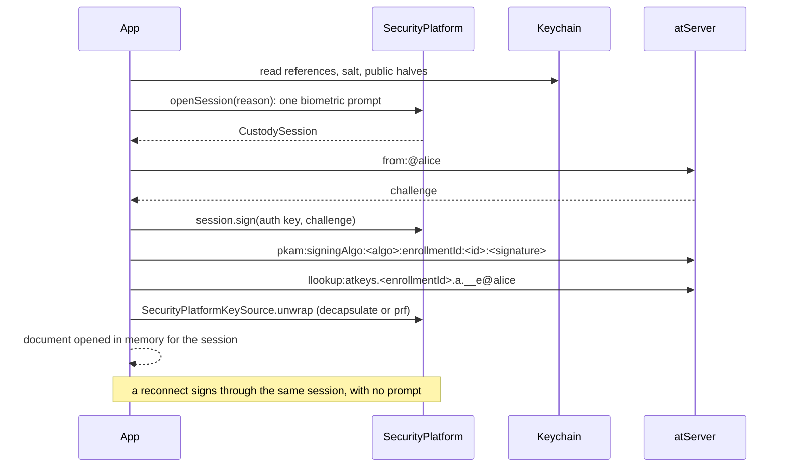

# APKAM custody: hardware-held credentials and a server-held atKeys document

A companion to [`design.md`](design.md). That design protects the atKeys
document at rest with a key source. This one moves the APKAM credential itself
into the device's secure hardware (Secure Enclave, TPM, Android Keystore or a
passkey), and keeps the rest of the enrollment's keys on the atServer as a
version 2 envelope that only that hardware can open. The hardware plugs into
`design.md`'s store as one more `AtKeysKeySource`.

## Status

Draft, 2026-10-01. Nothing here is built. The hardware capabilities in
[section 2](#2-what-the-hardware-offers) are taken from vendor documentation
and haven't been probed; [section 10](#10-open-questions) lists what would
settle them. The at_server claims were read from trunk.

## Table of contents

- [1. The problem](#1-the-problem)
- [2. What the hardware offers](#2-what-the-hardware-offers)
- [3. Why a signature can't be the secret](#3-why-a-signature-cant-be-the-secret)
- [4. Custody tiers and the ranking rule](#4-custody-tiers-and-the-ranking-rule)
- [5. The seam: SecurityPlatform](#5-the-seam-securityplatform)
- [6. SecurityPlatformKeySource](#6-securityplatformkeysource)
- [7. The server-held document](#7-the-server-held-document)
- [8. Opening a session](#8-opening-a-session)
- [9. The browser as the only device](#9-the-browser-as-the-only-device)
- [10. Open questions](#10-open-questions)
- [11. Changes by package](#11-changes-by-package)

## 1. The problem

Today an APKAM private key is bytes. It is minted in Dart, written into the
atKeys document, and signs `from:` challenges from memory. Protecting the
document at rest (`design.md`) stops a copied disk from yielding it, but any
process that opens the document gets a key it can take elsewhere.

Two stages fix that:

1. **The hardware mints the APKAM key.** Only its public half is enrolled, and
   PKAM signs challenges inside the hardware, so the key can't leave the
   device.
2. **The rest of the enrollment's keys** (encryption key pair, self encryption
   key, `apkamSymmetricKey`, any software signing keys) are kept on the
   atServer in an envelope that only this device's hardware can open. Nothing
   secret sits on the device at rest.

Recovery is through keychain or passkey sync only: an item synced from a Mac to
an iPhone is fine, but there is no manual export to another device.

## 2. What the hardware offers

| Platform                | Signs in hardware            | Key encapsulation in hardware | Deterministic secret in hardware              |
| ----------------------- | ---------------------------- | ----------------------------- | --------------------------------------------- |
| Apple Secure Enclave, OS 26+ | ML-DSA-65, P-256 ECDSA  | ML-KEM-768 and ML-KEM-1024    | P-256 ECDH against a fixed point              |
| Apple Secure Enclave, earlier | P-256 ECDSA                 | none                          | P-256 ECDH against a fixed point              |
| Windows TPM (NCrypt PCP) | P-256, RSA-2048              | none                          | ECDH_ZGen; HMAC may not be exposed through PCP |
| Linux TPM (tpm2-tss)    | P-256, RSA-2048              | none                          | `TPM2_HMAC` with a keyedHash key              |
| Android StrongBox or TEE | P-256; Ed25519 on TEE with KeyMint 2+ | none                | HMAC-SHA256 key                               |
| Browser                 | none (WebCrypto keys are software) | none                    | the WebAuthn PRF extension                    |

None of them offers Ed25519 across the board: `TPM_ALG_EDDSA` is in TPM spec
1.83 and later but not in shipping chips, and the Secure Enclave has none. AES
is no better: the Secure Enclave holds no AES key, and TPMs often disable
`EncryptDecrypt`. Android is the exception, with AES-GCM in hardware.

## 3. Why a signature can't be the secret

The first idea was to sign a fixed message, such as `atSign|enrollmentId|pkam`,
with the hardware key and use the signature as an encryption key. It fails
twice. ECDSA from the Secure Enclave and TPM, and hedged ML-DSA, are
randomised, so the same message gives a different signature each time. And the
PKAM key signs whatever challenge the atServer sends; the `from:` validator in
`at_lookup_impl.dart` constrains the shape, but a key whose signatures are
secrets would hand them to a malicious server.

The deterministic primitives are a hardware PRF (HMAC, ECDH against a fixed
point, WebAuthn PRF) and hardware key decapsulation. The PKAM key is never
used for either.

## 4. Custody tiers and the ranking rule

There are three tiers, and each feeds machinery the post-quantum work already
built:

- **hw-kem.** The Secure Enclave holds an ML-KEM-1024 key. Its public half is
  advertised with the existing `ml-kem-1024-rfc9180-v1` suite, and
  `privateDecapsulation` is a reference, never bytes.
- **hw-prf-seed.** `seed = HKDF-SHA256(PRF(salt), info)`, where the salt is a
  random 32 bytes per enrollment. The seed goes to the existing
  `keyPairFromSeed` (X-Wing, or ML-DSA-65 once that has a seed keygen), so no
  new suite is needed. The seed exists only in memory for the session.
- **software.** Today's behaviour, and the default.

The salt can't be the enrollment id, because the public keys go into
`enroll:request` before the id exists. Natively it sits in the same keychain
item as the hardware key reference. In the browser it is the passkey's
`userHandle`, which a discoverable `get()` returns.

Tiers rank differently by role, because the threats differ:

| Role                        | Order                                  | Why                                                                                                 |
| --------------------------- | -------------------------------------- | --------------------------------------------------------------------------------------------------- |
| Key encapsulation (the document) | hw-kem, hw-prf-seed, software     | the envelope sits on the atServer for years, so "harvest now, decrypt later" dominates: post-quantum first |
| Authentication (PKAM)       | hardware signing, hw-prf-seed, software | a forgery can't be harvested for later, and the key can be rotated: non-exportable first         |

Within a tier the strongest algorithm wins, using
`SigningAlgoType.strongestFirst` for signing and the posture's key-establishment
order for encapsulation. The choice is recorded and never silently downgraded,
matching the trusted-devices rule of "record, refuse, don't fall back". A
`PqPosture` setting of `custody: required` refuses the software tier.

## 5. The seam: SecurityPlatform

Every current signing path takes a private key as a string and runs
synchronously, so hardware can't plug in anywhere. `SecurityPlatform` is that
missing boundary. It holds handles, not bytes:

```dart
abstract interface class SecurityPlatform {
  /// 'apple-se', 'android-keystore', 'win-tpm', 'tpm2', 'webauthn', 'software'.
  String get id;

  Future<CustodyCapabilities> capabilities();

  Future<CustodyKey> mint(CryptographicMaterialRole role,
      CryptographicMaterialAlgorithm algorithm, {required String keyId});

  /// Raises the one biometric or PIN prompt for the session.
  Future<CustodySession> openSession({required String reason});
}

abstract interface class CustodySession {
  Future<Uint8List> sign(CustodyKey key, Uint8List message);
  Future<Uint8List> decapsulate(CustodyKey key, Uint8List enc);
  Future<Uint8List> prf(CustodyKey key, Uint8List salt);
  Future<void> close();
}
```

It is a new, non-sealed interface in at_auth, because `AtKeysIo` is sealed and
platform packages can't subtype it. It holds no keys and isn't a registry.
`CustodyKey` is an opaque `{platformId, ref, publicKey, role, algorithm}`, so a
future remote custodian (an identity provider's key, say) fits without an
interface change. The platform is injected through the same doors as storage:
`Atsign.activate/enroll/open(…, security:)`, defaulting to
`SoftwareSecurityPlatform`.

Role names, key ids (`auth:<algo>:<n>`), algorithm names and the per-enrollment
namespace are the ones the post-quantum work already uses.

## 6. SecurityPlatformKeySource

A platform becomes a key source for `design.md`'s store through a wrapper:

```dart
final class SecurityPlatformKeySource implements AtKeysKeySource {
  SecurityPlatformKeySource(this.platform, this.key, {required this.session});

  final SecurityPlatform platform;

  /// An encapsulation or PRF key; never the PKAM key.
  final CustodyKey key;

  /// The session's shared prompt.
  final Future<CustodySession> Function() session;

  @override
  String get id => 'custody:${platform.id}';

  @override
  Future<WrappedKey> wrap(Uint8List dataKey, {required String atSign});

  @override
  Future<Uint8List> unwrap(WrappedKey wrapped, {required String atSign});
}
```

- **hw-kem** wraps by sealing the data key to the Secure Enclave's ML-KEM-1024
  public key, which needs no prompt, and unwraps through
  `session.decapsulate`.
- **PRF-backed sources** (WebAuthn PRF, TPM HMAC, Keystore HMAC, Secure Enclave
  ECDH) wrap with AES-256-GCM under `HKDF(prf, "atkeys-kek")`, the label
  `design.md` section 8 already uses. The key is symmetric, so it is already
  post-quantum.
- The constructor rejects a key whose role is `privateAuthentication`, which
  keeps the rule from [section 3](#3-why-a-signature-cant-be-the-secret) out of
  the caller's hands.

So the store never learns about custody. A Secure Enclave, DPAPI and a cloud
KMS are all entries in the envelope's `keys` list, and a daemon could carry a
`custody:tpm2` entry beside a `systemd-credential` one. Software custody isn't
wrapped; the store keeps its platform default.

The two TPM uses are separate. `systemd-creds` protects a daemon's document at
rest, as `design.md` section 7 describes. A `tpm2` security platform holds the
APKAM key itself. A daemon can use either or both.

On macOS the Secure Enclave keys live in the keychain, so they inherit the
signing rule measured in `design.md` section 3: a team-signed binary with
`keychain-access-groups` reads them, and an unsigned CLI build gets software
custody, which is recorded.

## 7. The server-held document

The atKeys document for a custody enrollment is a version 2 envelope, kept at
`atkeys.<enrollmentId>.a.__e@<atSign>` as a private record. Three things make
that namespace the right home:

- The atServer confines `<enrollmentId>.a.__e` keys to that enrollment, so
  another enrollment on the same atSign can't read the record.
- Revoking or deleting the enrollment moves its per-enrollment data to `.r.__e`
  or `.d.__e`, so the record goes with it.
- It needs no server change.

The approver's secret-sharing envelope can't serve instead. `__ssenv`
envelopes are deleted once consumed (`pairwise_secret_sharing.dart`), including
one a device addressed to itself.

The document is written on activate, when an enrollment completes, and on
every key rotation. The device's keychain keeps only public halves, hardware
key references, the salt and the key-package id.

## 8. Opening a session

One prompt covers the whole session, including reconnects:



| Platform              | How the session holds one prompt                                          |
| --------------------- | ------------------------------------------------------------------------- |
| Apple                 | one `LAContext`, passed as `kSecUseAuthenticationContext`                 |
| Android               | `setUserAuthenticationParameters` with a timeout                          |
| TPM and Windows Hello | the prompt gates the PRF or encapsulation key; the PKAM key has no prompt |
| Browser               | one PRF `get()`; the derived keys are held for the session                |

Each platform reports whether it achieved per-operation, per-session or no
prompting, so policy can see what it got.

The atServer side is already on trunk. It verifies a PKAM signature with the
algorithm the enrollment record holds, `ecc_secp256r1` and `mldsa65` included
(`apkam_signature_verifier.dart`), and honours the client's `apsk`. What the
client lacks is ES256 in JOSE, and ecc in `mintApkamKeyPair`,
`signPkamChallenge` and the possession proof, which today take only RSA-2048
and ML-DSA-65.

## 9. The browser as the only device

`design.md` section 8 needs a gate for fetching the document before the
browser holds a PKAM key, and offers two: a hidden `public:_` record named from
the PRF, or an enrollment whose credential is the passkey. There is a third:

> Derive the APKAM key from the passkey. The PRF output, run through
> `HKDF(prf, "at_auth/custody/auth-seed/v1|<atSign>")`, seeds an ML-DSA-65 key
> pair, which is enrolled as an ordinary APKAM key. The browser does a normal
> PKAM, then reads the private `atkeys.<enrollmentId>.a.__e` record.

- **No server change.** Trunk already verifies ML-DSA-65 PKAM, and no atServer
  implementation has to verify WebAuthn assertions.
- **No public record,** so there is no name to leak through `lookup:` or logs.
- **Revocation** is enrollment revocation, as with any device. This closes
  the unauthenticated-read and revocation threats that gate (a) leaves open
  ([`prf-server-keys-blob.md`](prf-server-keys-blob.md#open)).
- **Eviction loses nothing.** IndexedDB becomes a cache: after it is cleared,
  the passkey re-derives the PKAM key and the atServer supplies the document.
- **The cost:** the PKAM key sits in page memory for the session, the same
  exposure `design.md` section 9 already accepts for the data key.

A separate label, `HKDF(prf, "atkeys-kek")`, derives the key that wraps the
document, so the PKAM key and the document key stay independent. Where PRF is
unavailable, the fallbacks are largeBlob, then a non-extractable WebCrypto key
(recorded as software custody), then refusal under `custody: required`.

Passkey sync makes the provider part of the trust base, as `design.md` notes,
and that is accepted here as the recovery route.

## 10. Open questions

| Question | How to settle it |
| --- | --- |
| Does the Secure Enclave's ML-DSA-65 signature verify with the pure-Dart verifier (context string, pure or pre-hash)? | A macOS 26 probe that signs and verifies in Dart |
| Do Secure Enclave ML-KEM-1024 public-key bytes give the same key-package id as ours? | The same probe |
| Is ecc PKAM on the wire DER or raw r‖s, and does SE/TPM output match? | A pin test against at_server trunk |
| Does NCrypt PCP expose HMAC on Windows TPMs, or only ECDH_ZGen? | A Windows probe |
| Can the atServer update a record conditionally? | Shared with `design.md` section 10; multi-writer rewraps need it |
| Is the custody tier worth recording in the enrollment record, so policy can require hardware later? | A decision for at_server; not blocking |
| How is a device secret rotated, and does revocation force it? | Design: new secret, new record name, old record deleted |
| Is the PRF output stable across UV states on every authenticator? | Pin UV to `required` and probe hmac-secret with and without UV |

## 11. Changes by package

| Package | Change |
| --- | --- |
| at_chops | ML-DSA-65 `keyPairFromSeed` (pure Dart and FFI); `pqOpen` with an external decapsulator; ECDSA DER and raw conversion; one HKDF helper for the custody labels |
| at_auth | `SecurityPlatform`, `CustodySession`, `CustodyKey`, `SoftwareSecurityPlatform`, `SecurityPlatformKeySource`; a tier selector; a `custody` field in keyfile material; the four raw-key signing paths routed through custody; the `_pkam` injected-signer path stops assuming RSA-2048 |
| at_client | ES256 in `envelope_signature.dart`; key packages advertise the custody encapsulation key; a server-backed store at `atkeys.<enrollmentId>.a.__e`; `open`, `activate` and `enroll` go through the session; `PqPosture.custody` |
| at_client_flutter | A federated `at_security_platform` plugin for Darwin (CryptoKit), Android (Keystore) and Windows (NCrypt); `KeychainAtKeysIo` keeps only references and public halves |
| at_client_wasm | `WebAuthnSecurityPlatform` on the existing passkey port, as in [section 9](#9-the-browser-as-the-only-device) |
| at_onboarding_cli | `--security tpm2\|software`, with a tpm2-tss FFI platform in its own package |
| at_commons, at_lookup | none; the PKAM grammar already carries `ecc_secp256r1` and `mldsa65` |
| at_server | none required; a pin test for ecc signature encoding |
| docs | a trusted-devices decision record that separates APKAM custody from the device-assertion credential, which must never be a PKAM key |

The order that keeps each step shippable: at_chops primitives, then the at_auth
seam with only the software platform (no behaviour change), then the server
store and session in at_client, then Apple (the first hw-kem), the browser,
Android, Windows and the TPM CLI.
