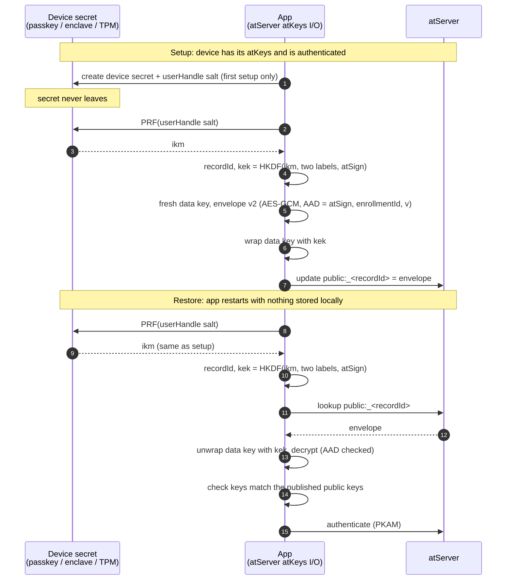

# atKeys on the atServer: a PRF-named blob

* **Status:** Agreed direction, for review
* **Last Updated:** 2026-10-08

A short profile of [`design.md` section 8](design.md#8-the-browser), gate (a):
the browser's atKeys document lives on the atServer under a name only the
device can compute. [`apkam-custody.md`](apkam-custody.md) covers the hardware
side and gate (c).

## TL;DR

* The `.atKeys` file moves off the device and onto the **atServer**, as a
  version 2 envelope ([`design.md` section 5](design.md#5-envelope-version-2)).
* A device secret (passkey, Secure Enclave, TPM) feeds **one PRF call**. Two
  labelled HKDF outputs come from it: the blob's **recordId** and the **kek**
  that wraps the envelope's data key.
* Nothing the atServer returns is fed back into the PRF.

## Before → after

| | Today | New model |
| --- | --- | --- |
| Where `.atKeys` live | Local file (IndexedDB on web, which the browser can evict) | Envelope v2 on the atServer |
| Recovery after a wipe | New enrollment + OTP | Re-derive, fetch, unwrap |

## Derivation

```text
ikm      = PRF(device secret, userHandle salt)          // one call, one prompt
recordId = HKDF(ikm, info = "atkeys-record-id|<atSign>")
kek      = HKDF(ikm, info = "atkeys-kek|<atSign>")
```

* **Domain separation.** The two outputs differ only by label, so neither can
  be made equal to the other. The raw `ikm` never leaves the device.
* **No server-chosen input.** The PRF salt is the passkey's `userHandle`
  ([`apkam-custody.md` section 4](apkam-custody.md#4-custody-tiers-and-the-ranking-rule)),
  held by the authenticator, not stored beside the blob.
* **atSign-bound.** One device with two atSigns gets two unrelated recordIds.
* **Fresh key per write** comes from the envelope's random data key, not from a
  PRF salt. Rewrapping is 32 bytes.

The record is `public:_<recordId>@<atSign>`, with a **single** underscore:

* at_server gives `public:_` keys no commit-log row, so they never sync to
  other clients (`sqlite_at_commit_log.dart`, `hive_at_commit_log.dart`;
  `public:__` keys *do* sync).
* Scan hides them from everyone, including the owner.
* `lookup:` travels over TLS (PQ-TLS when compatible), so only the atServer
  sees the name.

## What's created when

| Item | Created | Kept where |
| --- | --- | --- |
| **Device secret** | Once per device, at first setup | Authenticator / enclave / TPM; survives app-storage wipes |
| **userHandle salt** | With the device secret | In the passkey (returned by a discoverable `get()`) or the keychain item |
| **Data key + IV** | Every write | Data key wrapped by `kek` in the envelope; IV in clear |
| **recordId**, **kek** | Re-derived at setup and restore | Memory only |

## Sequence



## Payload

* The envelope carries the encryption key pair, the self-encryption key and
  `apkamSymmetricKey`.
* **APKAM private keys stay on the secure platform** and are never in the blob
  ([`apkam-custody.md` section 1](apkam-custody.md#1-the-problem)).
* Browser exception: under gate (c) the PRF-derived APKAM key sits in page
  memory for the session
  ([`apkam-custody.md` section 9](apkam-custody.md#9-the-browser-as-the-only-device)).

## Where the device secret comes from

| Platform | PRF |
| --- | --- |
| Browser (built first) | WebAuthn PRF extension on a discoverable passkey |
| Apple | Secure Enclave P-256 ECDH against a fixed point (no HMAC in the enclave) |
| Linux TPM | `TPM2_HMAC` with a keyedHash key |
| Android | Keystore HMAC-SHA256 key |
| Windows TPM | `ECDH_ZGen`; HMAC through PCP is an open question |

Only high-entropy sources qualify. No passphrase source: a deterministic
`recordId` would become an offline guessing target.

## Decisions

1. Replace local `.atKeys` files with an envelope v2 on the atServer.
2. One PRF call; recordId and kek are domain-separated HKDF outputs bound to the atSign.
3. Per-write freshness comes from the envelope's data key; no server-stored PRF salt.
4. The recordId hides the record; confidentiality rests on the kek.
5. The record is `public:_`, so it is not synced or in the commit log.
6. APKAM private keys never enter the blob.
7. Build the web version first.

## Threats

From an adversarial review of the first draft of this doc (33 findings).

### Fixed in the design above

| Finding | Fix |
| --- | --- |
| A writer chooses the stored salt so `wrapKey = recordId`, then substitutes keys | No server-supplied PRF input; separate labels |
| No AEAD, so blobs can be tampered with, spliced or rolled back | Envelope v2: AES-GCM, AAD = atSign, enrollmentId, version |
| Raw PRF output used as the name lets the server compute the key | Raw `ikm` never leaves the device |
| recordId links atSigns; nothing binds the atSign | atSign in both labels and the AAD |
| recordId reaches other apps through sync | `public:_` has no commit-log row |
| recordId exposed on the wire | TLS, moving to PQ-TLS |
| Two prompts per cold start | One PRF call |
| Key substitution on restore goes unnoticed | Check against published public keys before PKAM |
| Whole keyfile, including APKAM keys, on the server | APKAM keys excluded |

### Accepted, out of scope

* **Apple ID or Google account takeover.** A synced passkey gives the attacker
  a full restore, and synced devices share one record. Passkey sync is the
  recovery route, and the provider is part of the trust base
  ([`apkam-custody.md` section 9](apkam-custody.md#9-the-browser-as-the-only-device)).

### Open

| Finding | Direction |
| --- | --- |
| Gate (a) read is unauthenticated: anyone with the name can fetch | Gate (c) replaces it with PKAM then a private record |
| Revocation doesn't reach a gate (a) record | Gate (c) moves the record with the enrollment |
| Per-atSign rate limit would let anyone lock out restores | Limit misses per source, not per atSign |
| Device secret never rotates | Rotation = new secret, new recordId, delete old record |
| Wipe premise varies (uninstall, migration, TPM clear, biometric re-enroll) | Define "wipe" per platform; test it |
| Losing the last key-holder loses the atSign | Keep OTP enrollment as the recovery floor |
| rpId covers subdomains and Related Origins | Exact, dedicated rpId; no Related Origins |
| PRF output differs with and without user verification | Pin UV to `required`; never auto-recreate on failure |
| Same construction across platforms | Version byte and test vectors |
| Concurrent writers lose updates | Conditional update, shared with [`design.md` section 10](design.md#10-open-questions-and-probes-still-to-run) |

### Better than today

* A single-device web user whose storage is evicted recovers without an OTP.
