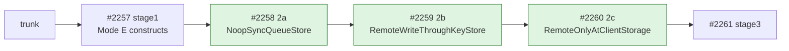
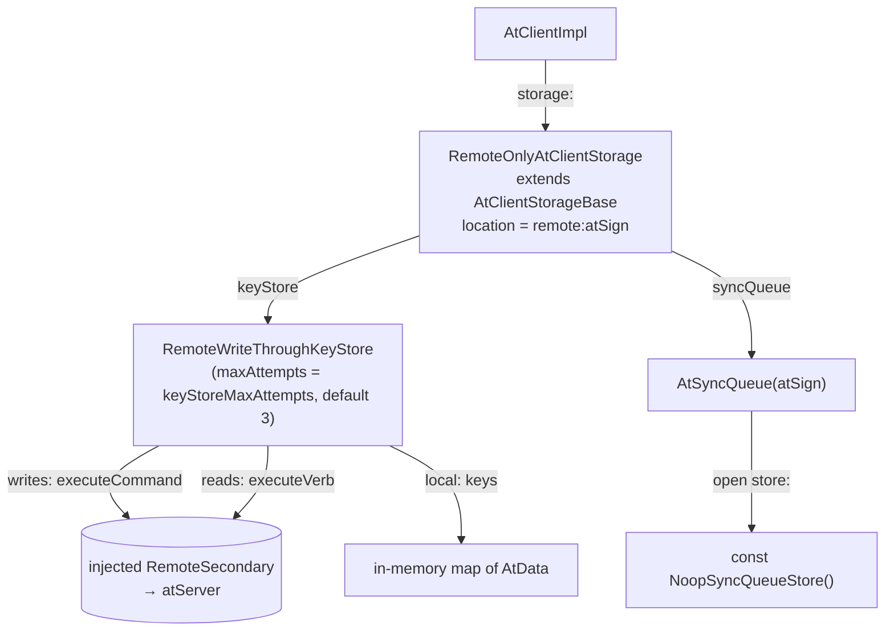
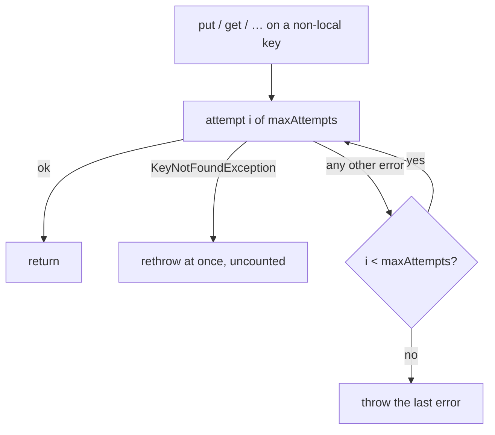
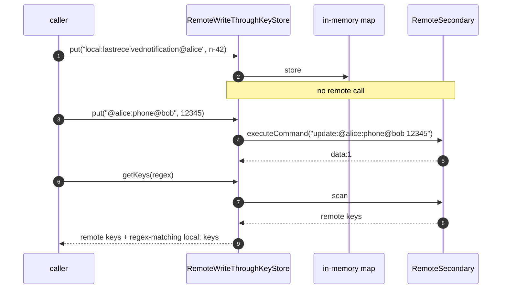

# pb3-stage2.md — the remote-only storage bundle exists: no-op queue, write-through keystore, `RemoteOnlyAtClientStorage`

**Status:** PRs open. The stack is [#2258](https://github.com/atsign-foundation/at_client_sdk/pull/2258) 2a → [#2259](https://github.com/atsign-foundation/at_client_sdk/pull/2259) 2b → [#2260](https://github.com/atsign-foundation/at_client_sdk/pull/2260) 2c, and it sits on top of stage1 ([#2257](https://github.com/atsign-foundation/at_client_sdk/pull/2257)).

**Bottom line:**
- `at_client` now has a concrete remote-only `AtClientStorage`: `RemoteOnlyAtClientStorage`, exported from `package:at_client/remote_only.dart`.
- It composes two new parts. `NoopSyncQueueStore` keeps nothing on disk. `RemoteWriteThroughKeyStore` sends every read and write straight to the atServer through `RemoteSecondary`.
- `local:` keys never reach the atServer. They stay in memory for the session.
- **A client built with `buildAtClient(storage: RemoteOnlyAtClientStorage(...))` under `isLocalStoreRequired: false` constructs.** Stage1 made that shape legal; stage2 fills it.

**Related docs:**
- The construction unblock this builds on: [`pb3-stage1.md`](pb3-stage1.md).
- The fixes and X-R2 proof that came later: [`pb3-stage6.md`](pb3-stage6.md).
- The rulings: [`decisions.md`](decisions.md) D-17 "V1 ships remote-only; the local store is a bundle choice, not a removed capability" and D-18 "Remote-only is delivered as an `AtClientStorage` implementation, not by making `localSecondary` nullable".
- The location rule: [`decisions.md`](decisions.md) D-14 "The storage-isolation design".
- The gates: [`acceptance.md`](acceptance.md) §9a.2, X-R1 / X-R2.

---

## 1. Where this sits in PB-3

D-18 "Remote-only is delivered as an `AtClientStorage` implementation, not by making `localSecondary` nullable" says `at_client` never learns about a "no local store" mode. It gets a bundle whose keystore is write-through and whose sync queue is a no-op. Stage2 builds exactly that bundle, one part per PR.

| PR | Branch | Adds | Files | Tests added |
|---|---|---|---|---|
| #2258 | `st/wasm/stage2a-noop-sync-queue` | `NoopSyncQueueStore` in `lib/src/sync/sync_queue_store.dart` | 2, +92 | 5 |
| #2259 | `st/wasm/stage2b-write-through-keystore` | `lib/src/storage/remote_write_through_keystore.dart` | 2, +618 | 25 |
| #2260 | `st/wasm/stage2c-remote-only-storage` | `lib/src/storage/remote_only_at_client_storage.dart`, `lib/remote_only.dart` | 3, +269 | 6 |

### How the bundle composes

---

## 2. 2a — `NoopSyncQueueStore`

### Why

- D-18 item 1: "The no-op queue is supplied, not evaded." Since X2/X3, `LocalSecondary` takes an injected sync queue, so the remote-only bundle supplies one instead of avoiding the Hive-backed default.
- **Delivery already happens synchronously in the write-through keystore's own retry.** So there is nothing left for a queue to redeliver across a restart, and nothing to persist.

### What

A `const` class in `lib/src/sync/sync_queue_store.dart`, beside `HiveBoxSyncQueueStore`.

| Member | Behaviour |
|---|---|
| `keys` | `const Iterable.empty()` |
| `get(atKey)` | `null` |
| `put`, `delete`, `clear`, `close` | no-op `async {}` |

`AtSyncQueue`'s in-memory FIFO is independent of the store. An `enqueue` still counts for the current process; it just never survives a reopen.

### Tests

5 tests added in `test/noop_sync_queue_store_test.dart`.

| Group | What it checks |
|---|---|
| `NoopSyncQueueStore` | `keys` empty and `get` null; `put` then `get` still null; `clear`/`close` complete |
| `AtSyncQueue.open with NoopSyncQueueStore` | Opens and enqueues without touching Hive (`size` 1 after enqueue); a fresh `open()` on a new `AtSyncQueue` replays nothing (`size` 0) |

---

## 3. 2b — `RemoteWriteThroughKeyStore`

### Why

- D-18 item 3 bars rebuilding `AtChops` from a store that never held the keys. The remote-only bundle has **no durable keystore at all**, and a write-through one is legal for it.
- Every read and write therefore goes straight to the atServer through `RemoteSecondary`. There is no local commit log.

### What

`RemoteWriteThroughKeyStore implements AtKeyValueStore<String, AtData, AtMetaData?>`, constructed as `RemoteWriteThroughKeyStore(remoteSecondary, {maxAttempts = 3})`.

| Member | Wire form | Via |
|---|---|---|
| `put` | `update:<key> <data>` | `executeCommand(…, auth: true)` |
| `putMeta` | `update:meta:<key><fragment>` | `executeCommand` |
| `putAll` | `update<fragment>:<key> <data>` | `executeCommand` |
| `remove` | `delete:<key>` | `executeCommand` |
| `get` / `getMeta` | `LLookupVerbBuilder(atKey: AtKey.fromString(key), operation: 'all')`, response `data:` stripped, decoded with `AtData().fromJson` | `executeVerb` |
| `getKeys` | `ScanVerbBuilder(regex, auth: true)`, decoded as a JSON list | `executeVerb` |

- **The wire strings are not invented.** They mirror `SyncServiceImpl._buildCommandFromQueueEntry`, including where the metadata fragment sits: after the key for `update:meta:`, before it for `update`.
- The fragment comes from `metadata.toCommonsMetadata().toAtProtocolFragment()`, not a hand mapping.
- Every write returns `null`: there is no commit log to return an id from.
- `nextExpiresAt` / `nextAvailableAt` return `null`; `changes` is an empty stream; hooks are empty; `supportsSnapshots` / `supportsPathQueries` are `false`; `commitLog` is `null` and its setter is a no-op.
- The other 14 members (`create`, `scanKeys`, `queryByPath`, `snapshot`, `compact`, `restore`, `peekNewlyAvailable`, `getExpiredKeys`, `deleteExpiredKeys`, `peekExpired`, `exists`, `getMany`, `removeMany`, `transaction`, `stats`) throw `UnsupportedError('RemoteWriteThroughKeyStore does not support <member>')`.

### Retry

- Bounded and in-memory, not a persistent queue.
- `KeyNotFoundException` bypasses retry entirely. **A miss is normal control flow, not a failure worth retrying.**
- A real `llookup` miss does arrive as `KeyNotFoundException`. The commit traces it through `AtLookupImpl._errorResponseHandler` → `AtExceptionUtils.get`, error code `AT0015`.

### `local:` keys stay in the session

`local:` keys are client-only by construction. The monitor's `lastreceivednotification` watermark is one. Sending it to the atServer would be wrong, so a separate commit (`e61199c9b`) keeps them in memory.

| Rule | Detail |
|---|---|
| Prefix match | `key.toLowerCase().startsWith('local:')`, so `LOCAL:` matches too |
| Absent key | `get` throws `KeyNotFoundException('<key> does not exist in keystore')`, as Hive does |
| `putMeta` | Replaces the metadata of an existing local value |
| `getKeys` | Merges regex-matching local keys into the remote scan result |

### Design choice

| Option | Chosen | Why |
|---|---|---|
| Persistent retry queue | ✗ | The commit rules it out: "bounded and in-memory, not a persistent queue" |
| Bounded in-memory retry, `maxAttempts` default 3 | ✓ | The write is acknowledged only after the server accepts it, so nothing is left to redeliver |
| Send `local:` keys to the atServer | ✗ | They are client-only by construction |
| Hold `local:` keys in memory for the session | ✓ | Matches their meaning. They are gone when the session ends |

### Tests

25 tests added in `test/storage/remote_write_through_keystore_test.dart`, all against a `MockRemoteSecondary`.

| Group | Tests | What it checks |
|---|---|---|
| `put` | 1 | Exact string `update:@alice:phone@bob 12345`; returns `null` |
| `putMeta / putAll` | 2 | `update:meta:<key>` then fragment (`:ttl:60000`, `:isBinary:true`); `update:ttl:60000` before `:<key> <data>` |
| `remove` | 1 | `delete:@alice:phone@bob` |
| `get / getMeta` | 4 | `operation == 'all'` and decode; metadata half; `privatekey:at_pkam_privatekey` and `public:publickey@alice` round-trip to their exact wire strings |
| `getKeys` | 1 | `ScanVerbBuilder` with `regex` and `auth: true`; list decode |
| `retry` | 3 | Succeeds on the 3rd call; stops at exactly 3 and rethrows; `KeyNotFoundException` after 1 call |
| `unsupported members` | 1 | 14 members throw `UnsupportedError` |
| safe defaults | 5 | Expiry probes `null`, `changes` empty, hooks empty, capability flags `false`, `commitLog` `null` |
| `local:` keys | 7 | Round-trip, metadata, `putMeta`, absent-key miss, `remove`, case-insensitive prefix, `getKeys` merge; `tearDown` asserts `executeCommand` was never called |

---

## 4. 2c — `RemoteOnlyAtClientStorage`

### Why

- D-18's amendment: remote-only ships as `RemoteOnlyAtClientStorage implements AtClientStorage`. **One gateway, not two.**
- D-17 "V1 ships remote-only; the local store is a bundle choice, not a removed capability" makes this bundle the browser default. It still needs a concrete class for `buildAtClient` to receive.

### What

`RemoteOnlyAtClientStorage extends AtClientStorageBase`, constructed with `atSign`, `remoteSecondary`, `keyStoreMaxAttempts` (default 3) and `closedByClient`.

| Member | Behaviour |
|---|---|
| `location` | `'remote:$atSign'` |
| `openBackend` | Builds a `RemoteWriteThroughKeyStore` and an `AtSyncQueue` opened on `const NoopSyncQueueStore()`. Idempotent: returns early if already open |
| `keyStore` / `syncQueue` | `StateError('storage for <atSign> is not open')` before `openBackend` |
| `closeBackend` | Closes the queue only. The injected `RemoteSecondary` is the caller's to close |
| `clearData` | `UnsupportedError('RemoteOnlyAtClientStorage.clearData: clearing a live atServer is a destructive remote operation, not implemented in this slice')` |

`lib/remote_only.dart` exports the class. It mirrors `lib/sqlite.dart`, so consumers don't need an `implementation_imports` reach into `src/`. The test file imports through it.

### Design choice — what `location` is keyed by

| Option | Chosen | Why |
|---|---|---|
| Per (atSign, enrollmentId) | ✗ | D-14 "The storage-isolation design": production stays atSign-keyed; `enrollmentId` is a test-fixture discriminator only |
| Per atSign: `remote:<atSign>` | ✓ | A second storage over the same atSign is the same store. `AtClientStorageBase.attach` refuses it with `StateError('another storage is already open at remote:<atSign>…')` rather than sharing silently |

### Tests

6 tests added in `test/storage/remote_only_at_client_storage_test.dart`.

| Test | What it checks |
|---|---|
| attach, put, get | Reads and writes reach the mocked `RemoteSecondary`: `executeCommand` ×1, `executeVerb` ×1 (X-R1; X-R2 wiring only) |
| `syncQueue` | Open and empty after attach |
| `location` | Differs across atSigns; a second storage for the same atSign throws `StateError` on `attach` |
| `clearData` | `storage.clear()` throws `UnsupportedError` |
| `closeBackend` | `remoteSecondary.closeConnection()` is never called |
| `buildAtClient` | Constructs under `isLocalStoreRequired: false` with `llookup` throwing `KeyNotFoundException` (no key material); `client.localSecondary` is not null |

---

## 5. Verification

| Branch | Tests added | at_client suite | Source |
|---|---|---|---|
| 2a | 5 | — | diff |
| 2b | 25 | — | diff; PR body says "25 unit tests" |
| 2c | 6 | 2139 / 2139 | diff; suite figure from the #2260 PR body |

- Across 2a–2c: 7 files changed, +979 / −0, all in `packages/at_client`.
- No `CHANGELOG.md` change in any of the three.

---

## 6. Open items

| Item | Status | Where |
|---|---|---|
| `get` on the remote path decodes with `AtData().fromJson` and doesn't stamp `AtData.key`. On a live client this threw a `TypeError` in `GetResponseTransformer` | Fixed later | 6b, [#2274](https://github.com/atsign-foundation/at_client_sdk/pull/2274); see [`pb3-stage6.md`](pb3-stage6.md) §4 |
| A remote-only client still ran the default sync loop | Fixed later with `WriteThroughSyncService` | 6c, [#2275](https://github.com/atsign-foundation/at_client_sdk/pull/2275) |
| `remote_only.dart` had no WASM gate | Gated later: 0 offenders, compiles | 6a, [#2273](https://github.com/atsign-foundation/at_client_sdk/pull/2273) |
| The 2c test covers X-R2 composition wiring only, not two clients reading each other's writes | Closed later by the X-R2 interop test | 6d, [#2276](https://github.com/atsign-foundation/at_client_sdk/pull/2276) |
| The code comment and test on `location` cite "D-13" for atSign-only keying. D-13 is "Local storage is isolated per (atSign, enrollmentId), not per atSign"; the atSign-keyed production rule is D-14 "The storage-isolation design" | Open | `remote_only_at_client_storage.dart`, `remote_only_at_client_storage_test.dart` |
| `clearData` against a live atServer | Out of scope for this slice | `RemoteOnlyAtClientStorage.clearData` |
| `local:` keys are lost when the session ends, including the `lastreceivednotification` watermark | Not addressed in stage2 | `RemoteWriteThroughKeyStore` |
