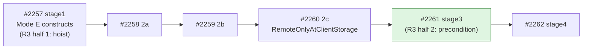
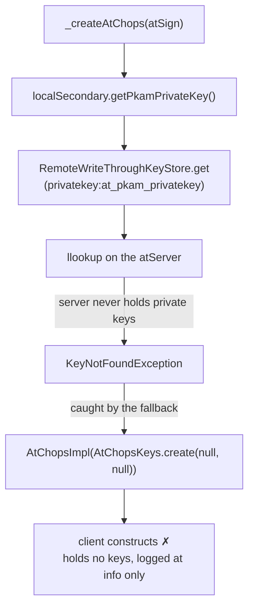
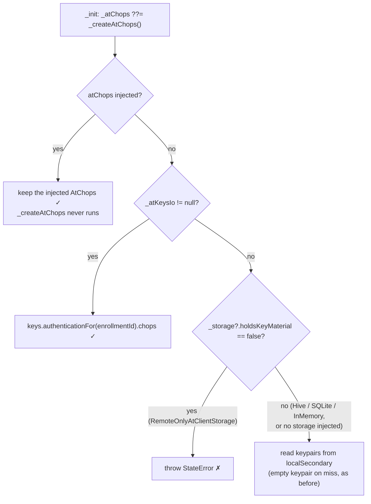
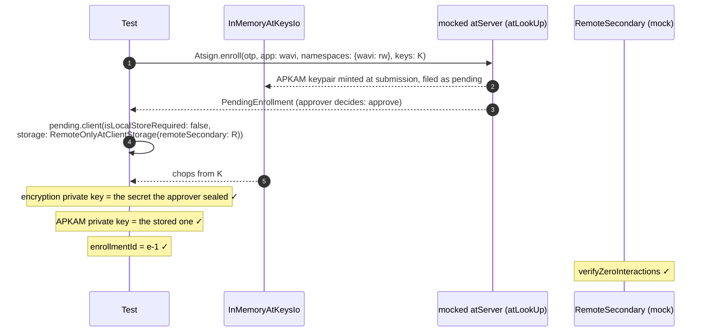

# pb3-stage3.md — a remote-only client must be handed its keys, and an ephemeral session already is

**Status:** PR open, 2026-09-23. [#2261](https://github.com/atsign-foundation/at_client_sdk/pull/2261), branch `st/wasm/stage3-r3-chops-precondition`, stacked on stage2c (#2260).

**Bottom line:**
- A client on `RemoteOnlyAtClientStorage` with neither `atChops:` nor `atKeysIo:` now fails at construction with a `StateError`.
- Before this, it constructed **silently with an empty keypair**, and authenticated and decrypted nothing.
- The storage declares the fact itself: new `AtClientStorage.holdsKeyMaterial`, `false` only for `RemoteOnlyAtClientStorage`.
- A fresh ephemeral session (enroll → approve → client) already hands the client an in-memory `AtKeysIo`, so it opens on remote-only storage unchanged. A new test proves it.

**Related docs:**
- The storage bundle and the chops hoist: [`pb3-stage1.md`](pb3-stage1.md).
- What came after: [`pb3-stage6.md`](pb3-stage6.md). Its `replicatesServer` flag follows this stage's `holdsKeyMaterial` precedent.
- The ruling: [`decisions.md`](decisions.md) D-18 "Remote-only is delivered as an `AtClientStorage` implementation, not by making `localSecondary` nullable", consequence 3.

---

## 1. Where this sits in PB-3



- **R3** is item e/R3 of the PB-3 plan. It has two halves.
- **Half 1, the hoist,** shipped in stage1 (#2257). `_atChops ??= await _createAtChops(_atSign)` and `_validateDefaultCryptoProvider()` now run outside the `isLocalStoreRequired` branch.
- **Half 2, the precondition,** is this PR: a remote-only client takes its key material as a named precondition.

| "R3" in these docs | Means | Same thing? |
|---|---|---|
| PB-3 e/R3 | Key material is a precondition of a remote-only client | This doc |
| `implementation-plan.md` R3 | The no-throwing-stub gate | ✗ Unrelated |
| `acceptance.md` §9a.2 X-R3 | A write is not acknowledged until the atServer accepts it | ✗ Unrelated |

---

## 2. Why

D-18 consequence 3, quoted from `decisions.md`:

> **`AtChops` must not be rebuilt from a store that never held the keys.** … A remote-only bundle has no durable keystore at all, so key material must come from `AtKeysIo` and must never be inferred from storage.

The atServer never holds a client's private keys. **A `RemoteOnlyAtClientStorage` is therefore never a valid key source,** and the client must say so rather than guess.

---

## 3. What

### The problem

With `RemoteOnlyAtClientStorage`, no `atChops:` and no `atKeysIo:`, `_createAtChops` fell through to its store path.



- The lookup ran on a connection that needs those very keys to authenticate.
- The fallback catches `KeyNotFoundException` on purpose. For a local store, "no keys" is the ordinary state before onboarding.
- The only signal was an `info` log: "…'s local store holds no key material, so this client holds none…".

### Root cause

**The store fallback could not tell "not onboarded yet" from "this backend can never hold keys".** Both surfaced as the same `KeyNotFoundException`.

### Design choice: a capability flag

| Option | Verdict |
|---|---|
| `_storage is RemoteOnlyAtClientStorage` in `AtClientImpl` | ✗ Couples `at_client_impl.dart` to one concrete backend |
| Key off `!isLocalStoreRequired` | ✗ Breaks stage1's valid case: a pre-seeded non-Hive store with no `AtKeysIo` |
| **`AtClientStorage.holdsKeyMaterial`** | ✓ The storage declares its own capability, and the client asks |

### The change

| File | Change |
|---|---|
| `lib/src/storage/at_client_storage.dart` | New abstract `bool get holdsKeyMaterial` on `AtClientStorage`. `AtClientStorageBase` returns `true` |
| `lib/src/storage/remote_only_at_client_storage.dart` | Overrides `holdsKeyMaterial` → `false` |
| `lib/src/client/at_client_impl.dart` | `_createAtChops` throws `StateError` when `_storage?.holdsKeyMaterial == false`, placed after the `_atKeysIo` branch |

The error text:

```
<atSign>'s storage holds no key material, so this client has no keys to
authenticate or decrypt with. Pass atKeysIo: (or atChops:) when creating it.
```

### The decision flow after stage3



### Why the guard's placement is enough

- **Injected `atChops`:** `_init` uses `??=`, so `_createAtChops` never runs.
- **Re-derive after enrollment:** `_rederiveFromEnrollment` is called only from `_settleEnrollmentIdentity`, which returns early when `_atKeysIo == null`. So a re-derive always takes the `AtKeysIo` branch.
- **No storage injected:** `_storage` is `null`, the `== false` test fails, and the old fallback runs unchanged.

### Additive interface member

The PR's grep found no class that implements `AtClientStorage` directly and no mock of it. Every backend extends `AtClientStorageBase`, so the concrete `true` there reaches all of them.

---

## 4. Fresh ephemeral session

### Why it already works

Enrollment files its keys into the `AtKeysIo` named at submission. `PendingEnrollment.client()` then builds the client over that store. **So the `AtKeysIo` branch is taken, and the new guard is never reached.**

### The test

`test/lifecycle/enroll_test.dart`, "a fresh ephemeral session enrolls and opens on remote-only storage: its keys come from the enrollment's in-memory store, never the atServer".



---

## 5. Tests

5 tests added, 1 test changed.

| Test | File | What it checks |
|---|---|---|
| holdsKeyMaterial: false for remote-only, true for a local backend | `test/remote_only_key_precondition_test.dart` | `RemoteOnlyAtClientStorage` → `false`; `InMemoryAtClientStorage` → `true` |
| no atChops and no atKeysIo: construction throws StateError and never asks the server for key material | same | `StateError` whose message contains `atKeysIo`; `verifyNever(remote.executeVerb)` |
| atKeysIo: constructs, chops come from AtKeysIo | same | PKAM public key matches the `InMemoryAtKeysIo.holding` keys; no `executeVerb` |
| injected atChops: constructs and keeps the injected instance | same | `identical(client.atChops, chops)`; no `executeVerb` |
| a fresh ephemeral session enrolls and opens on remote-only storage… | `test/lifecycle/enroll_test.dart` | See §4 |
| *(changed)* a RemoteOnlyAtClientStorage constructs via buildAtClient… | `test/storage/remote_only_at_client_storage_test.dart` | Now passes `atKeysIo: InMemoryAtKeysIo.holding(...)`. The stub that made `executeVerb` throw `KeyNotFoundException`, which fed the empty-keypair fallback, is removed |

- The precondition tests' `setUp` makes `executeVerb` throw `KeyNotFoundException`, the same server miss the write-through keystore surfaces. So a regression back to the fallback would be caught by `verifyNever`, not masked.
- **Regression guard for the rejected option:** stage1's "chops resolves through a pre-seeded non-Hive keystore when no AtKeysIo is injected" (`test/at_client_mode_e_construction_test.dart`) is unchanged by this PR. It is the case that keying off `!isLocalStoreRequired` would have broken.

---

## 6. Verification

| Item | State |
|---|---|
| Commits | `70f1b25ab` feat (lib + precondition tests + the stage2c test change), `11a1ece4e` test (enroll) |
| Diff | 6 files changed, +187 / −4 |
| `CHANGELOG.md` | No entry in this PR |
| AI attribution trailers | None on either commit |

---

## 7. Open items

| Item | Owner | Blocks |
|---|---|---|
| A `CHANGELOG.md` entry for the new `StateError` and the `holdsKeyMaterial` member | PB-3 | Nothing. Construction now fails where it used to succeed with no keys, so consumers may want it called out |
| Mode P: the sealed IndexedDB `AtKeysIo` as the browser's key source | Browser lane | Nothing here. This PR only requires *some* `AtKeysIo` or `AtChops` |
