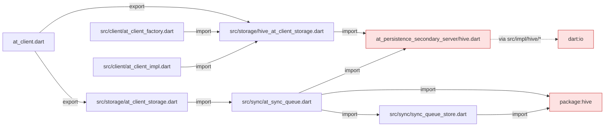
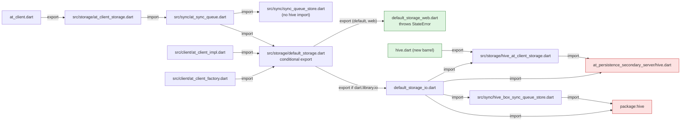

# pb3-stage4.md — Hive leaves the default barrel: `HiveAtClientStorage` moves to `package:at_client/hive.dart`

**Status:** PR open (checked 2026-09-28), [#2262](https://github.com/atsign-foundation/at_client_sdk/pull/2262), branch `st/wasm/stage4-hive-barrel`. It is stacked on stage3 (#2261), and stage5 (#2263) sits on top of it. **BREAKING** for `at_client` 4.0.0.

**Bottom line:**
- `package:at_client/at_client.dart` no longer exports `HiveAtClientStorage`. It now comes from `package:at_client/hive.dart`.
- On the web branch of the import graph, `package:hive` is unreachable from `at_client.dart`, `remote_only.dart` and `sqlite.dart`.
- On native, a client built with no `storage:` still gets Hive under `hiveStoragePath`, as before.
- On the web, a client that would have fallen back to Hive throws a `StateError` that points at `storage:` instead.
- `AtClientStorage` gains an abstract `persistenceBundle` getter, which is also **BREAKING** for a direct implementer.
- Consumers add one import line. `at_client_flutter.dart` re-exports `hive.dart`, so apps importing it change nothing.

**Related docs:**
- The storage bundle this builds on: [`pb3-stage1.md`](pb3-stage1.md).
- What comes after: [`pb3-stage6.md`](pb3-stage6.md), whose §1 shows the whole PB-3 stack.
- The rulings: [`decisions.md`](decisions.md) D-17 "V1 **ships** remote-only; the local store is a bundle choice, not a removed capability", D-1 "Injection over conditional imports" and D-2 "No throwing stubs".
- The gate that enforces D-2 "No throwing stubs": [`acceptance.md`](acceptance.md) T0.4 "no throwing fallbacks".
- The plan items: [`implementation-plan.md`](implementation-plan.md) I9 "Backend-neutral `AtSyncQueue`" and I10 "Drop the direct `hive: ^2.2.3` dependency".

---

## 1. Why

D-17 "V1 **ships** remote-only; the local store is a bundle choice, not a removed capability" fixes the browser payload: "no SQLite, no VFS, no `sqlite3.wasm`, no Hive in the shipped browser payload".

**Before stage4, every importer of `at_client.dart` paid for Hive, whatever storage it injected.** Three edges carried it:

| Edge (stage3) | Why it drags Hive in |
|---|---|
| `at_client.dart` exports `src/storage/hive_at_client_storage.dart` | That file imports `package:at_persistence_secondary_server/hive.dart` |
| `src/sync/at_sync_queue.dart` imports `package:hive/hive.dart` and `at_persistence_secondary_server/hive.dart` | The queue's fallback opened a Hive box itself |
| `src/sync/sync_queue_store.dart` imports `package:hive/hive.dart` | `HiveBoxSyncQueueStore` lived next to the neutral `SyncQueueStore` interface |

- `at_client_factory.dart` and `at_client_impl.dart` also imported `hive_at_client_storage.dart` directly, for the default, the location check and `persistenceBundle`.
- Hive is not only a payload cost. In `at_persistence_secondary_server` 5.3.0 (the resolved version), `hive_instances.dart`, `hive_base.dart` and `hive_at_keyvalue_store.dart` import `dart:io`. A browser build cannot use that code.

Stage5 (#2263), stacked on this, removes the remaining `dart:io` from `at_client.dart` and gates it in CI.

---

## 2. What

### Barrels, before and after

| Barrel | stage3 | stage4 |
|---|---|---|
| `package:at_client/at_client.dart` | Exports `HiveAtClientStorage` | Does not export it |
| `package:at_client/hive.dart` | — | **New.** Exports `src/storage/hive_at_client_storage.dart` |
| `package:at_client/remote_only.dart` | Unchanged | Unchanged |
| `package:at_client/sqlite.dart` | Unchanged | Unchanged |
| `package:at_client_flutter/at_client_flutter.dart` | Re-exports `at_client.dart` | Also re-exports `at_client/hive.dart` |

### Export and import edges

Edges are labelled `export` or `import`. `FAC` and `IMPL` are reached from `at_client.dart` through its other exports.

Before (stage3):



After (stage4):



- After stage4, `lib/src` imports `hive_at_client_storage.dart` in only two places: `hive.dart` and `default_storage_io.dart`.

### The default-storage seam

`src/storage/default_storage.dart` is two lines: `export 'default_storage_web.dart' if (dart.library.io) 'default_storage_io.dart';`. Both branches expose the same four functions.

| Function | Caller | `_io` branch | `_web` branch |
|---|---|---|---|
| `defaultAtClientStorage` | `AtClientImpl._init`, when no `storage:` is injected, `isLocalStoreRequired` is true and `hiveStoragePath` is set | `HiveAtClientStorage(atSign, storagePath, closedByClient)` | Throws `StateError` |
| `defaultStorageLocation` | factory `_locationOf` | `HiveAtClientStorage(...).location` | `null` |
| `isDefaultStorage` | factory's `isLocalStoreRequired` check | `storage is HiveAtClientStorage` | `false` |
| `defaultSyncQueueStore` | `AtSyncQueue.open`, when no `store:` is passed | `HiveBoxSyncQueueStore` on `HiveInstances.forPath(path)`, or the global `Hive` when the path is null | Throws `StateError` |

- `_init` still throws `Exception('Please set local storage path')` first when `hiveStoragePath` is null. A client with no `storage:` and `isLocalStoreRequired: false` reaches neither branch.
- The web `StateError` message: "There is no default storage on the web; pass storage: (e.g. RemoteOnlyAtClientStorage)".

### Other changes

| File | Change |
|---|---|
| `src/sync/hive_box_sync_queue_store.dart` (new) | `HiveBoxSyncQueueStore` moves here from `sync_queue_store.dart` |
| `src/sync/at_sync_queue.dart` | `open` drops the `injectedBox` test seam; it takes `store ?? await defaultSyncQueueStore(...)` |
| `src/storage/at_client_storage.dart` | New capability `AtPersistenceBundle? get persistenceBundle`; `AtClientStorageBase` returns `null` |
| `src/storage/hive_at_client_storage.dart` | Its `bundle` getter becomes the `persistenceBundle` override |
| `src/client/at_client_impl.dart` | `persistenceBundle => _storage?.persistenceBundle`, replacing a `storage is HiveAtClientStorage` check |
| `README.md` | Names `package:at_client/hive.dart` as where `HiveAtClientStorage` comes from |

---

## 3. Migration

A consumer that names `HiveAtClientStorage` adds one import:

```dart
// before
import 'package:at_client/at_client.dart';

// after
import 'package:at_client/at_client.dart';
import 'package:at_client/hive.dart';
```

| Consumer | Action |
|---|---|
| Dart app or CLI that constructs `HiveAtClientStorage` | Add `import 'package:at_client/hive.dart';` |
| Native app that passes no `storage:` | Nothing. The default is still Hive under `hiveStoragePath` |
| App importing `at_client_flutter.dart` | Nothing. It re-exports `hive.dart` |
| Browser app that passes no `storage:` | Pass one, e.g. `RemoteOnlyAtClientStorage` from `package:at_client/remote_only.dart`. Otherwise `StateError` |
| Code calling `HiveAtClientStorage.bundle` | Use `persistenceBundle` |
| A class that `implements AtClientStorage` directly | Implement `AtPersistenceBundle? get persistenceBundle`, or extend `AtClientStorageBase`, which returns `null` |
| Test code calling `AtSyncQueue.open(injectedBox: box)` | Use `open(store: HiveBoxSyncQueueStore(box))`, importing `src/sync/hive_box_sync_queue_store.dart` |

### Swept in this PR

| Package | Files that gained `import 'package:at_client/hive.dart'` |
|---|---|
| `at_client` tests | `at_client_create_test.dart`, `at_client_manager_principal_change_test.dart`, `process_exit/busy_client.dart`, `storage/at_client_storage_release_test.dart`, `storage/at_client_storage_wiring_test.dart`; `storage/hive_at_client_storage_test.dart` swaps its import |
| `at_onboarding_cli` | `lib/src/util/at_onboarding_preference.dart`, `example/util/atsign_preference.dart`, `test/at_onboarding_storage_test.dart` |
| `at_contact` | `test/test_util.dart` |
| `at_end2end_test` | `lib/src/test_preferences.dart`, `test/notify_with_isolate_test.dart` |
| `at_functional_test` | `lib/src/functional_storage.dart`, `test/sync_multiple_client_test.dart` |
| `at_client_skills` | `SKILL.md` and `01-deprecation-guide.md` name the import in the `hiveStoragePath` migration row; the `14-multi-agent.md` and `15-client-lifecycle.md` snippets gain the import |

---

## 4. Design choices

### Where Hive goes: a separate barrel plus an internal conditional default

| Option | Verdict |
|---|---|
| Keep Hive in `at_client.dart` | ✗ Every browser importer ships Hive, against D-17 "V1 **ships** remote-only; the local store is a bundle choice, not a removed capability" |
| Require `storage:` everywhere, no default (pure injection, per D-1 "Injection over conditional imports") | ✗ Breaks every native caller that relies on the `hiveStoragePath` default. The PR keeps that behaviour on native |
| **`hive.dart` barrel for the public type, and a conditional `default_storage.dart` for the internal default** | ✓ Follows the `remote_only.dart` / `sqlite.dart` pattern. Native behaviour is unchanged, and the web branch never reaches Hive |

- This choice sits against D-1 "Injection over conditional imports" and D-2 "No throwing stubs". The web branch is a throwing stub. §7 lists it as open.
- The 2026-09-14 amendment to D-1 "Injection over conditional imports" asks that a conditional in a gated package have both branches walked: the web branch by the ratchet and the native branch by a control.
- `at_client` has no stanza in `.github/wasm_gates.yaml` at stage4, so that audit does not apply yet. The PR's own walk covered the web branch plus two controls (§6). It reports no walk of `default_storage_io.dart` itself.

### `persistenceBundle`: a capability, not a type check

| Option | Verdict |
|---|---|
| `storage is HiveAtClientStorage ? storage.bundle : null` in `AtClientImpl` | ✗ Forces `at_client_impl.dart` to import the Hive class |
| **`AtClientStorage.persistenceBundle`** | ✓ Follows the precedent of `holdsKeyMaterial`: the storage declares what it has, and callers ask |

### `isDefaultStorage` on the web: accepted semantic change

- On the web, `isDefaultStorage` is always `false`. So an explicitly passed `HiveAtClientStorage` with `isLocalStoreRequired: false` is no longer refused there.
- The PR accepts this. A capability getter can replace the check if the refusal turns out to matter.

---

## 5. Tests

`test/storage/default_storage_test.dart` (new, 112 lines) imports both branches directly (`as io`, `as web`), so the web branch runs on the VM.

| Group | What it checks |
|---|---|
| `web branch` | `defaultAtClientStorage` and `defaultSyncQueueStore` throw a `StateError` naming `storage:`; `defaultStorageLocation` is `null`; `isDefaultStorage` is `false`, even for a `HiveAtClientStorage` |
| `io branch` | `defaultAtClientStorage` is a `HiveAtClientStorage` on the path with `closedByClient` kept; `defaultStorageLocation` equals the Hive `location`; `isDefaultStorage` is true only for Hive; `defaultSyncQueueStore` persists a record across a reopen on one path |
| `persistenceBundle` | `null` for `RemoteOnlyAtClientStorage` and `InMemoryAtClientStorage`; for Hive, `null` before attach, and after `AtClientImpl.create` the client's `persistenceBundle` is the same object as the storage's |

Other test edits:

| File | Change |
|---|---|
| `public_api_surface_test.dart` | The `at_client.dart` export golden drops `hive_at_client_storage.dart` |
| `sync_stop_abandons_test.dart` | The one `injectedBox:` caller now passes `store: HiveBoxSyncQueueStore(box)` |

---

## 6. Verification

As reported in the PR description:

| Check | Result |
|---|---|
| `at_client` suite | 2154 / 2154 |
| `dart analyze` | Clean on `at_client`, `at_onboarding_cli`, `at_contact`, `at_end2end_test`, `at_functional_test` |
| `flutter analyze` | Clean on `at_client_flutter` |
| Web-branch import walk | No `hive` from `at_client.dart`, `remote_only.dart` or `sqlite.dart` |
| Controls | `hive.dart` still reaches `hive`; `at_client.dart` reaches `default_storage_web.dart` and never `_io` |

- `.github/wasm_gates.yaml` has no `at_client` stanza at stage4; the gate arrives in stage5.
- Ripple check (run for this doc): at stage4, the only `implements AtClientStorage` in `lib/` is `AtClientStorageBase`, so no workspace class misses `persistenceBundle`.
- Diff: 35 files, +247 / −56, in two commits: `4bbcda0dc` (code) and `dedd2ed03` (`at_client_skills` docs).
- `CHANGELOG.md` is not touched in this PR. The PB-3 changelog entry for `hive.dart` lands later, in `7a467ebc4`.

---

## 7. Open items

| Item | Owner | Blocks |
|---|---|---|
| The web branch of `default_storage.dart` is a throwing stub, against D-2 "No throwing stubs", and the seam is a conditional export, against D-1 "Injection over conditional imports" | No ruling in `decisions.md` covers it. T0.4 "no throwing fallbacks" is not implemented, so D-2 "No throwing stubs" is upheld by review only. Needs an amendment to D-1 "Injection over conditional imports" and D-2 "No throwing stubs", or a follow-up that replaces the stub | Nothing at runtime. A browser app that passes `storage:` never reaches it |
| The direct `hive: ^2.2.3` dependency stays in `at_client`'s pubspec (plan item I10 "Drop the direct `hive: ^2.2.3` dependency") | Not assigned in this PR | Nothing on the web branch. It is still resolved on native through `default_storage_io.dart` |
| `isDefaultStorage` is `false` on the web, so the Hive refusal under `isLocalStoreRequired: false` no longer applies there | Whoever needs the refusal back; a capability getter replaces it | Nothing today |
