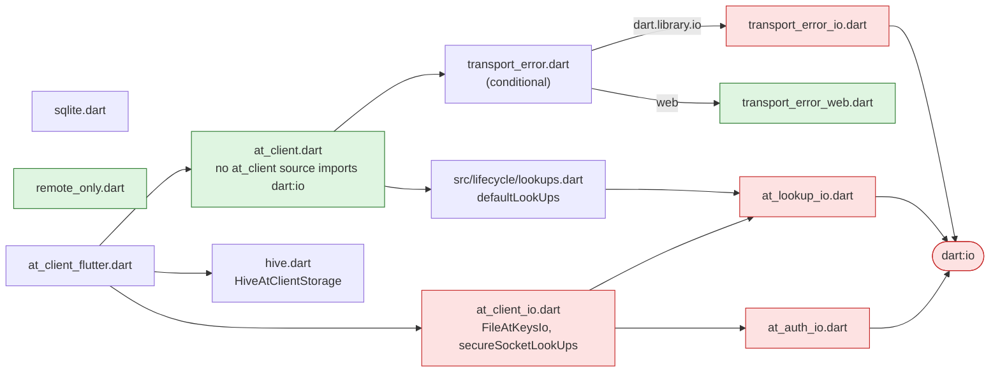
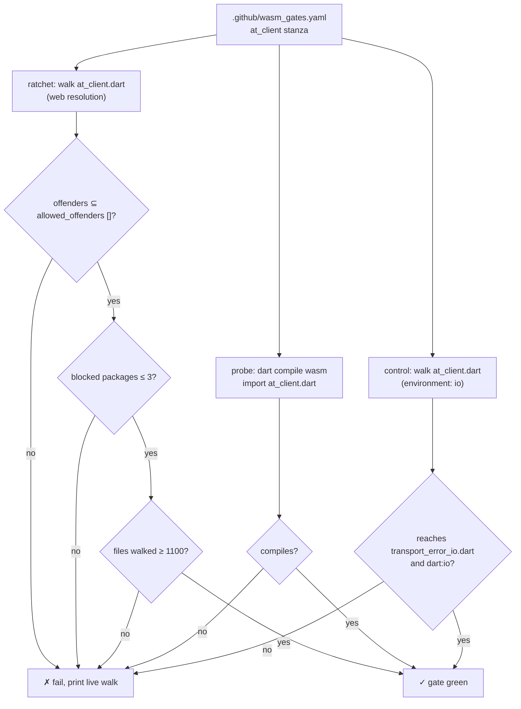

# pb3-stage5.md — `at_client.dart` carries no `dart:io`, the file/stream API is gone, and CI gates it

**Status:** PR open, 2026-09-28. [#2263](https://github.com/atsign-foundation/at_client_sdk/pull/2263), branch `st/wasm/stage5-io-split`. It is stacked on stage4 (#2262), and stage6 (#2273–#2276) sits on top of it.

**Bottom line:**
- **BREAKING:** the deprecated file-transfer and stream API is **deleted, not moved**. The SDK has no replacement for it.
- No source file in `at_client` imports `dart:io` any more when reached from `package:at_client/at_client.dart`. `FileAtKeysIo` and `secureSocketLookUps` move to a new barrel, `package:at_client/at_client_io.dart`.
- A new `at_client:` stanza in `.github/wasm_gates.yaml` holds that line: 0 offenders, and 3 blocked packages inherited from `at_lookup`, `at_utils` and `chalkdart`.
- `archive`, `http` and `internet_connection_checker` leave `at_client`'s `pubspec.yaml`.

**Related docs:**
- The stack and what came next: [`pb3-stage6.md`](pb3-stage6.md).
- The rulings: [`decisions.md`](decisions.md) D-3 "Breaking majors are accepted", D-5 "Native implementations live in `_io` barrels, not new packages", and D-6 "The structural gate is primary; the compiler is not a gate".
- The gate tooling: [`tools/wasm_shakedown/README.md`](../../../tools/wasm_shakedown/README.md).

---

## 1. Why

PB-3 is the `at_client` part of browser support. The goal is a client that runs in the browser with no disk and no `dart:io`.

- Before stage5, 7 of `at_client`'s own files imported `dart:io`. 5 were the file/stream API (`at_client_spec.dart`, `at_client_impl.dart`, `encryption_service.dart`, `file_transfer_service.dart`, `stream_notification_handler.dart`); `List<File>` sat in `AtClient`'s public signatures.
- The other 2 were `remote_secondary.dart` (for `isAvailable`) and `at_connection.dart` (for socket-error classification, §3).
- D-3 "Breaking majors are accepted" already names this break: "`dart:io File` leaves the `AtClient` public surface".
- Every removed member was already `@Deprecated`. Their messages said the file methods were "moved to app layer" and the stream methods were "Obsolete, will be removed in v4".
- So deleting was cheaper than porting. OQ-4 "File transfer: change the API, or extract the component?" offered both; this PR takes neither and removes the API.
- The PR also removes the last `at_client` caller of `getSocket()` (`RemoteSecondary.addStreamData`). That unblocks at_lookup T3 (#2223).

---

## 2. What was removed

| API | Replacement |
|---|---|
| `AtClient.uploadFile` / `downloadFile` / `reuploadFiles` / `shareFiles` | none — file transfer belongs to the app |
| `AtClient.stream` / `sendStreamAck` | none |
| `EncryptionService.encryptFileInChunks` / `decryptFileInChunks` | none (`generateFileEncryptionKey` stays) |
| `FileTransferService` (`file_transfer_service.dart`) | none |
| `src/stream/*`: `AtStreamNotification`, `AtStreamResponse`, `FileTransferObject`, `FileStatus`, `FileDownloadResponse`, `StreamNotificationHandler` | none |
| `ConnectivityListener` | none — its deprecation said to use "a connectivity checker of your own choice" |
| `RemoteSecondary.isAvailable` | none |
| `RemoteSecondary.addStreamData` | none |

| Dependency | Why it could go |
|---|---|
| `archive` | only `FileTransferService` used it |
| `http` | only `FileTransferService` used it |
| `internet_connection_checker` | only `ConnectivityListener` and `RemoteSecondary.isAvailable` used it |

Across the whole PR: 67 files changed, +110 / −927.

---

## 3. The io split

**`at_client.dart` stops exporting the two `dart:io` helpers, and a new `at_client_io.dart` exports only them.**

```dart
// packages/at_client/lib/at_client_io.dart
export 'package:at_auth/at_auth_io.dart' show FileAtKeysIo;
export 'package:at_lookup/at_lookup_io.dart' show secureSocketLookUps;
```

`at_client_io.dart` does **not** re-export `at_client.dart`. A `dart:io` app imports both.

### The one `dart:io` use left in `at_client`'s own code

`classifyConnectionFailure` in `at_connection.dart` checked `SocketException` and `HandshakeException`. That check now goes through `isTransportError`, behind a conditional export:

| File | Body |
|---|---|
| `transport_error.dart` | `export 'transport_error_web.dart' if (dart.library.io) 'transport_error_io.dart';` |
| `transport_error_io.dart` | `error is SocketException \|\| error is HandshakeException` |
| `transport_error_web.dart` | `false` |

- The web branch returns `false` because web transport errors arrive as at_lookup exceptions, and those are already classified.
- This is the same pattern as stage4's `default_storage.dart`.

### Barrels after stage5



- **Red** reaches `dart:io` directly. **Green** is what a browser build resolves.
- `lookups.dart` → `at_lookup_io.dart` is the one path from `at_client.dart` to `dart:io` that remains. It is inherited from `at_lookup`, not owned by `at_client`, and stays until PB-2.
- `at_client_flutter` re-exports `at_client_io.dart`, so Flutter apps see no change.

---

## 4. The CI gate

### Why a compile is not enough

**`dart compile wasm` does not reject `dart:io`.** It ships a stub that throws `Unsupported operation` at first use. That is why D-6 "The structural gate is primary; the compiler is not a gate" puts the import-graph walk above the compile.

`tools/wasm_shakedown` runs three checks per gated package:

| Key | What it does | Catches |
|---|---|---|
| `ratchets` | Walks the import graph from a barrel, resolving conditional imports as the web does | `dart:io`, and anything else forbidden, reachable from the barrel |
| `probe` | Runs `dart compile wasm` on a generated `void main() {}` that imports the barrel | Libraries dart2wasm rejects outright (`dart:html`, `dart:js`, `dart:ffi`, `dart:mirrors`) |
| `controls` | Walks the other side of a platform seam and asserts it still **reaches** a known file or library | A ratchet that has quietly stopped proving anything |

- **Offenders** are the gated package's own sources that reach a forbidden library. **Blocked packages** are all packages anywhere in the graph that own one.
- Both baselines are one-way. A new offender, or a count above the ceiling, fails. A fix passes with no edit.
- `min_files_walked` catches a stalled walk, which would otherwise find 0 offenders and pass.
- Controls resolve with io semantics by default. `environment: web` pins the other branch.



### The stanza added

```yaml
at_client:
  # Gated since PB-3 stage5; at_client.dart holds no dart:io. The three
  # blocked packages are inherited: at_lookup via lib/src/lifecycle/lookups.dart
  # (defaultLookUps, until PB-2), at_utils and chalkdart via the logger. Hive
  # and SQLite sit behind hive.dart / sqlite.dart and a conditional default.
  ratchets:
    - barrel: package:at_client/at_client.dart
      allowed_offenders: []
      max_blocked_packages: 3
      min_files_walked: 1100
  probe:
    - package:at_client/at_client.dart
  controls:
    - barrel: package:at_client/at_client.dart
      environment: io
      reaches_file: lib/src/lifecycle/transport_error_io.dart
      reaches_library: dart:io
      because: the socket-error classification the web branch stubs
```

- **Why this control:** controls only count files the gated package owns. Hive lives in package `hive`, and `at_client_io.dart` only re-exports other packages, so neither can serve. `transport_error_io.dart` is `at_client`'s own file on the io side of a seam.
- The yaml header comment drops `at_client` from its list of ungated packages.

### Measured (from the PR body)

| | Files walked | Offenders | Blocked packages |
|---|---|---|---|
| Before stage5 | 1283 | 7 | 8 |
| After stage5 | 1145 | 0 | 3 |

The 3 blocked packages:

| Package | Path into the graph | Owner |
|---|---|---|
| `at_lookup` | `lib/src/lifecycle/lookups.dart` → `at_lookup_io.dart` (`defaultLookUps`) | PB-2 (#2223) |
| `at_utils` | the logger | PB-1 (#2214) |
| `chalkdart` | the logger, via `at_utils` | PB-1 (#2214) |

---

## 5. Migration for consumers

| You use | Do this |
|---|---|
| `FileAtKeysIo` or `secureSocketLookUps` | Add `import 'package:at_client/at_client_io.dart';` next to `at_client.dart` |
| `at_client_flutter` | Nothing. It re-exports `at_client_io.dart` |
| Any API in §2 | Delete the call. Move file transfer or connectivity checks into the app |
| `archive`, `http` or `internet_connection_checker` through `at_client` | Declare it in your own `pubspec.yaml` |

The in-repo consumer sweep added the `at_client_io.dart` import to:

- `at_cli_commons` (`cli_base.dart`)
- `at_onboarding_cli`: lib (`at_onboarding_service_impl.dart`, `at_onboarding_preference.dart`, `create_at_client_cli.dart`), tests and examples
- `at_contact` (`test_util.dart`)
- `tests/at_end2end_test`, `tests/at_functional_test`, `tests/at_onboarding_cli_functional_tests`
- `at_client` tests, the `at_client_skills` snippets, and the `at_client` README

### CHANGELOG (`at_client` 4.0.0-rc1)

The 4.0.0-rc1 entry is new in this PR. It covers stage4 and stage5 together:

- BREAKING: `HiveAtClientStorage` is imported from `package:at_client/hive.dart`, and `FileAtKeysIo`/`secureSocketLookUps` from `package:at_client/at_client_io.dart`. `at_client_flutter` re-exports both.
- BREAKING: `uploadFile`, `downloadFile`, `reuploadFiles`, `shareFiles`, `stream`, `sendStreamAck`, `ConnectivityListener` and `RemoteSecondary.isAvailable` are removed.
- BREAKING: `HiveAtClientStorage.bundle` is `persistenceBundle`, a member of `AtClientStorage` (stage4).
- feat: on the web, a client built without `storage:` throws a `StateError` naming it (stage4).

---

## 6. Tests

| Test | Change |
|---|---|
| `test/lifecycle/transport_error_test.dart` | **New**, 2 tests. The io branch is true for `SocketException` and `HandshakeException` and false for `StateError`. The web branch is false for all three |
| `test/file_encryption_test.dart` | **Deleted**, 4 tests. It covered `encryptFileInChunks` / `decryptFileInChunks` |
| `test/samples/file_downloader.dart`, `file_uploader.dart`, `monitor/connectivity_test.dart` | **Deleted** with the APIs they exercised |
| `test/public_api_surface_test.dart` | Golden updated: `connectivity_listener.dart`, `at_auth_io.dart` and `at_lookup_io.dart` leave the `at_client.dart` export set |
| `enroll_test.dart`, `local_secondary_test.dart`, `notification_service_test.dart`, `test_utils/mocks.dart` | Import `at_client_io.dart` |

---

## 7. Verification

From the PR body:

| Check | Result |
|---|---|
| `at_client` suite | 2152 / 2152 (2154 − 4 deleted + 2 new) |
| `dart analyze`, every consumer | clean |
| `flutter analyze` | clean |
| `dart run wasm_shakedown` | green on all 3 gated packages (`at_chops`, `at_auth`, `at_client`) |

Commits:

| Commit | Subject |
|---|---|
| `408edbcbd` | feat(at_client)!: PB-3 stage5 — delete the file/stream API; at_client.dart carries no dart:io |
| `e4cbfc99c` | ci(wasm): gate at_client — 0 offenders, 3 inherited blocked packages |
| `7a467ebc4` | docs(at_client): PB-3 changelog — hive.dart, at_client_io.dart, file/stream API removal |

---

## 8. Open items

| Item | Owner | Blocks |
|---|---|---|
| The 3 inherited blocked packages (`at_lookup`, `at_utils`, `chalkdart`) | PB-1 / PB-2 (#2214, #2223) | A fully io-free graph. The gate ratchets at 3 until then |
| `tools/wasm_shakedown/README.md` still says `at_client` owns 7 offenders and lists only `at_chops` and `at_auth` as gated | Whoever next touches the tool | Nothing. The yaml is correct; only the README is stale |
| The CHANGELOG omits `RemoteSecondary.addStreamData` and `EncryptionService.encryptFileInChunks` / `decryptFileInChunks` | This PR, if wanted | Nothing. `RemoteSecondary` is exported from `at_client.dart`, so `addStreamData` was public |
| `at_client_io.dart` exports only the io helpers. D-5 "Native implementations live in `_io` barrels, not new packages" describes each `_io` barrel as "exporting the neutral barrel plus the native implementations" | Your call: amend D-5 or re-export `at_client.dart` | Nothing. Consumers import both barrels today |
| `remote_only.dart` has no gate of its own | Done in stage6a (#2273) | — |
