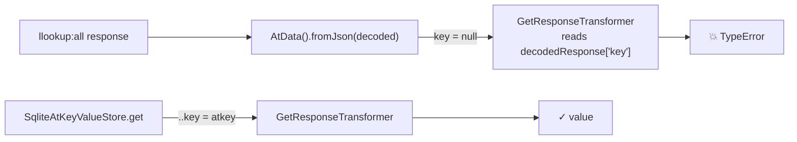
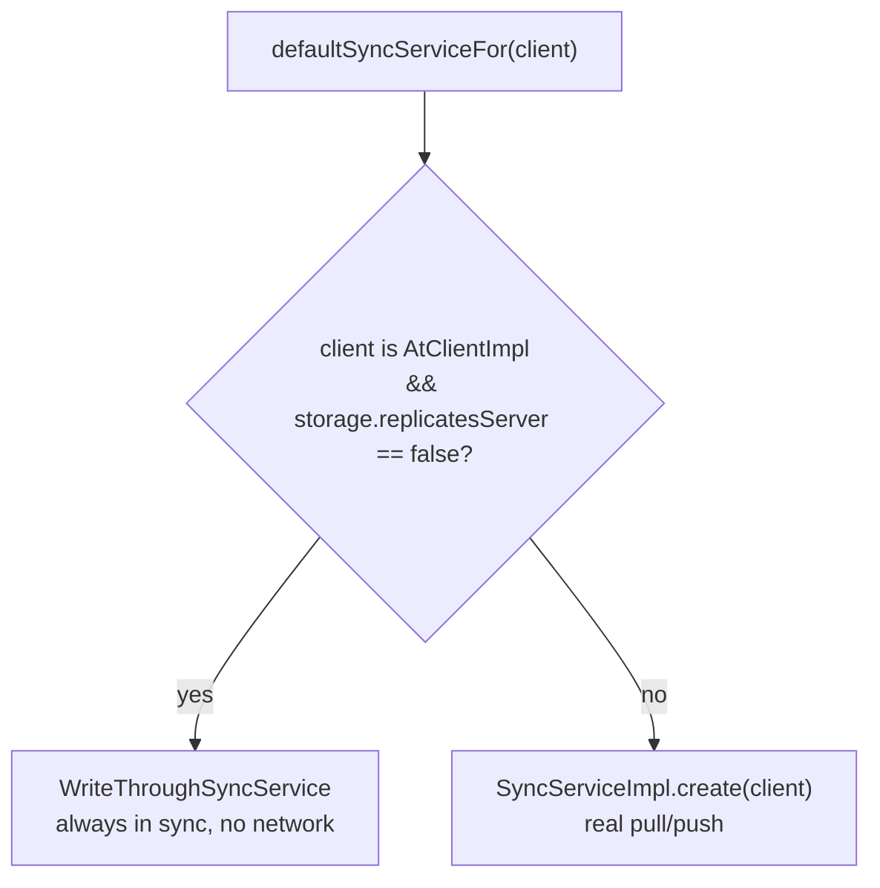
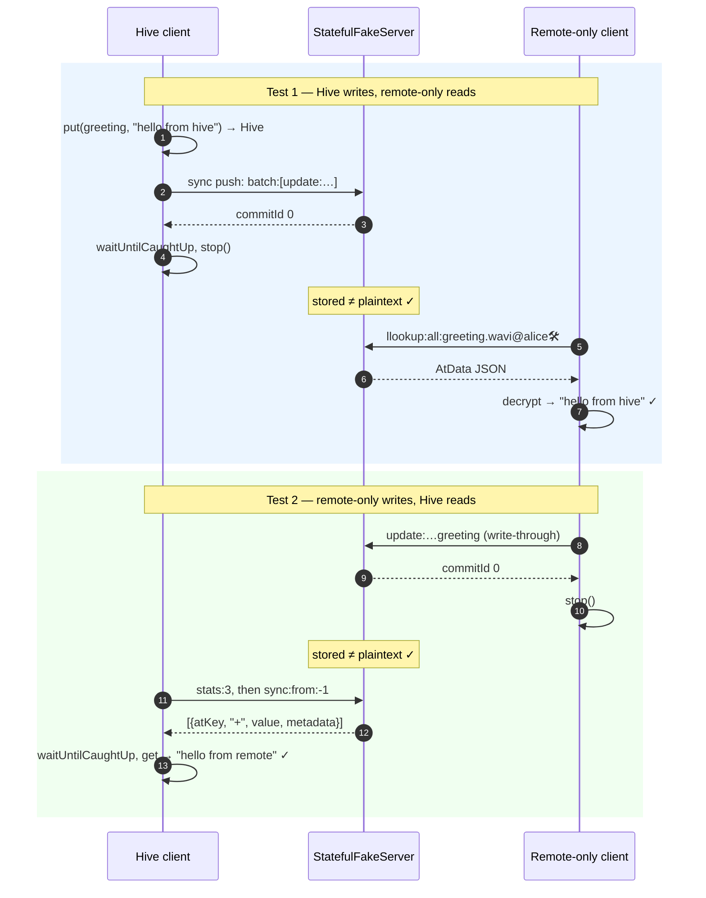

# pb3-stage6.md — remote-only clients: gated, fixed, and proven interoperable

**Status:** PRs open, 2026-09-28. The stack is [#2273](https://github.com/atsign-foundation/at_client_sdk/pull/2273) 6a → [#2274](https://github.com/atsign-foundation/at_client_sdk/pull/2274) 6b → [#2275](https://github.com/atsign-foundation/at_client_sdk/pull/2275) 6c → [#2276](https://github.com/atsign-foundation/at_client_sdk/pull/2276) 6d, and it sits on top of stage5 (#2263).

**Bottom line:**
- A client on `RemoteOnlyAtClientStorage` ("Mode E") now compiles under dart2wasm and has a CI gate.
- It reads its own keys without crashing, and it no longer runs a sync loop that can only fail.
- It exchanges data with a Hive client through one atServer, in both directions. Acceptance gate **X-R2** now passes.

**Related docs:**
- The storage bundle: [`pb3-stage1.md`](pb3-stage1.md).
- The rulings: [`decisions.md`](decisions.md) D-17 "V1 ships remote-only" and D-18 "Remote-only as an AtClientStorage impl".
- The gate definition: [`acceptance.md`](acceptance.md) §9a.2.

---

## 1. Where this sits in PB-3

PB-3 is the `at_client` part of browser support. The goal is a client that runs in the browser with no disk and no `dart:io`.

```mermaid
graph LR
  T[trunk] --> S1["#2257 stage1<br/>Mode E constructs"]
  S1 --> S2a["#2258 2a<br/>NoopSyncQueueStore"]
  S2a --> S2b["#2259 2b<br/>RemoteWriteThroughKeyStore"]
  S2b --> S2c["#2260 2c<br/>RemoteOnlyAtClientStorage"]
  S2c --> S3["#2261 stage3<br/>R3 key-material precondition"]
  S3 --> S4["#2262 stage4<br/>Hive → hive.dart"]
  S4 --> S5["#2263 stage5<br/>at_client.dart has no dart:io"]
  S5 --> S6a["#2273 6a<br/>gate remote_only.dart"]
  S6a --> S6b["#2274 6b<br/>get stamps AtData.key"]
  S6b --> S6c["#2275 6c<br/>WriteThroughSyncService"]
  S6c --> S6d["#2276 6d<br/>X-R2 interop test"]
  classDef new fill:#dff5e1,stroke:#2e7d32;
  class S6a,S6b,S6c,S6d new;
```



| Stage | PR | What it delivered | Doc |
|---|---|---|---|
| 1 | #2257 | The factory accepts a non-Hive storage when `isLocalStoreRequired: false`, and chops setup always runs | [`pb3-stage1.md`](pb3-stage1.md) |
| 2a | #2258 | `NoopSyncQueueStore`: the sync queue keeps nothing on disk | [`pb3-stage2.md`](pb3-stage2.md) |
| 2b | #2259 | `RemoteWriteThroughKeyStore`: every write goes straight to the atServer, and `local:` keys stay in the session | [`pb3-stage2.md`](pb3-stage2.md) |
| 2c | #2260 | `RemoteOnlyAtClientStorage` bundles the two, exported from `package:at_client/remote_only.dart` | [`pb3-stage2.md`](pb3-stage2.md) |
| 3 | #2261 | R3: a remote-only storage demands key material up front, so an ephemeral session can enroll | [`pb3-stage3.md`](pb3-stage3.md) |
| 4 | #2262 | **BREAKING:** `HiveAtClientStorage` moves to `package:at_client/hive.dart` | [`pb3-stage4.md`](pb3-stage4.md) |
| 5 | #2263 | **BREAKING:** the file/stream API is deleted, `at_client.dart` has no `dart:io`, and CI gates it | [`pb3-stage5.md`](pb3-stage5.md) |
| **6a–6d** | **#2273–#2276** | **Remote-only barrel gated, `get` and sync fixed, X-R2 passes** | **This doc** |

---

## 2. The stage6 asks, and what came of them

| Ask | Result | Branch |
|---|---|---|
| "fix the wasm compile thing" | `remote_only.dart` gets its own ratchet and a compile probe. 0 offenders, and it compiles | 6a |
| (found while running X-R2) | `get` on a remote-only client threw a `TypeError`. Fixed | 6b |
| "fix the syncService warning" | A remote-only client gets `WriteThroughSyncService`, and the warning is gone | 6c |
| "perform the x-r2 test" | Two tests, one per direction. Both green | 6d |

**Order is deliberate.** The `get` fix (6b) sits under the sync fix and the test, so each PR is green on its own. 6d depends on both fixes.

---

## 3. 6a — WASM gate for `remote_only.dart`

### Why

- stage5 gated `package:at_client/at_client.dart` only.
- `remote_only.dart` is the barrel that browser apps will import. If nothing gates it, a new `dart:io` import can slip in unnoticed.
- **dart2wasm does not reject `dart:io` imports.** The compile alone proves nothing, which is why the gate also runs an import-graph walk (the "ratchet").

### What

The change is in `.github/wasm_gates.yaml`, under `at_client`:

```yaml
    - barrel: package:at_client/remote_only.dart
      allowed_offenders: []
      max_blocked_packages: 3
      min_files_walked: 1050
  probe:
    - package:at_client/at_client.dart
    - package:at_client/remote_only.dart
```

### Measured

| Barrel | Files walked | Offenders | Blocked packages | dart2wasm compile |
|---|---|---|---|---|
| `at_client.dart` | 1146 | 0 / 0 | 3 / 3 | ok |
| `remote_only.dart` | 1097 | 0 / 0 | 3 / 3 | ok |

- **`min_files_walked`** guards against a false pass. If the walk broke and found 0 files, it would also find 0 offenders.
- **The 3 blocked packages** are `at_lookup`, `at_utils` and `chalkdart`. They are inherited, and PB-1/PB-2 own them (#2214, #2223).

---

## 4. 6b — `get` crashed on remote-only clients

### Symptom

X-R2 direction 1 failed with:

```
type 'Null' is not a subtype of type 'String'
  in GetResponseTransformer
```

### Root cause

**`AtData.fromJson` never sets `AtData.key`.** Each keystore stamps the key after reading, but `RemoteWriteThroughKeyStore` skipped that step.



### Fix

One line in `lib/src/storage/remote_write_through_keystore.dart`. It matches what the SQLite store already does:

```dart
return AtData().fromJson(decoded)..key = key;
```

### Test (TDD, red first)

`remote_write_through_keystore_test.dart` gains "get stamps the AtData with the key it was read under". It asserts `result?.key == '@alice:phone@bob'`.

### Why no unit test caught it

The stage2b tests only checked `.data` and `.metaData`. It took a full `AtClient.get` round trip to reach the transformer, and X-R2 was the first test to make one.

---

## 5. 6c — the sync warning

### Symptom

Every remote-only client logged `Unexpected exception in sync` in a loop.

### Root cause

The factory always built `SyncServiceImpl`. `SyncServiceImpl` reconciles a **local replica** against the server. A remote-only client has no replica: every write already lands on the server. So sync had nothing to reconcile, and failed each time it tried.

### Design choice: a capability flag, not a type check

| Option | Verdict |
|---|---|
| `storage is RemoteOnlyAtClientStorage` in the factory | ✗ Couples the factory to one concrete class, and a second write-through backend would need another branch |
| **`AtClientStorage.replicatesServer`** | ✓ Follows the precedent of `holdsKeyMaterial`: the storage declares what it can do, and callers ask |

### What

| File | Change |
|---|---|
| `at_client_storage.dart` | New abstract `bool get replicatesServer`, with `AtClientStorageBase` returning `true` |
| `remote_only_at_client_storage.dart` | `replicatesServer => false` |
| `write_through_sync_service.dart` (new) | `WriteThroughSyncService` plus the `defaultSyncServiceFor` chooser |
| `at_client_factory.dart`, `at_client_manager.dart` | Both call `defaultSyncServiceFor(...)`. There is one chooser, not two |



### How `WriteThroughSyncService` behaves

| Member | Behavior |
|---|---|
| `isInSync` | `true` |
| `isSyncInProgress` | `false` |
| `sync(onDone:)` | Emits success in a **microtask**: a `SyncProgress` with `pendingPushCount: 0` to listeners, then a `SyncResult(success, dataChange: false)` to `onDone` |
| `waitUntilCaughtUp` | Completes at once. The base implementation already treats a success with null commit ids as "caught up" |
| listeners | `add`, `remove` and `removeAllProgressListeners` work on a plain set |

- **Why a microtask:** callers register listeners after calling `sync()`. If the result were emitted synchronously, those listeners would miss it.

### Tests

| Test | What it checks |
|---|---|
| `write_through_sync_service_test.dart` | 4 tests: in sync / not in progress, success reaches both `onDone` and listeners, a removed listener hears nothing, `waitUntilCaughtUp` completes |
| `remote_only_at_client_storage_test.dart`, group `sync` | Both `buildAtClient` and `DefaultAtServiceFactory().syncService` produce a `WriteThroughSyncService` |

### Ripple check

- No class in the workspace implements `AtClientStorage` directly, so none misses the new abstract member.
- The pure-Dart dependents (`at_contact`, `at_cli_commons`, `at_policy`, `at_onboarding_cli`) analyze with 0 errors.

---

## 6. 6d — X-R2 interop test

### Why

§9a.2 X-R2 asks that a Hive client and a remote-only client **read each other's writes** through one atServer. If they can't, Mode E forks the data model.

### Design

| Decision | Reason |
|---|---|
| Fake the server at the **`RemoteSecondary`** layer, not the socket | This is the layer both storages talk to. A socket fake would be testing the wire format, which is someone else's job |
| Parse commands with the real **at_commons verb builders** | The fake stores what the client actually sent, so a metadata encoding bug would surface |
| Run the two clients **one after the other** | There is one live client per atSign (D-22 "One client per atSign, no process globals") |
| `closedByClient: true` on the remote-only storage | `client.stop()` then releases the storage, so the next client can open it |
| Assert the stored value is **not** the plaintext | This proves a self key arrives encrypted, rather than only round-tripping |

### `StatefulFakeServer` (`test/test_utils/stateful_remote.dart`)

It holds one records map and one commit log, and wraps them in a `MockRemoteSecondary`.

| Input | Handling |
|---|---|
| `update:…` | Parses with `UpdateVerbBuilder`, stores the value plus the protocol metadata strings, and commits `+` |
| `delete:…` | Parses with `DeleteVerbBuilder`, removes the record, and commits `-` |
| `batch:[{id,command}]` | Runs each command and answers `[{id, response:{data:"<commitId>"}}]` |
| `StatsVerbBuilder` | Returns `[{"id":"3","name":"lastCommitID","value":"N"}]` |
| `SyncVerbBuilder` | Returns the latest entry per key with `commitId > from`, capped at `limit` |
| `LLookupVerbBuilder` | Returns `AtData` JSON, or throws `KeyNotFoundException` |
| anything else, including `update:meta:` | Throws `UnimplementedError` rather than failing silently |

### The two directions



### What X-R2 caught

- **The 6b bug.** Direction 1 crashed in `GetResponseTransformer`, as described in §4.
- **A test bug, not a product bug.** Direction 2 failed with "another storage is already open at remote:@alice🛠". The storage was missing `closedByClient: true`.

---

## 7. Verification

| Branch | at_client suite | analyze | wasm gate |
|---|---|---|---|
| 6a | — | clean | ✓ both barrels |
| 6b | 2153 / 2153 | clean | ✓ |
| 6c | 2159 / 2159 | clean | ✓ |
| 6d | 2161 / 2161 | clean | ✓ |

- Across 6a–6d: 13 files changed, +479 / −8.
- None of the commits carries an AI attribution trailer.
- `CHANGELOG.md` (4.0.0-rc1) has three new entries: the `get` fix, the **BREAKING** `replicatesServer` member, and the sync-warning fix.

---

## 8. Open items

| Item | Owner | Blocks |
|---|---|---|
| The 3 inherited blocked packages (`at_lookup`, `at_utils`, `chalkdart`) | PB-1 / PB-2 (#2214, #2223) | A fully io-free graph. The gate ratchets at 3 until then |
| Whether to cherry-pick the 6b `get` fix onto stage2b (#2259) | Your call. #2259 is untouched for now | Nothing. The fix reaches trunk through the stack either way |
| `update:meta:` in `StatefulFakeServer` | Whoever next needs it in a test | Nothing today. The fake throws `UnimplementedError` for it |
| X-R2 against a **real** atServer | Later, in the functional/e2e lane | Nothing for PB-3. The fake covers the client-side contract |
