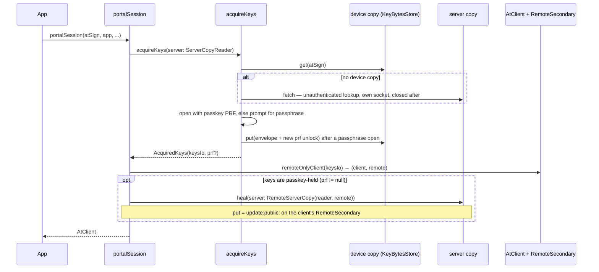

# pb5-h-sessions.md — sessions: acquire keys, heal the server copy

**Status:** on branch `st/wasm/pb5-sessions`, 2026-10-08. No PR yet. It sits on layer C (#2271), the cutter (#2272) and the rebased PB-3 stage 6d (#2276).

**Bottom line:**
- `at_client_wasm` starts a client in one call, in one of two modes:
  - `ephemeralSession` (Mode E): keys handed in, nothing written anywhere.
  - `portalSession` (Mode P): keys from the portal-cut envelope, unlocked by passkey or passphrase.
- Reading keys and repairing the server copy are two functions, and the type system keeps them apart:
  - `acquireKeys` only reads the server copy.
  - `heal` is the only writer.
- Heal goes over the client's own authenticated connection. No second socket is opened for it.
- **One open contract question for the portal (R-5):** what a device must do after the portal re-cuts the keys.

**Related docs:**
- The golden envelope contract: [`packages/at_client_wasm/test/fixtures/README.md`](../../../packages/at_client_wasm/test/fixtures/README.md).
- The remote-only storage this runs on: [`pb3-stage6.md`](pb3-stage6.md).
- The portal-cuts-keys ruling: [`decisions.md`](decisions.md).

---

## 1. Two modes

| | Mode E — `ephemeralSession` | Mode P — `portalSession` |
|---|---|---|
| Keys come from | the caller (`AtKeys`) | the envelope at `_atkeys.<app>@<atSign>` |
| Unlock | none | passkey PRF, else the recovery passphrase |
| Device writes | none | the device copy (`KeyBytesStore`) and the passkey credential hint |
| Server writes | none | `heal` only, and only on `healed` |
| Storage | `RemoteOnlyAtClientStorage` | `RemoteOnlyAtClientStorage` |

## 2. Acquire, then heal

- **Type-enforced split.**
  - `acquireKeys` takes a `ServerCopyReader`, which has `fetch` only.
  - `heal` takes a `ServerCopy`, which adds `put`.
  - Acquisition writing the server copy is therefore a compile error, not a review finding.
- **Why heal runs after the client exists.**
  - Writing the server copy needs an authenticated connection.
  - The client already holds one. `RemoteServerCopy` writes on it and never closes it.
- **A failed heal is logged, and the client keeps running.** Heal is repair, not a precondition for the session.

## 3. Heal outcomes

| `HealOutcome` | Found | Writes |
|---|---|---|
| `healed` | The server copy has no unlock for this passkey | `put` of the device copy merged with the server copy's unlocks |
| `alreadyPresent` | The server copy already opens with the passkey | nothing |
| `contentKeyMismatch` | The device and server copies seal different content keys, so the portal re-cut | nothing |
| `missingCopy` | The device or the server copy is absent | nothing |

## 4. ServerCopy adapters

| Adapter | Role | Connection |
|---|---|---|
| `LookupServerCopyReader` | `fetch` | A fresh `lookUps(authenticator: null)` connection. It sends `lookup:_atkeys.<app>@<atSign>` and is closed in `finally` |
| `RemoteServerCopy` | `fetch` through the reader, `put` | `put` is `updateCommand` on the client's `RemoteSecondary` with `auth: true`, which it leaves open |

- `fetch` reads AT0015 (key not found) and `data:null` as `null`. Every other error propagates.
- **Rejected alternative:** a second authenticated connection just for `put`.
  - It would PKAM twice per session.
  - It would leave a socket authenticated as the enrollment, which is the second-socket leak that stage 6 removed.

## 5. Open — R-5: re-cut contract

- A portal **re-cut** issues a new content key and seals a new envelope. Its triggers include:
  - a lost passphrase;
  - re-enrollment;
  - the OQ-K1 KDF remedy.
- Every existing device copy and every `prf` unlock is then stale:
  - `heal` reports `contentKeyMismatch` and writes nothing.
  - A passkey synced to a new device falls back to the passphrase.
- **Question for the portal's owners:**
  - When does the portal re-cut?
  - Must a device drop its copy and re-acquire from the server?
- Detecting a re-cut proactively, by comparing a hash of the server copy's `content.ct`, is deferred to PB-8 / V2.

## 6. Findings

- **The dart2wasm passphrase-open hang (open, not a KDF-cost issue).**
  - Under dart2wasm in Chrome, a test that opens an envelope with a passphrase *more than once* never completes. It times out, then hangs the runner for about 4.5 minutes.
  - Affected tests:
    - `key_envelope_test` round trip and golden;
    - `tool/cut_test` `cutEnvelope`;
    - `session_test` "acquireKeys first visit".
  - It is not the KDF. PBKDF2 at 1000 iterations hangs exactly as argon2id does.
  - It is deterministic, and these all pass:
    - a single passphrase open;
    - the KDF and AES-GCM primitives, alone and chained, in every `package:cryptography` browser/Dart backend combination.
  - It depends on the shape of the test: the same two opens hang when their inputs are built in `main()`, and pass when the inputs are built inside the test body.
  - dart2js and the VM pass. It also reproduces on the pre-restack branch.
  - Next step: minimise it to a standalone repro and file it against dart2wasm or `package:test`. The timeouts are not raised.
- **Golden read in the browser.**
  - The golden test now reads `test/fixtures/envelope_v1_golden.dart`.
  - `test/fixtures_test.dart` (VM) pins that constant to the JSON contract file byte for byte.
  - It passes on dart2js. On dart2wasm it hits the hang above.
- **The at_client follow-up ([#2336](https://github.com/atsign-foundation/at_client_sdk/pull/2336), merged into this branch):**
  - A remote-only client starts with `isLocalStoreRequired` at its default.
  - Rederiving after an enrollment change moves `RemoteOnlyAtClientStorage` onto the new `RemoteSecondary`.
  - `remoteOnlyClient` no longer sets `isLocalStoreRequired = false`.
