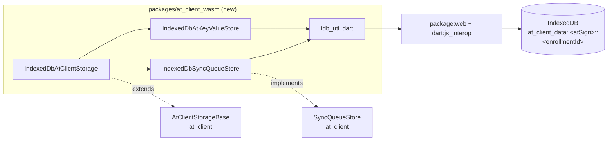

# Spike: raw-IndexedDB local replica (W4 / D4 input)

**Status:** spike complete · 2026-09-29 · branch `st/wasm/spike-idb-storage` (off `st/wasm/stage6d-x-r2-interop`) · not committed

## 1. Verdict

**A raw-IndexedDB `AtClientStorage` works and costs ~57× less payload than SQLite-wasm: +6.6 KB gzipped vs ≥ +376.9 KB.**

- It passes the at_client storage contract and syncs both ways against a fake server. All 25 tests pass under dart2js and under dart2wasm in Chrome.
- On payload alone this makes a case for **D4 "raw IndexedDB backend (V2)"**. Per `implementation-plan.md:1189`, D4 happens only if W4 rules `sqlite3.wasm` out. The ~348 KB gzipped binary is the thing W4 has to weigh.
- Nothing here changes V1. D-17 "V1 ships remote-only" stands, and no ruling is filed.

## 2. What was built



| Piece | Shape |
|---|---|
| Package | `packages/at_client_wasm`, created fresh. The IDB helpers were copied from `pb5-sessions`, with no dependency override (R2). Barrel: `lib/at_client_wasm.dart` |
| DB identity | One DB per (atSign, enrollmentId), per D-13. `location` = `idb:at_client_data::<atSign>::<enrollmentId>`. An empty `enrollmentId` → `ArgumentError`, and there is no legacy segment (R3) |
| Object stores | `records` (out-of-line key = canonical atKey; value `{json, expiresAt, availableAt}`; indexes on both timestamps), and `sync_queue` |
| Keystore | Parity target is `SqliteAtKeyValueStore`. Each method is one IDB transaction, with no non-IDB `await` inside. Read-modify-writes go through `_readModifyWrite` |
| Sync queue | An in-memory `Map` loaded at open serves the synchronous `keys` / `get`, and `put` / `delete` / `clear` write through |

## 3. Payload

The same toy app (`tool/payload/common.dart`: build client → `put` → `get`) is compiled in three variants with `dart compile wasm -O2`, on Dart 3.14.0-95.2.beta.

Repeated runs of `tool/payload/measure.sh` on the same code gave byte-identical output.

| Variant | `.wasm` | `.wasm` gz | `.mjs` | `.mjs` gz |
|---|---:|---:|---:|---:|
| `remote_only` (baseline) | 1,071,778 | 371,105 | 15,297 | 4,166 |
| `indexed_db` | 1,089,111 | 377,198 | 18,192 | 4,655 |
| `sqlite3_wasm` glue | 1,151,601 | 398,841 | 23,471 | 5,365 |
| `sqlite3.wasm` binary (2.9.4) | 730,989 | 347,931 | — | — |

### Delta over baseline

| Backend | Raw | **Gzipped** |
|---|---:|---:|
| IndexedDB | +20,228 | **+6,582** |
| SQLite-wasm (glue + binary) | +818,986 | **+376,866** |

- **The SQLite figure is a lower bound.** No `AtClientStorage` over `sqlite3/wasm` exists yet, so the variant counts only the bindings, the IDB VFS and the binary. The keystore adapter would add more on top.
- Latency was not measured as a verdict (D-21).

## 4. Parity deviations from `SqliteAtKeyValueStore`

| # | Deviation | Impact |
|---|---|---|
| P1 | `transaction`, `snapshot`, `scanKeys`, `queryByPath` and `stats` throw `UnsupportedError` | Nothing in at_client calls them. This is the `RemoteWriteThroughKeyStore` precedent |
| P2 | `getKeys` is a full cursor scan, with the regex applied in Dart | O(n) per call. A mirrored key index is the alternative (§6) |
| P3 | The sync-queue mirror updates before its IDB transaction commits | If the transaction fails, memory and disk diverge until the next open |
| P4 | No multi-tab coordination. `onversionchange` closes the connection, and nothing more | Two tabs on one (atSign, enrollmentId) can interleave writes |

## 5. Traps met

| Trap | Symptom | Fix |
|---|---|---|
| **dart2wasm forwards defaulted named args into `noSuchMethod`** | A mocktail `when(() => remote.executeVerb(any()))` fails with "ArgumentMatcher was declared as named sync…". Only under dart2wasm | `StatefulFakeServer` overrides `executeVerb` rather than stubbing it. This matters to any at_client test headed for `-c dart2wasm` |
| Read-modify-write split across two transactions | `put` / `putAll` / `putMeta` read in one transaction and wrote in another. Concurrent `put`s on one key could both see "absent" and emit two `KeyAdded`s, or lose a metadata merge | `_readModifyWrite` reads and writes in one readwrite transaction. The synchronous `AtMetadataBuilder.build()` runs inside the read's `onsuccess`. Covered by the concurrent-put test |
| `removeMany` counted every key | Absent keys were counted and emitted `KeyRemoved`, unlike SQLite's `_existsSync` guard | A `getKey` probe per key inside the same transaction |
| Keystore `close()` closed `changes` | A post-close cursor write threw "Cannot add new events after calling close"; SQLite's `close()` is a no-op | `close()` is a no-op, matching SQLite |
| An unclosed connection blocks `deleteDatabase` | Each test stalled 8–14 s | Close the storage in `tearDown` before deleting |
| Transaction `abort` isn't `error` | `transactionToFuture` could hang forever on a quota or constraint abort | Listen for `onabort` too |
| `closeBackend` left `_db` set | Reopening the same instance returned "not open". Covered by a regression test that is red without the fix | Null every handle on close |
| A `late` field initialised inside `when()` | mocktail "any used outside stubbing" | Assign eagerly in the constructor |

The IDB auto-commit rule (a transaction closes at the first non-IDB `await`) was designed around up front, so it never fired.

## 6. Open questions

1. **Wasm gate (R5) is blocked by the tool, not the code.**
   - `wasm_shakedown` requires `controls`.
   - A control must name an *offender inside the package*, drawn from a fixed web-hostile set.
   - A browser-only package has none, by design.
   - Measured anyway: ratchet 1,151 files walked, 0/0 offenders, 3/3 blocked; probe compiles.
   - Unblocking it needs a tool change, e.g. a per-control `forbidden:` override so `environment: io` can assert `dart:js_interop` is reached.
2. **`getKeys` strategy:** cursor scan vs an in-memory key index mirrored at open, the same shape as the sync-queue mirror. The trade-off is memory vs O(n) IDB reads per call.
3. **Merge with pb5.** pb5's `at_client_wasm` depends on `at_chops` and not on at_client. Merging both means add/add conflicts on `pubspec.yaml` and the barrel, which R2 accepted.
4. **Ruling needed if pursued:**
   - D4 moves from "reserve" to "candidate" in `design.md` §5;
   - D-17's V2 default choice must name IndexedDB vs SQLite-wasm.

## 7. Reproduce

```bash
cd packages/at_client_wasm
dart test -p chrome                    # 25/25
dart test -p chrome -c dart2wasm       # 25/25
./tool/payload/measure.sh              # §3 table
```
