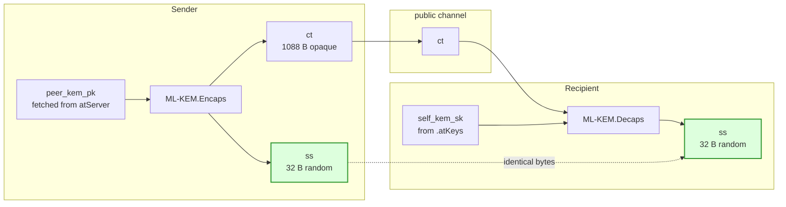
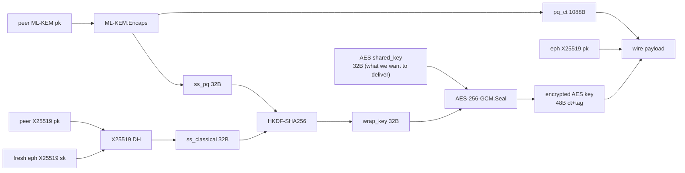

# ML-KEM — Mental model and role in the PQ migration

**Status: Draft.** Explanatory file. The framing here is settled cryptographic background, but everything it links to (component plan, dependencies, mechanisms) is still draft.

Two questions worth nailing down before reading the rest of the PQ docs:

1. **What does ML-KEM actually do, and how does it "transport" an AES key?**
2. **Why does asymmetric crypto exist at all if symmetric crypto is stronger?**

This file answers both. It is intentionally non-implementation — for protocol/algorithm specifics see [`mechanisms.md`](mechanisms.md), [`components.md`](components.md), and [`../pq-migration.md`](../pq-migration.md).

---

## 1. What ML-KEM actually does

ML-KEM is a **Key Encapsulation Mechanism**, not an encryption algorithm. It cannot encrypt arbitrary plaintext — not an AES key, not a message, not anything you hand it. What it does:

The green boxes are the same 32 bytes — derived independently on each side. **Only `ct` crosses the wire; `ss` never does.**

The trick: the 32-byte `ss` is generated **inside the algorithm**, not chosen by the sender. The sender doesn't pick a secret and encrypt it for the recipient (that would be "key transport"). Instead:

- Sender runs `Encaps(peer_pk)` → outputs `(ct, ss)`. The `ss` is freshly random and recoverable only by someone holding the matching `sk`.
- Sender ships `ct` (which leaks nothing about `ss` to an eavesdropper, even one with a quantum computer).
- Recipient runs `Decaps(sk, ct)` → outputs the same `ss`.

Both ends now share a 32-byte symmetric key established **without ever putting it on the wire**.

---

## 2. How an AES key gets "transported"

It doesn't, technically. The flow is:

In plain English:

1. **Both sides agree on a shared secret** via ML-KEM + X25519 (the two KEMs run side by side). Neither side picked it — the maths produced it.
2. **HKDF turns that shared secret into an AES wrap key.**
3. **AES-256-GCM uses the wrap key to actually encrypt the AES `shared_key`** — this is the step that "transports" the bytes.

So ML-KEM's role is **to establish a symmetric key without transmitting it.** AES-GCM then does the actual data encryption using that established key.

The "harvest now, decrypt later" attack on RSA is defeated because the sender never produces a ciphertext that, once decrypted, would reveal the AES key. The AES key isn't in the wire payload — it's the *output* of a computation a quantum-equipped eavesdropper still cannot run without `sk`.

---

## 3. The RSA correction

A common misconception: *"ML-KEM lets us transport RSA keys quantum-safely."*

No. RSA is being **removed** from this path entirely. Three things in the design:

| Algorithm | Role | Quantum-safe? |
|---|---|---|
| **ML-KEM-768** | Establishes a shared secret between two atSigns | Yes (lattice-based, FIPS 203) |
| **X25519** | Same job, classical fallback woven in alongside | No, but kept for defense-in-depth |
| **AES-256-GCM** | Uses the established secret to wrap the AES `shared_key` | Yes — symmetric ciphers are largely quantum-resistant; Grover's algorithm only halves effective key strength, so AES-256 → 128 bits, still safe |

RSA disappears from this code path once Track 1 ships. It only remains in the codebase for backwards-compatible fallback to non-PQ peers.

### One-line answer

> ML-KEM lets two parties **derive the same symmetric key without ever sending it across the network** — that derived key then encrypts the AES `shared_key` via AES-GCM. We are replacing RSA-OAEP, not protecting RSA keys.

---

## 4. Why asymmetric crypto exists if symmetric is stronger

> *"The weakness of symmetric key encryption was the transmission of the secret over the public domain, and ML-KEM solves that. In actuality the strength of symmetric key encryption is stronger than that of asymmetric key encryption."*

Both halves of that statement are correct. The precisions:

### 4.1 Symmetric's historical weakness

AES (and its predecessors) need both parties to already share a secret. Pre-1976 there was no way to do that over an insecure channel without meeting in person or trusting a courier. This was *the* unsolved problem of cryptography until Diffie–Hellman.

### 4.2 What "ML-KEM solves" really means

Diffie–Hellman (1976) and RSA (1977) **already solved** the bootstrap problem for classical adversaries. ML-KEM solves it again for the **quantum** threat model, because DH and RSA both break under Shor's algorithm. ML-KEM is a quantum-safe replacement for the *role* DH/RSA play (establishing a shared symmetric key over a public channel), not a brand-new capability.

### 4.3 Why symmetric is "stronger"

| Property | Symmetric (AES) | Asymmetric (RSA / ECC / lattice) |
|---|---|---|
| Foundation | "No structural shortcut exists" — empirical, decades of cryptanalysis | Specific math problem is hard (factoring, discrete log, LWE) |
| Best attack | Exhaustive search: 2^n | Sub-exponential algorithms exist for every scheme |
| Security strength per bit | AES-128 ≈ 128-bit security | RSA-3072 ≈ 128-bit security |
| Quantum impact | Halved (Grover): AES-256 → 128-bit | Broken (Shor) for RSA/ECC; PQ schemes degrade differently |
| Performance | ~1000× faster than asymmetric | Slow, especially PQ |

Implications:

- **Asymmetric crypto is a necessary evil**, not a goal. We use it solely to bootstrap a symmetric key, then throw it away for that session and rely on symmetric crypto for the actual work.
- **AES-256 will likely outlive RSA, ECC, and even ML-KEM** as a primitive. Symmetric ciphers age slowly; asymmetric schemes get retired every couple of decades when new mathematical attacks appear, and PQ algorithms haven't yet had the same cryptanalytic scrutiny AES has had.

### 4.4 The cleaner phrasing

> Symmetric encryption (AES) is the stronger, faster primitive, but it has one weakness: getting the key to both parties without anyone overhearing. Public-key crypto (DH, RSA, and now ML-KEM) exists *solely* to solve that bootstrap problem. ML-KEM updates the bootstrap to survive quantum attackers; the actual data is still — and always was — protected by symmetric crypto.

That's the mental model: **asymmetric crypto delivers the symmetric key; symmetric crypto delivers the data.** Always has been.

---

## See also

- [`mechanisms.md`](mechanisms.md) — algorithm/protocol catalog with wrap/unwrap sequence diagrams
- [`components.md`](components.md) — 11-component architecture and the three goals (A: hybrid KEM, B: SPQR, C: PQ-MLS)
- [`dependencies.md`](dependencies.md) — why mlkem-native over liboqs
- [`../pq-migration.md`](../pq-migration.md) — full Track 1 plan (Stage 1 + Stage 2)
