# PQ Compliance — Component Architecture

**Status: Draft.** Nothing in this file is locked. All component names, package boundaries, suite IDs, and stage assignments are working proposals to be discussed and revised.

Full set of components needed for atProtocol to become end-to-end post-quantum compliant. Aligns with the three goals in issue [#1893](https://github.com/atsign-foundation/at_client_sdk/issues/1893).

Each component below has a purpose, a mechanism diagram, and the package(s) that own it. A unified block diagram at the end shows how they compose.

Related drafts in this directory: [`algorithms-and-protocols.md`](algorithms-and-protocols.md) (algorithms/protocols catalog), [`crypto-fundamentals.md`](crypto-fundamentals.md) (mental model for ML-KEM's role), [`native-dependencies.md`](native-dependencies.md) (native dep candidates), [`pqxdh-spqr-deep-dive.md`](pqxdh-spqr-deep-dive.md) (Goal B deep dive — threat model, prekey bundles, ratchet state, wire formats).

---

## The three goals (from issue #1893)

| Goal | Name | What it gives us | Status / stage | Specs |
|---|---|---|---|---|
| **A** | **Hybrid classical + PQ KEM** | Replace RSA-OAEP key-wrap with X25519 ‖ ML-KEM-768 so an attacker recording today's traffic can't decrypt it once quantum computers exist (defeats "harvest now, decrypt later"). Static `shared_key.<peer>@me` objects become PQ-safe. | **Stage 1 + 2** (Track 1, this plan) | [FIPS 203](https://csrc.nist.gov/pubs/fips/203/final) (ML-KEM), [RFC 7748](https://datatracker.ietf.org/doc/html/rfc7748) (X25519), [draft-ietf-tls-hybrid-design](https://datatracker.ietf.org/doc/draft-ietf-tls-hybrid-design/) (hybrid construction) |
| **B** | **Signal SPQR — Sparse Post-Quantum Ratchet** (built on PQXDH session init) | Per-session **forward secrecy** and **post-compromise security** for streamed messages between two atSigns. Each message uses a fresh key; old keys are deleted; key compromise heals on the next ratchet step. PQ-resistant version of Signal's Double Ratchet. **Requires PQXDH** for PQ-safe session initialization (Component 12). | Stage 3 | [Signal SPQR announcement (2025)](https://signal.org/blog/spqr/), [PQXDH spec](https://signal.org/docs/specifications/pqxdh/) |
| **C** | **PQ-MLS — `draft-ietf-mls-combiner`** | Group messaging analogue of B: shared group key with PQ guarantees, scales O(log N) for member adds/removes/rekeys. Needed for any multi-party atProtocol surface (group chat, shared collections, multi-device). | Stage 4 | [draft-ietf-mls-combiner](https://datatracker.ietf.org/doc/draft-ietf-mls-combiner/), [RFC 9420 (MLS base)](https://datatracker.ietf.org/doc/html/rfc9420) |

**Why all three, not just A:** Goal A protects static keys at rest. It does **not** give forward secrecy — if a peer's private key leaks tomorrow, every message encrypted under shared keys derived from it is exposed. SPQR (B) plugs that hole for 1:1 streams. PQ-MLS (C) does the same for groups. The three goals are layered, not alternatives.

---

## Component inventory

| # | Component | Goal A | Goal B | Goal C | Owner package |
|---|---|:--:|:--:|:--:|---|
| 1 | Hybrid KEM (key wrap) | ✓ | | | `at_chops` + `at_chops_pq_native` |
| 2 | Hybrid Signatures (PKAM auth) | future | | | `at_chops` + `at_chops_pq_native` |
| 3 | Identity & `.atKeys` schema | ✓ | ✓ | ✓ | `at_auth` |
| 4 | Public key directory & verbs | ✓ | ✓ | ✓ | atServer + `at_client` |
| 5 | Capability & suite negotiation | ✓ | ✓ | ✓ | `at_client` + atServer `from:` |
| 6 | Wire envelope format | ✓ | ✓ | ✓ | `at_protocol` / `at_commons` |
| 7 | Forward-secret session ratchet (SPQR) | | ✓ | | new `at_pq_ratchet` (Stage 3) |
| 8 | Group ratchet (PQ-MLS) | | | ✓ | new `at_pq_mls` (Stage 4) |
| 9 | Native FFI backend | ✓ | ✓ | ✓ | `at_chops_pq_native` |
| 10 | Trust-on-first-PQ & downgrade defense | ✓ | ✓ | ✓ | `at_client` |
| 11 | Key migration & rotation | ✓ | ✓ | ✓ | `at_auth` + `at_client` |
| 12 | PQXDH — session initialization | | ✓ | | new `at_pq_ratchet` (Stage 3) |

---

## 1. Hybrid KEM — key wrap

Replaces RSA-OAEP wrap of the per-conversation AES shared key.

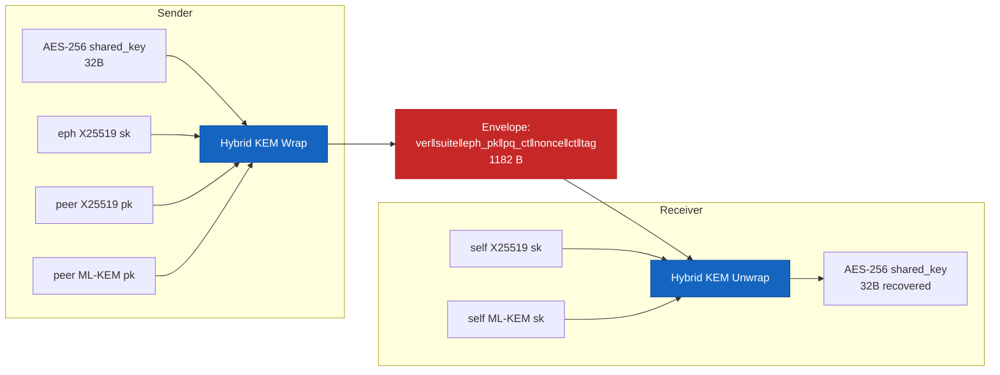

**Algorithms:** X25519 (RFC 7748) ‖ ML-KEM-768 (FIPS 203) → HKDF-SHA256 (RFC 5869) → AES-256-GCM (NIST SP 800-38D).

---

## 2. Hybrid Signatures — PKAM authentication

Replaces RSA-PKAM with hybrid Ed25519 + ML-DSA-65. Track 1 leaves this alone; this is Stage 5 (the renamed Track 2).

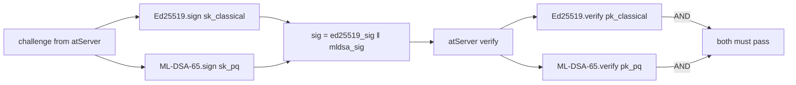

**Why concatenation, not OR:** if either component is broken, the strong one still authenticates. NIST PQC hybrid signature guidance.

---

## 3. Identity & `.atKeys` schema

Each atSign keeps several long-term keypairs. Schema extends, never replaces, existing fields.

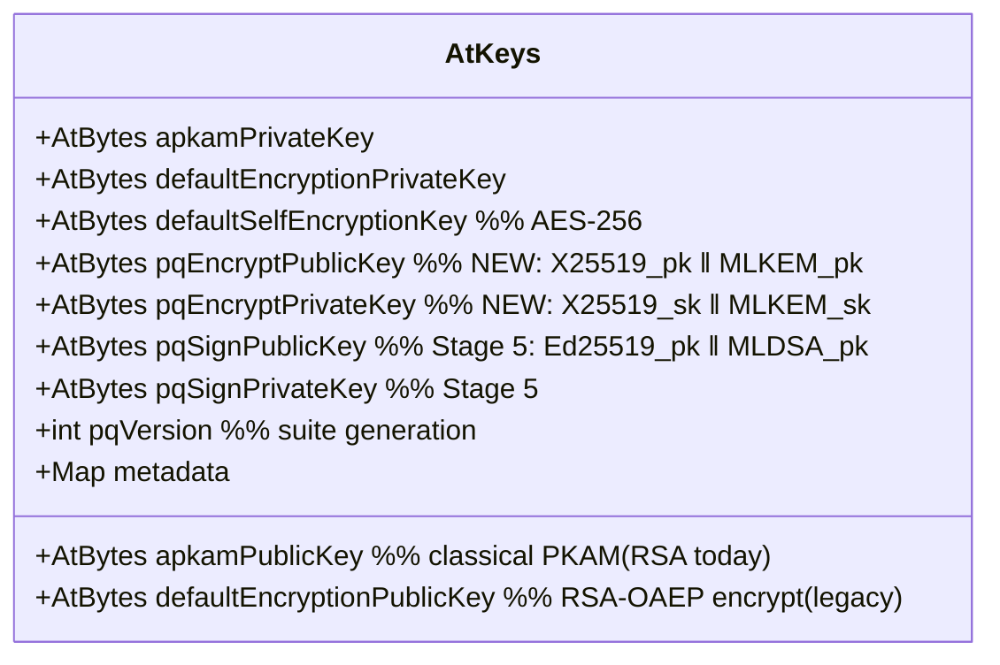

**Persistence:** same `~/.atsign/keys/<atsign>_key.atKeys` file, JSON-serialized, AES-CTR encrypted with the Argon2id-derived passphrase key. No file location change.

---

## 4. Public key directory & verbs

atServer must serve every flavor of public key. Existing `lookup:publickey.<atsign>` returns RSA; new verbs return PQ blobs.

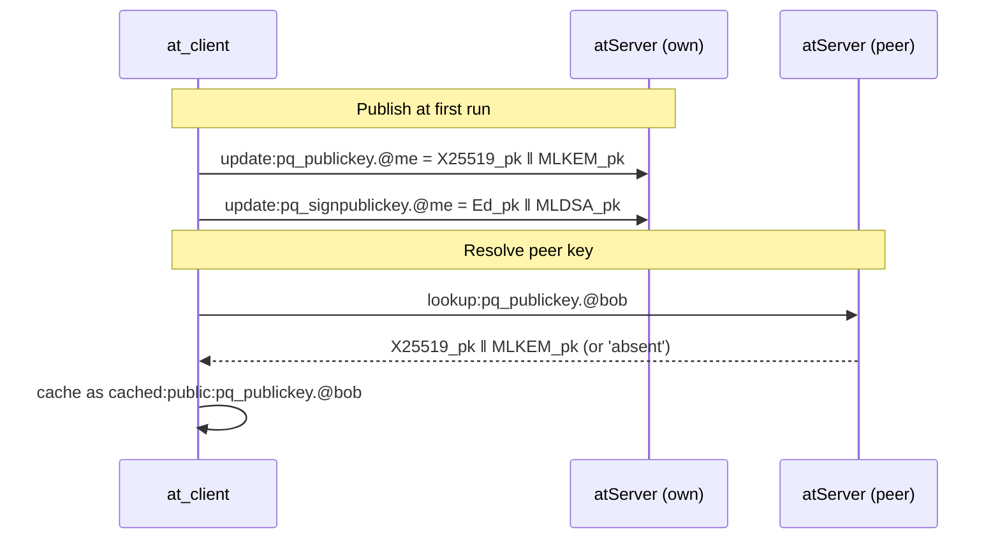

**Storage at server:** ordinary keystore entries with public scope. **Negotiation hint:** `from:` response advertises `"pq": ["mlkem768_x25519_v1", ...]`.

---

## 5. Capability & suite negotiation

Both parties must agree on a suite before they wrap or sign. Uses an explicit registry, not version inference.

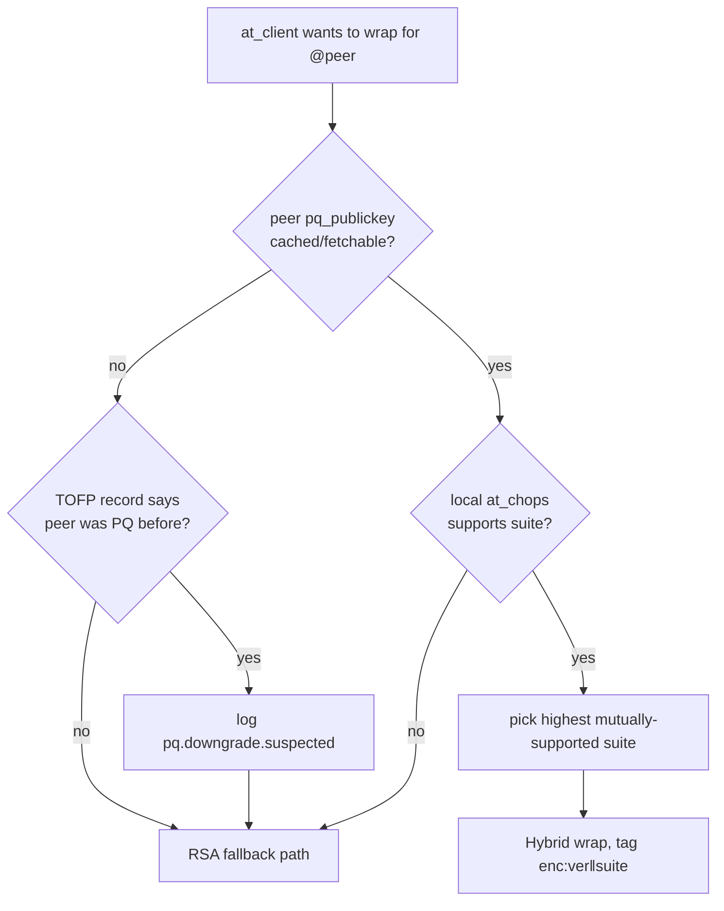

**Suite IDs (proposed registry):**
| ID | Suite |
|---|---|
| `0x01` | `MLKEM768_X25519_HKDF_SHA256_AESGCM256` |
| `0x02` | `MLKEM1024_X25519_HKDF_SHA512_AESGCM256` (future) |

---

## 6. Wire envelope format

A single self-describing byte layout for every wrapped object. Parsable without context: first 2 bytes always tell you version + suite.

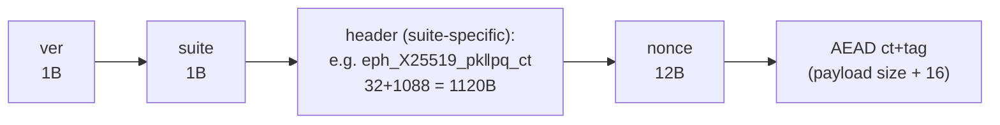

**Property:** `ver` covers parser breaks (e.g., adding a 4-byte AAD-length prefix later). `suite` covers crypto changes within the same wire schema. They are intentionally separate axes of evolution.

---

## 7. Forward-secret session ratchet — SPQR (Goal B)

Signal's SPQR is a **triple ratchet** — symmetric chain + classical DH ratchet + sparse PQ KEM ratchet — that runs *after* a session has been established via PQXDH (Component 12). It provides forward secrecy and post-compromise security for streamed messages between two atSigns.

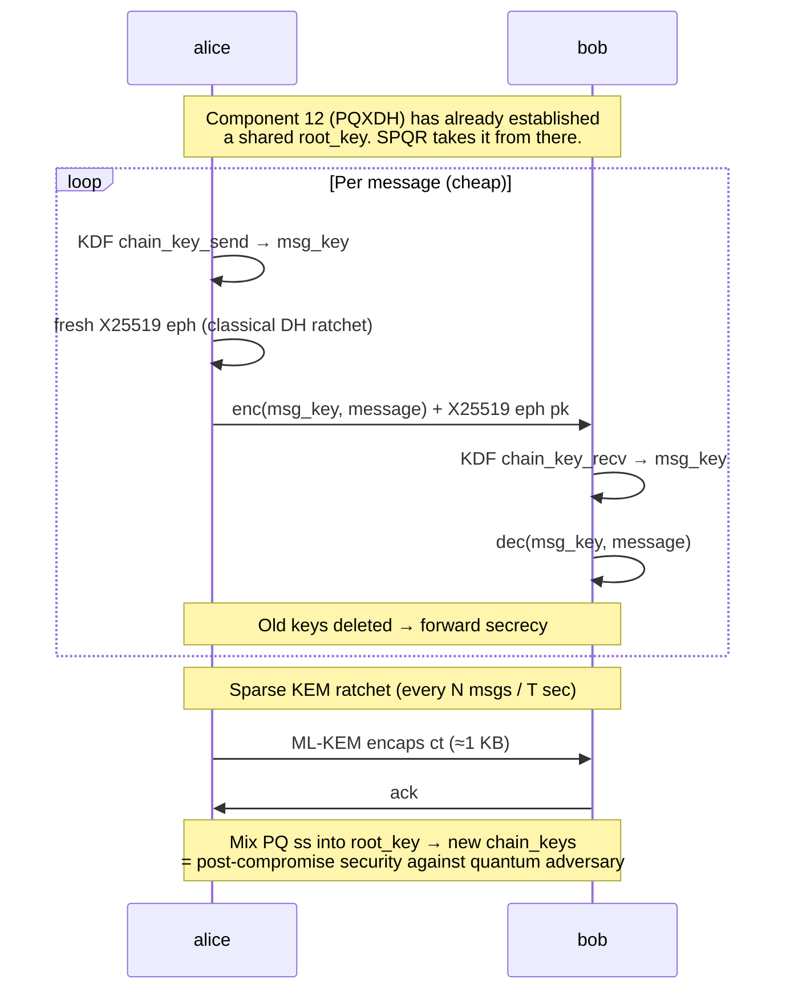

**Why "sparse":** ML-KEM ciphertexts are ~1 KB. Running KEM per message tanks mobile bandwidth/battery. SPQR runs DH every message (cheap) and KEM periodically (expensive but amortized). PQ entropy still mixes into the root_key, so PQ guarantees propagate across the sparse boundaries.

**Position in atProtocol:** notification/stream payloads (chat, presence, real-time). NOT for static shared keys — those stay on Component 1.

**Dependency:** Component 12 (PQXDH) must produce the initial `root_key`. Without PQ session-init, SPQR's PQ guarantees collapse — see [`crypto-fundamentals.md`](crypto-fundamentals.md) for the mental model, §12 below for the architectural role, and [`pqxdh-spqr-deep-dive.md`](pqxdh-spqr-deep-dive.md) for the full state machine and wire formats.

---

## 8. Group ratchet — PQ-MLS (Goal C)

`draft-ietf-mls-combiner` defines a PQ variant of MLS. Group secret tree where each node combines classical + PQ KEM. Stage 4 work.

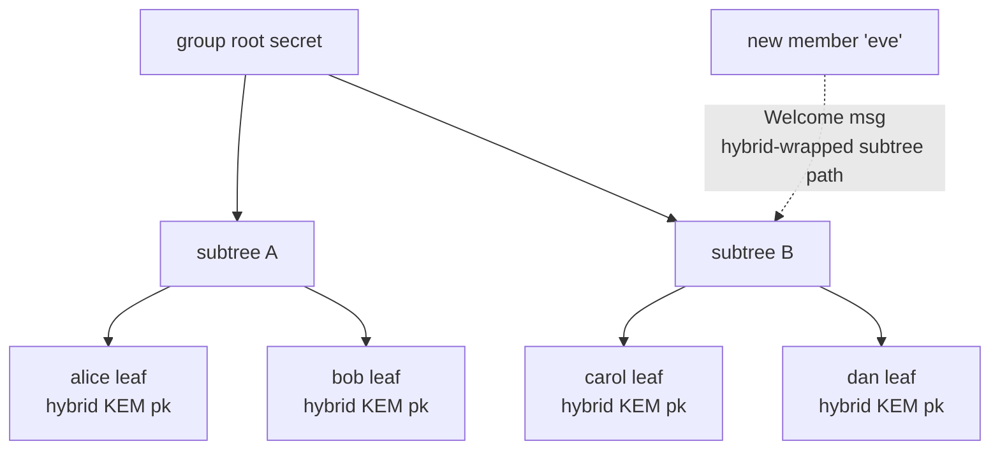

**Why MLS-combiner instead of n-pairwise SPQR:** MLS scales O(log N) for adds/removes and key rotation in a group of N. SPQR is O(N).

---

## 9. Native FFI backend

The only home for non-Dart code in this work. Two PQ schemes via the same plugin.

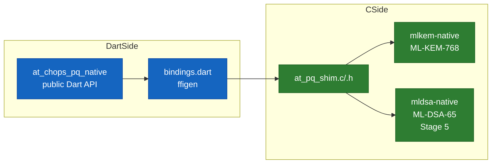

**Build artifacts:** per-platform static lib (.a/.so/.dll). **Web:** not in scope — needs Emscripten WASM build (Stage future).

---

## 10. Trust-on-first-PQ & downgrade defense

A passive MITM can strip `lookup:pq_publickey` responses, silently downgrading. Defense is per-peer persistence + observability.

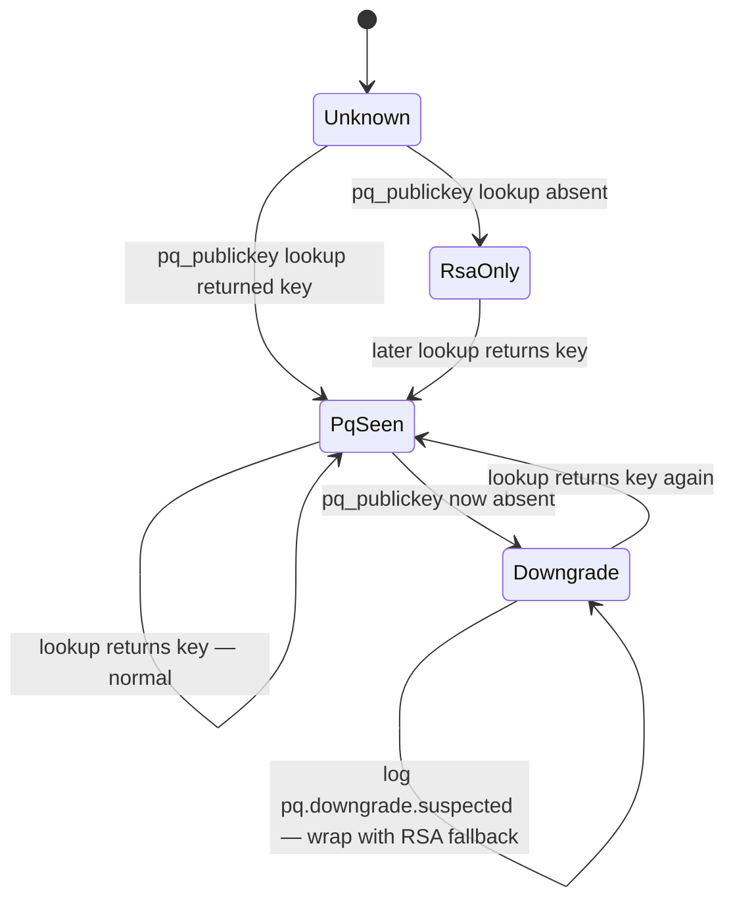

**Storage:** local SQLite/keystore record `{peer_atsign → first_pq_seen_at}`. **Stage 1 policy:** log only. **Future:** refuse fallback once `PqSeen` is reached, after PQ coverage stabilises.

---

## 11. Key migration & rotation

Two distinct flows: first-time PQ generation, and periodic rotation. Both must keep old keys readable to decrypt historical data.

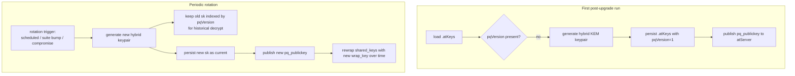

**Compromise recovery:** out of scope for Track 1 — flagged as Stage 5 follow-up.

---

## 12. PQXDH — post-quantum session initialization (Goal B prerequisite)

Signal's PQXDH (Post-Quantum Extended Diffie-Hellman) is the **session-init** companion to SPQR. It produces the initial `root_key` that SPQR (Component 7) ratchets forward from. Without PQXDH (or an equivalent PQ key agreement at session start), SPQR ratchets from classically-bootstrapped secrets — fatal under harvest-now-decrypt-later.

PQXDH solves three problems simultaneously:

| Problem | How PQXDH addresses it |
|---|---|
| PQ-safe key agreement at session start | Hybrid X25519 + ML-KEM KEM (same primitive as Goal A) |
| Asynchronous delivery — alice can send to offline bob | Prekey bundle published to atServer in advance |
| Identity binding & deniability | Long-term identity key signs the prekey bundle |

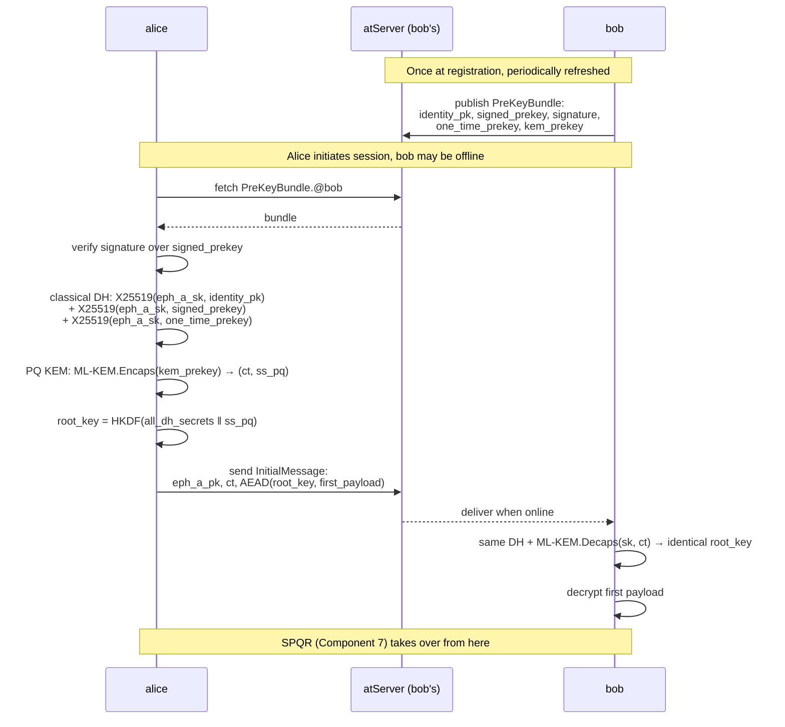

**Why this is its own component and not part of Component 7:** PQXDH runs **once per session** at the start; SPQR runs **per message** for the lifetime of the session. Different cadences, different state, different code paths. Signal documents them as a matched pair for exactly this reason — their security proofs are joint.

**Could we substitute Goal A's hybrid KEM directly?** The cryptographic primitive is the same. But PQXDH adds the **prekey-bundle** protocol layer (async delivery + identity binding) which Goal A's static `shared_key.<peer>@me` flow doesn't need. atProtocol notifications are async, so we'd need that layer either way — adopting PQXDH wholesale (vs reinventing) is the working proposal; not yet decided.

**Storage at atServer:** new keystore entries for each atSign:
- `public:pq_signed_prekey.@me` (rotated periodically)
- `public:pq_one_time_prekeys.@me` (consumed on use, replenished by client)
- `public:pq_kem_prekey.@me`

---

## Unified block diagram

Split into two views to keep the labels legible. Diagram 1 shows the per-device component stack; Diagram 2 shows the wire interactions between devices and atServers. Both sides (alice / bob) mirror Diagram 1 — drawing it once is sufficient.

### 1. Per-device component stack

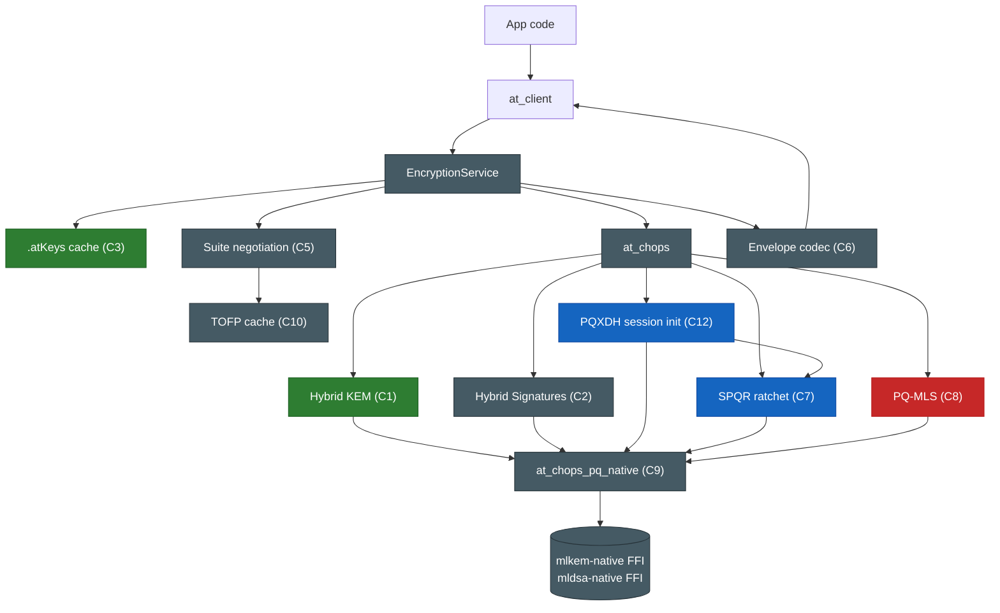

### 2. Cross-device wire flow

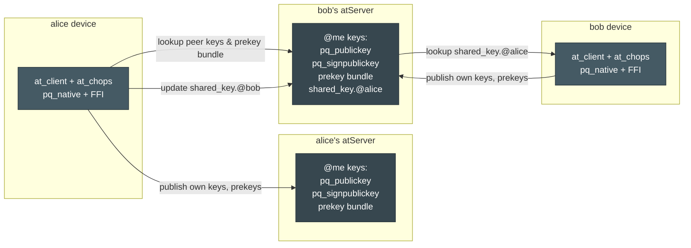

**Color legend** (Diagram 1):
- **Green** = Goal A (Track 1, hybrid KEM key wrap)
- **Blue** = Goal B (Stage 3, SPQR + PQXDH)
- **Red** = Goal C (Stage 4, PQ-MLS)
- **Slate** = Shared infrastructure (envelope, FFI, suite negotiation, TOFP, signatures, at_chops, EncryptionService)

---

## Order of construction (what blocks what)

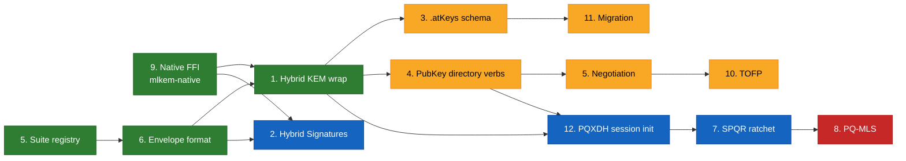

Critical path: **Native FFI (9) → Envelope (6) → Hybrid KEM (1) → PQXDH (12) → SPQR (7).** Goal C (PQ-MLS) reuses every primitive built for A + B; no new cryptographic primitives needed.
