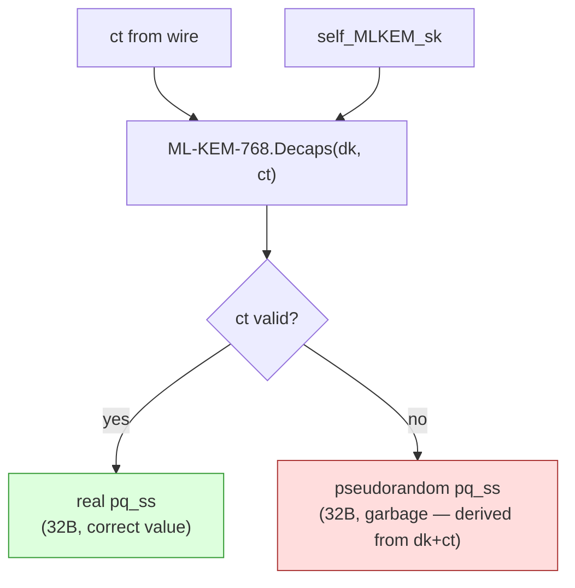
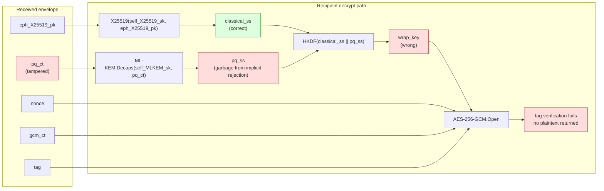
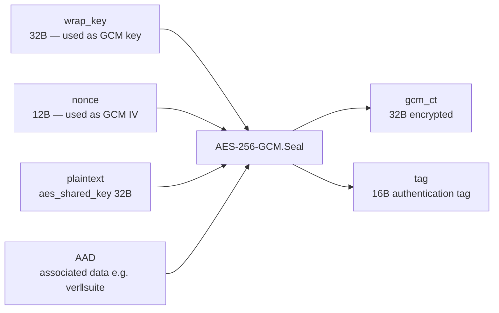
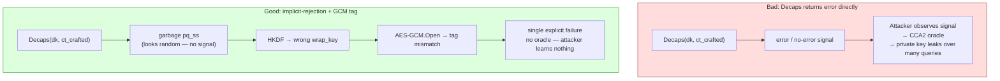
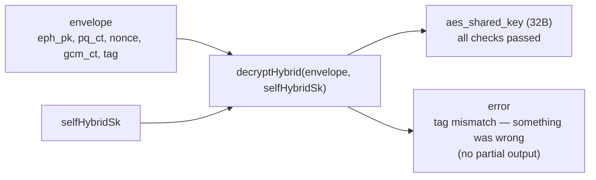

# ML-KEM-768 + AES-256-GCM: How GCM Authenticates the Decaps Step

## The cliffhanger

`ml-kem-768.md` described the **implicit-rejection** property of ML-KEM.Decaps: if `ct` is tampered with, Decaps does not return an error — it silently returns a pseudorandom 32-byte garbage value instead of the real `pq_ss`. The file promised that "the follow-on AES-GCM authentication step is what actually signals tampering." This file explains exactly how that works.

---

## What implicit-rejection means in practice

FIPS 203 mandates that Decaps always outputs 32 bytes, regardless of whether `ct` is valid:



From the outside — from the caller's perspective — both outputs look identical: 32 opaque bytes. There is no `null`, no exception, no error code. You cannot tell which branch fired just by looking at the Decaps output.

This is intentional. It prevents **decryption oracle attacks**: if Decaps returned an error on bad ciphertext, an attacker could probe with carefully crafted inputs and use the error/no-error signal to extract information about `dk`. Implicit-rejection closes that side-channel.

But it creates a problem: the recipient now holds either the correct `pq_ss` or silent garbage, and has no direct way to know which.

---

## Why AES-256-GCM solves this

AES-256-GCM is an **Authenticated Encryption with Associated Data (AEAD)** cipher. It does two things in one operation:

1. **Encrypts** the plaintext using AES-256-CTR.
2. **Computes a 128-bit authentication tag** (GHASH) over the ciphertext and any associated data.

On decryption, AES-GCM re-derives the tag and compares it to the received tag. If they differ by even one bit, decryption fails with an explicit error and no plaintext is returned.

The tag is what ties everything together.

---

## The full chain: how tampering with `ct` surfaces as a GCM tag failure

Walk through what happens when a recipient receives a corrupted `pq_ct`:



The chain of causality:

```
tampered pq_ct
  → Decaps returns garbage pq_ss
    → HKDF produces wrong wrap_key
      → AES-GCM cannot verify the tag
        → explicit decryption failure
```

The GCM tag acts as a **downstream witness** to everything that fed into `wrap_key`. Any corruption anywhere in that chain — tampered `pq_ct`, tampered `eph_X25519_pk`, tampered `gcm_ct`, or a wrong private key — produces a wrong `wrap_key` or wrong ciphertext, which breaks the tag check.

---

## What AES-256-GCM's tag actually covers

The tag is computed over:



- **`wrap_key`** feeds in because it is the GCM key. Any error in `classical_ss` or `pq_ss` → wrong `wrap_key` → tag mismatch.
- **`nonce`** feeds in as the GCM IV. A replayed or tampered nonce → tag mismatch.
- **`gcm_ct`** is covered by the tag directly. A bit-flip in the ciphertext → tag mismatch.
- **`AAD`** (e.g. `ver‖suite` bytes) is authenticated but not encrypted. Tampering with the suite identifier → tag mismatch even though those bytes are plaintext on the wire.

---

## Why this is better than checking Decaps separately

One alternative design: have Decaps return an error code, check it, abort if bad. The problem: **that creates a decryption oracle**. An attacker who can send crafted `ct` values and observe whether the recipient errored or not can mount a chosen-ciphertext attack (CCA2) against the KEM. Over many queries they can extract information about the private key.

FIPS 203's implicit-rejection defends against this by making Decaps a pure function with no observable error signal. The price is that the caller must verify correctness a different way — and GCM's tag is exactly the right tool: it is a single, unforgeable, all-or-nothing check that covers every input to the decryption pipeline.



The combined design is **IND-CCA2 secure**: an attacker who can observe decryption failures gains no information about the private key, because every failure looks like the same GCM tag rejection regardless of where in the pipeline the corruption happened.

---

## What the recipient actually sees

From the caller's point of view, `decryptHybrid` is a black box:



There is no in-between. Either the tag verifies and the caller receives the AES key, or the tag fails and the caller receives an error. The caller never touches `pq_ss`, `classical_ss`, or `wrap_key` directly — those are internal to `at_chops` and discarded immediately after use.

---

## Summary

| Question | Answer |
|---|---|
| What does Decaps return when `ct` is bad? | A pseudorandom 32-byte garbage value — looks identical to a real `pq_ss` |
| How does the caller detect the garbage? | It can't — directly. Decaps gives no error signal by design. |
| What detects it then? | AES-256-GCM's authentication tag. Garbage `pq_ss` → wrong `wrap_key` → tag mismatch → explicit decryption failure. |
| Why not just have Decaps error? | That would create a decryption oracle: an attacker could probe Decaps to extract private key information (CCA2 attack). |
| What does the tag actually authenticate? | The entire pipeline: `wrap_key` (which embeds both `pq_ss` and `classical_ss`), `nonce`, `gcm_ct`, and any AAD. |
| Is the combined scheme CCA-secure? | Yes. ML-KEM (FIPS 203) is IND-CCA2 secure by specification; GCM's tag provides the external verification that closes the implicit-rejection loop. |

---

## See also

- [`ml-kem-768.md`](ml-kem-768.md) — ML-KEM-768 operations and implicit-rejection detail
- [`x25519-and-ml-kem-768.md`](x25519-and-ml-kem-768.md) — full wrap/unwrap flow and how `wrap_key` is derived
- [`algorithms-and-protocols.md`](../algorithms-and-protocols.md) — sequence diagrams for the full unwrap flow in `at_chops`
