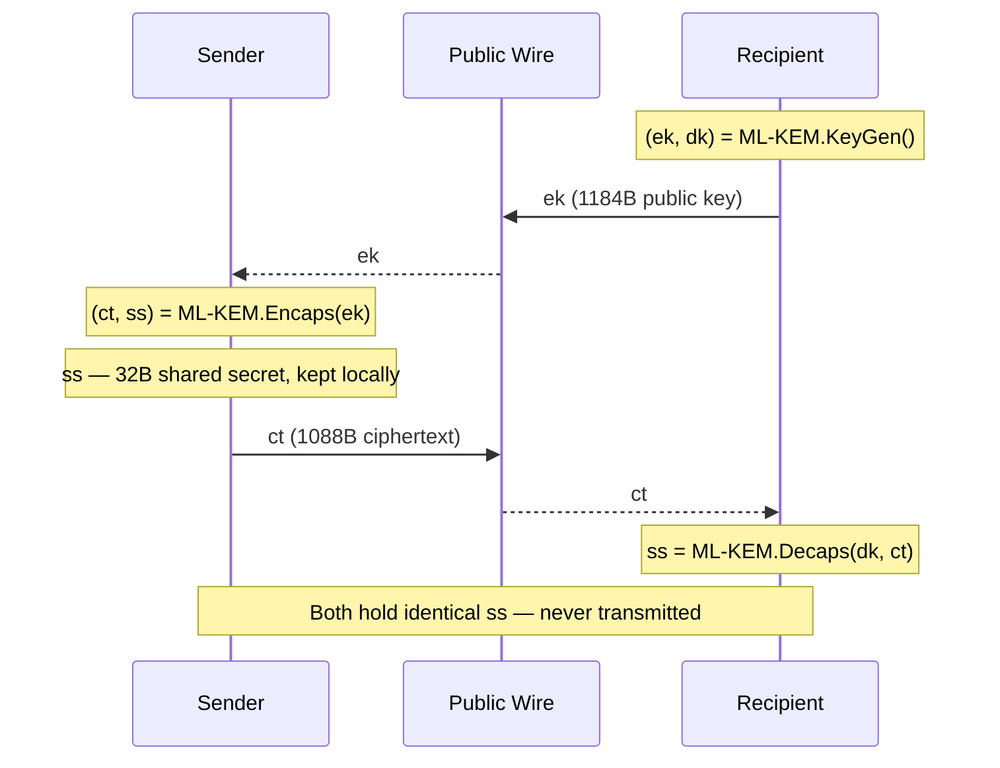
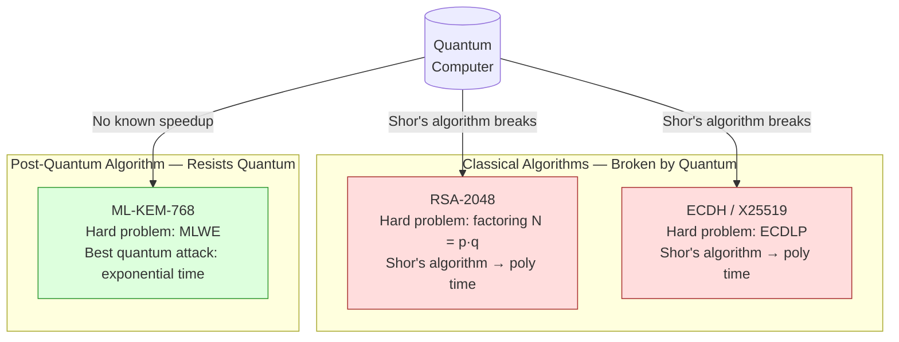

# ML-KEM-768

## What it is

ML-KEM-768 is a **post-quantum Key Encapsulation Mechanism** standardized by NIST as FIPS 203 (2024). "ML-KEM" stands for Module Lattice-based Key Encapsulation Mechanism. It was formerly known as Kyber-768 before standardization.

It is the **security-level-3 parameter set** of the ML-KEM family:

| Variant | Claimed security | Closest classical analogue |
|---|---|---|
| ML-KEM-512 | Level 1 (~AES-128) | — |
| **ML-KEM-768** | **Level 3 (~AES-192)** | — |
| ML-KEM-1024 | Level 5 (~AES-256) | — |

Level 3 is the working default in this codebase: it provides a comfortable security margin against both classical and quantum adversaries while keeping key and ciphertext sizes manageable.

## Comparison to RSA-2048

| Property | ML-KEM-768 | RSA-2048 |
|---|---|---|
| Hard math problem | Module Learning With Errors (MLWE) | Integer factorization |
| Public key size | **1184 bytes** | 256 bytes |
| Private key size | 2400 bytes (decapsulation key) | ~1200 bytes |
| Ciphertext size | **1088 bytes** | 256 bytes |
| Shared secret size | 32 bytes | N/A (RSA does key transport, not KEM) |
| Classical security | ~180 bits (Level 3 estimate) | ~112 bits |
| Quantum resistance | **Yes** — no known quantum speedup for MLWE | **No** — broken by Shor's algorithm |
| Speed (keygen) | Very fast (~200 µs) | Slow (~50 ms for 2048-bit) |
| Speed (encaps/decaps) | Very fast (~300 µs each) | Moderate (~5 ms) |
| Forward secrecy | Yes — sender generates fresh randomness each time | Only in ephemeral RSA-DH modes |
| Standardization | FIPS 203 (2024) | PKCS#1, RFC 8017 (1977-era origins) |

The most striking difference from RSA-2048 is not the key sizes but the **security model**. RSA's hardness relies on one number-theoretic problem (factoring). ML-KEM's hardness relies on the geometry of high-dimensional lattices — a family of problems for which no efficient quantum algorithm is known, and which have resisted decades of classical cryptanalysis.

RSA-2048 offers roughly **112 bits** of classical security and **0 bits** of quantum security (Shor runs in polynomial time). ML-KEM-768 offers roughly **180 bits** of classical security and substantial (estimated 150+ bit) post-quantum security.

## What ML-KEM-768 does

ML-KEM-768 has three operations:

### 1. KeyGen
```
(ek, dk) = ML-KEM.KeyGen()
```
- `ek` = encapsulation key (public key), 1184 bytes
- `dk` = decapsulation key (private key), 2400 bytes

The recipient generates this pair and publishes `ek`. The private `dk` never leaves the recipient's device.

### 2. Encaps
```
(ct, ss) = ML-KEM.Encaps(ek)
```
- `ct` = ciphertext, 1088 bytes — sent across the wire
- `ss` = shared secret, 32 bytes — **never sent**, only computed

The sender feeds the recipient's public key `ek` into Encaps. The algorithm internally picks randomness, entangles it with `ek` through lattice arithmetic, and outputs both a ciphertext `ct` and a 32-byte shared secret `ss`. The sender uses `ss` as key material and discards it after the session; `ct` goes to the recipient.

### 3. Decaps
```
ss = ML-KEM.Decaps(dk, ct)
```
The recipient feeds their private key `dk` and the received `ct` into Decaps, recovering the same 32-byte `ss` the sender computed.

Critically: **`ss` never travels across the wire.** An eavesdropper who captures `ct` cannot recover `ss` without `dk`. And unlike RSA or ECDH, there is no known quantum algorithm that breaks this — the best attacks against MLWE have exponential (or super-polynomial) cost even on quantum hardware.



## Why it is quantum-safe

Classical public-key schemes (RSA, ECDH, ECDSA) depend on mathematical problems that quantum computers solve efficiently:

- RSA, DH → **integer factorization / discrete logarithm** → Shor's algorithm: polynomial time on a large enough quantum computer.
- ECDH / ECDSA → **elliptic-curve discrete logarithm** → Shor's algorithm: same issue.

ML-KEM depends on **Module Learning With Errors (MLWE)**: given a matrix `A` and a vector `b = A·s + e` (where `s` is a secret vector and `e` is a small-coefficient "error" vector), find `s`. No quantum algorithm is known to solve MLWE significantly faster than the best classical algorithms. This is because the hardness comes from the geometry of integer lattices, not from number-theoretic structure that quantum Fourier transforms exploit.



## The FIPS 203 implicit-rejection property

ML-KEM-768 (FIPS 203) includes a hardened Decaps step: if the ciphertext `ct` is malformed or tampered with, Decaps returns a **pseudorandom value** derived from the private key and `ct` rather than an error or a garbage output. This prevents an attacker from probing the decapsulation function to learn information about the private key (a "decryption oracle" attack). The caller cannot distinguish a good decapsulation from a bad one by timing or by output — both look like 32 random bytes. The follow-on AES-GCM authentication step is what actually signals tampering.

## What ML-KEM-768 does NOT do

- It does not encrypt arbitrary data — only establishes a 32-byte shared secret.
- It does not authenticate the sender. Encaps requires only the recipient's public key; anyone can call it. Authentication is handled at a higher layer (atProtocol, PKAM, or the SPQR/PQXDH layer for Goal B).
- It does not provide deniability.

## Wire footprint in this codebase

The sender includes `ct` (1088 bytes) in the wire envelope. Combined with the ephemeral X25519 public key (32 bytes), version/suite byte (2 bytes), GCM nonce (12 bytes), and GCM ciphertext+tag (48 bytes), the total envelope is 1182 bytes — compared to 256 bytes for RSA-OAEP-2048. The overhead is real but one-time per shared-key establishment, not per message.

## See also

- [`x25519.md`](x25519.md) — the classical KEM that runs alongside ML-KEM-768
- [`x25519-and-ml-kem-768.md`](x25519-and-ml-kem-768.md) — how they combine into a hybrid KEM
- [`crypto-fundamentals.md`](crypto-fundamentals.md) — mental model: KEM vs encryption, why asymmetric exists
- [`native-dependencies.md`](native-dependencies.md) — mlkem-native vs liboqs, FFI bridge
- [`algorithms-and-protocols.md`](algorithms-and-protocols.md) — full algorithm catalog and sequence diagrams
