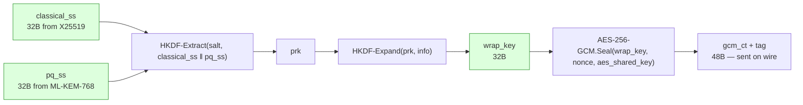
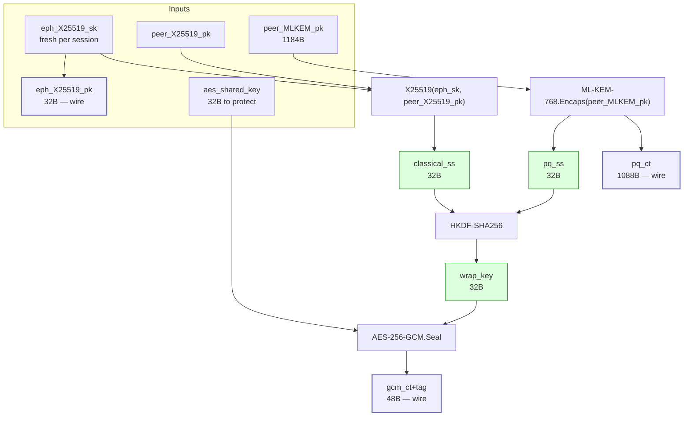
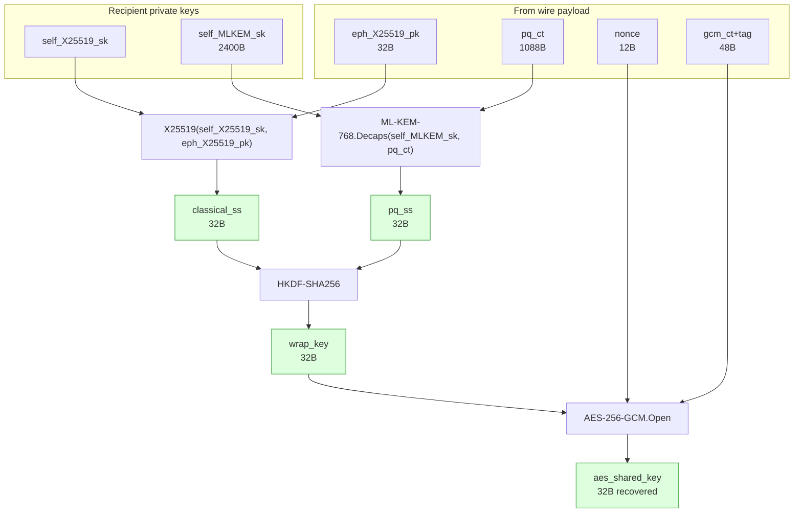
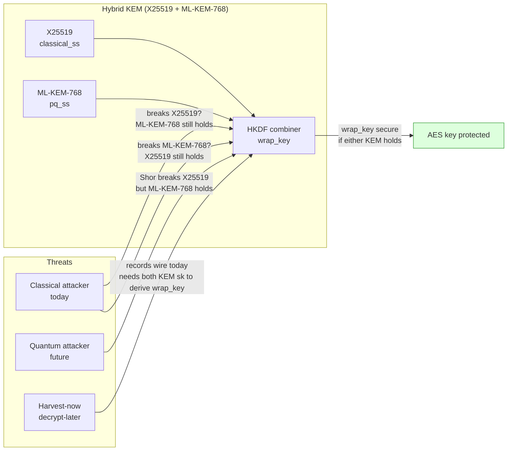

# X25519 + ML-KEM-768: Hybrid KEM and Post-Quantum Cryptography

## Why two KEMs?

Neither X25519 nor ML-KEM-768 alone is sufficient right now.

- **X25519 alone** is broken by a large enough quantum computer running Shor's algorithm. A "harvest now, decrypt later" adversary who captures today's traffic and later builds a quantum computer can retroactively decrypt it.
- **ML-KEM-768 alone** is post-quantum safe, but it is newer. It has received substantial cryptanalytic scrutiny since the NIST PQC competition began in 2016, but it has not accumulated the 40+ years of real-world vetting that elliptic-curve schemes have. If a classical break were found (unlikely but not impossible), a system relying only on ML-KEM would have no fallback.

Running both in **parallel** and combining their outputs achieves **defense-in-depth**: the combined wrap key is secure as long as *either* primitive remains unbroken. An attacker must defeat both simultaneously. Classical attackers are blocked by ML-KEM's lattice hardness. Quantum attackers are blocked by ML-KEM's quantum hardness (X25519 is broken, but only ML-KEM needs to hold). And if ML-KEM were somehow broken classically, X25519 still protects against classical adversaries.

This pattern — combining a classical KEM with a post-quantum KEM — is called a **hybrid KEM**, and is recommended by NIST, BSI, ANSSI, and the IETF (RFC 9370, "Hybrid Public Key Encryption").

---

## How they work together

### The combiner

After running both KEMs independently, the two 32-byte shared secrets (`classical_ss` from X25519, `pq_ss` from ML-KEM-768) are fed into **HKDF-SHA256** to produce a single 32-byte wrap key.

HKDF's output is indistinguishable from random as long as at least one of its inputs contains entropy the adversary doesn't know. If X25519's `classical_ss` is exposed (quantum attacker), `pq_ss` remains opaque. If ML-KEM's `pq_ss` were exposed (hypothetical classical break), `classical_ss` still protects the output.

The `wrap_key` is then used with AES-256-GCM to encrypt the actual AES shared key. AES-256-GCM is the symmetric layer — it does the work of actually protecting data; the hybrid KEM is only responsible for establishing the 32-byte `wrap_key` without ever transmitting it.

---

### Sender (wrap) flow

Wire payload: `[ ver(1B) | suite(1B) | eph_X25519_pk(32B) | pq_ct(1088B) | nonce(12B) | gcm_ct+tag(48B) ]` — total 1182 bytes.

The ephemeral X25519 keypair `(eph_sk, eph_pk)` is generated fresh for every wrap operation. `eph_sk` is discarded after use. This is the source of **perfect forward secrecy**: even if the recipient's long-term X25519 private key is later leaked, past sessions cannot be decrypted because `eph_sk` no longer exists.

---

### Recipient (unwrap) flow

If either KEM step or the AES-GCM authentication tag fails, the whole unwrap fails. There is no partial success.

---

## Comparison to RSA-OAEP-2048 (the scheme being replaced)

| Property | Hybrid (X25519 + ML-KEM-768) | RSA-OAEP-2048 |
|---|---|---|
| Hard problem | ECDLP **and** MLWE (both must break) | Integer factorization (one must break) |
| Quantum safety | **Yes** — MLWE holds against quantum | **No** — Shor breaks factoring |
| Classical safety | **Yes** — both ECDLP and MLWE are hard classically | Yes (for now, at 112-bit level) |
| Key agreement method | Two independent KEMs, combined via HKDF | Key transport: sender encrypts secret under RSA pubkey |
| Forward secrecy | **Yes** — ephemeral X25519 per session | Only with ephemeral RSA-DH (rarely used) |
| Wire overhead | 1182 bytes per key-wrap envelope | 256 bytes |
| AES key exposure risk | AES key derived from KEM outputs, never exists in encrypted form until wrap_key is known | AES key encrypted directly under RSA pubkey — if RSA breaks, AES key is exposed |
| Standardization | X25519: RFC 7748; ML-KEM: FIPS 203 | PKCS#1 v2.2, RFC 8017 |

The philosophical shift from RSA-OAEP to hybrid KEM is important: RSA-OAEP **transports** a secret (the AES key is encrypted, and anyone who breaks RSA gets the AES key). The hybrid KEM **derives** a secret (the wrap key never appears in plaintext on either side; it is reconstructed independently by both parties from KEM outputs). A quantum attacker recording today's traffic and later running Shor's algorithm against an RSA-OAEP payload gets the AES key. Against a hybrid KEM payload, they get only `eph_X25519_pk` and `pq_ct` — the former is a public value, the latter yields `pq_ss` only via ML-KEM.Decaps, which requires `self_MLKEM_sk` and resists quantum attack.

---

## What "PQC" means in this context

Post-quantum cryptography (PQC) refers to asymmetric algorithms that are believed to resist attacks by both classical and quantum computers. PQC does **not** mean:

- "All crypto is quantum-safe." Symmetric ciphers (AES-256) and hash functions (SHA-256) are not broken by quantum computers — Grover's algorithm at most halves effective key length, so AES-256 retains ~128-bit security. The PQ problem is specific to asymmetric (public-key) cryptography.
- "We need to replace AES." AES-256 is already post-quantum safe at an acceptable security level.
- "Classical algorithms are immediately insecure." Harvest-now-decrypt-later is a real threat for long-lived data, but interactive sessions are only at risk once large-scale quantum computers actually exist, which is not yet the case.

The hybrid scheme here makes the following security guarantees:

1. **Against a classical adversary today**: security rests on ECDLP (X25519) and MLWE (ML-KEM-768), both hard classically. Even if one were broken, the other remains.
2. **Against a quantum adversary in the future**: security rests on MLWE alone (X25519 is broken by Shor). ML-KEM-768 is designed and standardized specifically for this threat.
3. **Against harvest-now-decrypt-later**: the AES shared key is wrapped under a `wrap_key` that is derived from both KEM outputs. A recording adversary who later acquires a quantum computer can break X25519's contribution but cannot recover `pq_ss` without `self_MLKEM_sk`, so `wrap_key` remains secret and the wrapped AES key stays protected.

---

## Summary

| Primitive | Role | Quantum-safe? | Why kept |
|---|---|---|---|
| **X25519** | Classical ECDH shared secret (32B) | No | Defense-in-depth; 40+ years of vetting; forward secrecy |
| **ML-KEM-768** | Post-quantum KEM shared secret (32B) | Yes | FIPS 203 standard; resists Shor; protects harvest-now traffic |
| **HKDF-SHA256** | Combines the two secrets into wrap_key | Yes (SHA-256 is quantum-resistant) | Cryptographic combiner; output is secure if either input is |
| **AES-256-GCM** | Encrypts the AES shared key under wrap_key | Yes (Grover halves to ~128-bit) | Actual data protection layer |

X25519 and ML-KEM-768 do not replace each other — they do the same job at different points on the classical/quantum threat axis, and their combined output is strictly harder to break than either alone.

## See also

- [`x25519.md`](x25519.md) — X25519 in detail
- [`ml-kem-768.md`](ml-kem-768.md) — ML-KEM-768 in detail
- [`crypto-fundamentals.md`](crypto-fundamentals.md) — KEM mental model and why asymmetric crypto exists
- [`algorithms-and-protocols.md`](algorithms-and-protocols.md) — full wrap/unwrap sequence diagrams and wire-envelope byte layout
