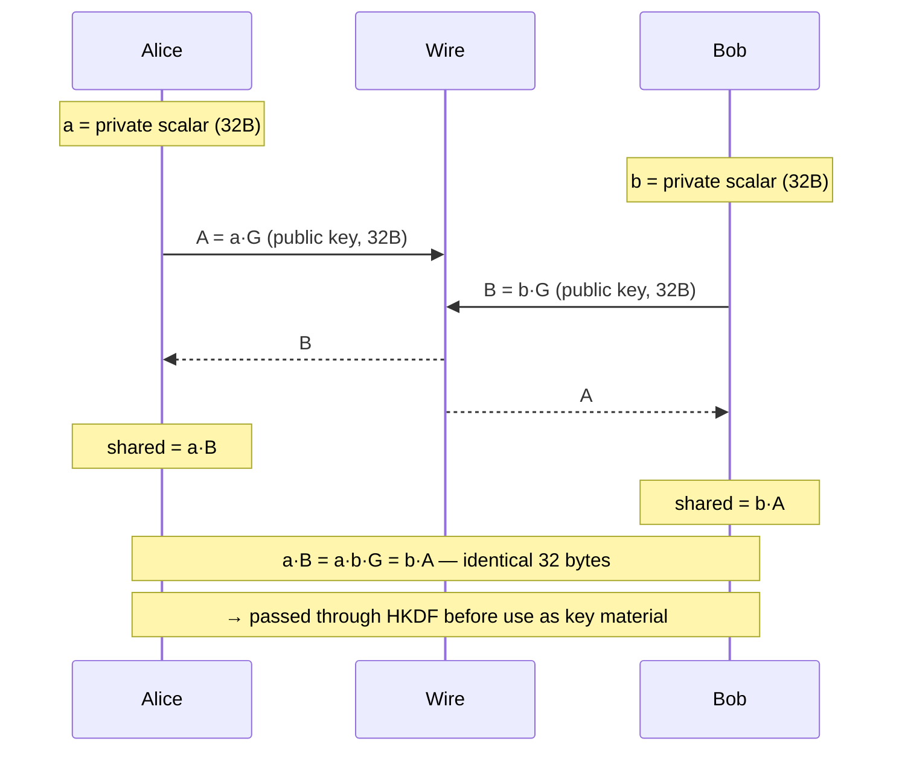
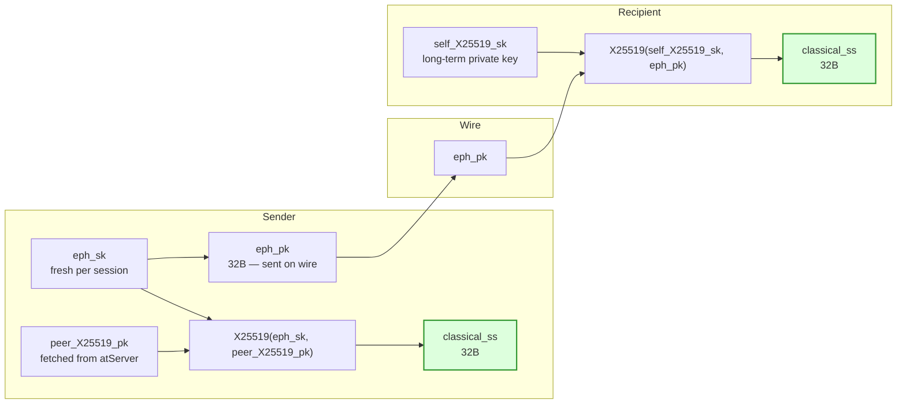

# X25519

## What it is

X25519 is an **Elliptic-Curve Diffie-Hellman (ECDH) key agreement function** defined in RFC 7748. It operates over Curve25519, a Montgomery-form elliptic curve designed by Daniel J. Bernstein in 2006 for speed, safety, and resistance to implementation mistakes.

"X25519" specifically refers to the scalar-multiplication step that performs the Diffie-Hellman exchange. It is not an encryption algorithm and not a signature scheme — it is a **key agreement primitive**: two parties each contribute a public value, and both independently compute the same shared secret without ever transmitting that secret.

## Comparison to RSA-2048

| Property | X25519 | RSA-2048 |
|---|---|---|
| Hard math problem | Elliptic-curve discrete logarithm (ECDLP) | Integer factorization |
| Public key size | **32 bytes** | 256 bytes (2048-bit modulus) |
| Private key size | 32 bytes (scalar) | ~1200 bytes (CRT form) |
| Shared secret size | 32 bytes | N/A — RSA doesn't do DH directly |
| Classical security level | ~128 bits | ~112 bits |
| Quantum resistance | **None** — broken by Shor's algorithm | **None** — broken by Shor's algorithm |
| Speed | Very fast (~100 µs on modern hardware) | Slow (~10 ms for 2048-bit) |
| Constant-time safe | Yes — designed that way | Difficult — timing side-channels are common |
| Forward secrecy | Yes — ephemeral keypairs per session | Only if used in ephemeral RSA-DH mode (rare) |

RSA-2048 is typically used for **key transport** (the sender encrypts a secret under the recipient's public key via RSAES-OAEP). X25519 performs **key agreement** — neither side chooses the shared secret; it emerges from the math. The distinction matters: RSA-OAEP can leak the AES key if the private key is later compromised; an ephemeral X25519 exchange produces a shared secret that is never stored anywhere by either party and therefore provides **perfect forward secrecy**.

## What X25519 does

Given:
- Alice's private scalar `a` (32 random bytes, clamped per RFC 7748)
- Alice's public point `A = a·G`
- Bob's public point `B = b·G`

Alice computes `a·B`. Bob computes `b·A`. By the commutativity of scalar multiplication over an elliptic curve, `a·B = a·b·G = b·A`. Both arrive at the same 32-byte x-coordinate, which becomes the raw shared secret.

The shared secret is then passed through a KDF (e.g. HKDF-SHA256) before use as a key, because the raw output has structure that makes it unsuitable as direct key material.

## What X25519 does NOT do

- It does not encrypt data.
- It does not authenticate the parties (no signature). Without authentication, a pure X25519 exchange is vulnerable to a man-in-the-middle attack.
- It does not resist a quantum adversary running Shor's algorithm.

## How it is used in this codebase

In the hybrid PQ scheme, X25519 is run in **ephemeral mode** on the sender side:

1. Sender generates a fresh, single-use X25519 keypair `(eph_sk, eph_pk)`.
2. Sender computes `classical_ss = X25519(eph_sk, peer_X25519_pk)`.
3. `eph_pk` (32 bytes) is included in the wire envelope so the recipient can reproduce the computation.
4. Recipient computes `classical_ss = X25519(self_X25519_sk, eph_pk)`.

Both sides now hold the same `classical_ss`. This value is combined with the ML-KEM shared secret via HKDF to produce the final wrap key (see [`x25519-and-ml-kem-768.md`](x25519-and-ml-kem-768.md)).

X25519 is kept in the design not because it is quantum-safe (it isn't), but because it adds **defense-in-depth**: a classical attacker who somehow broke ML-KEM's lattice problem would still need to solve ECDLP to recover the wrap key, and vice versa. Security degrades to the stronger of the two primitives.

## Key properties of Curve25519 worth knowing

- **No patent encumbrances** — unlike the NIST P-curves, Curve25519 is free of legal risk.
- **Twist-safe** — invalid public keys produce a point on the twist rather than leaking private key bits.
- **Deterministic** — no per-operation randomness needed, eliminating a class of nonce-reuse vulnerabilities.
- **Constant time** — the Montgomery ladder formulation has no secret-dependent branches, making side-channel attacks much harder.

## See also

- [`ml-kem-768.md`](ml-kem-768.md) — the PQ KEM that runs alongside X25519
- [`x25519-and-ml-kem-768.md`](x25519-and-ml-kem-768.md) — how they combine into a hybrid KEM
- [`algorithms-and-protocols.md`](algorithms-and-protocols.md) — full algorithm catalog and wire-envelope layout
- [`crypto-fundamentals.md`](crypto-fundamentals.md) — mental model for KEM vs encryption
