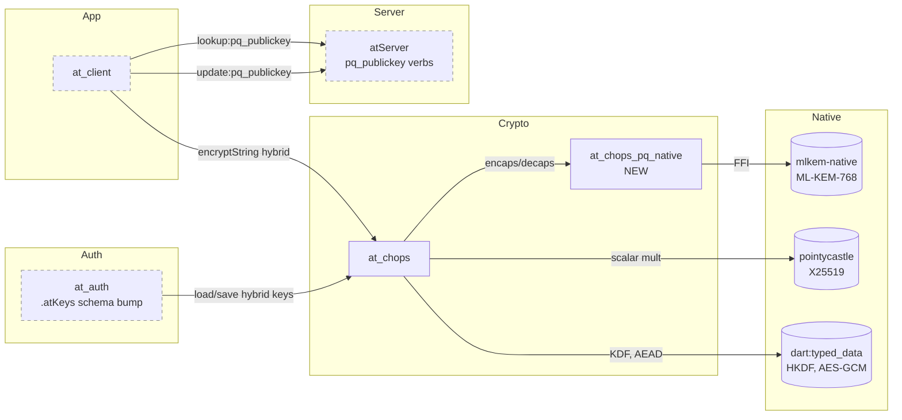
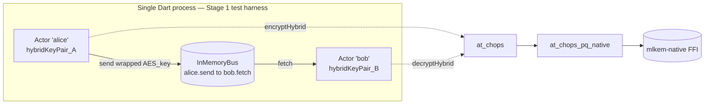
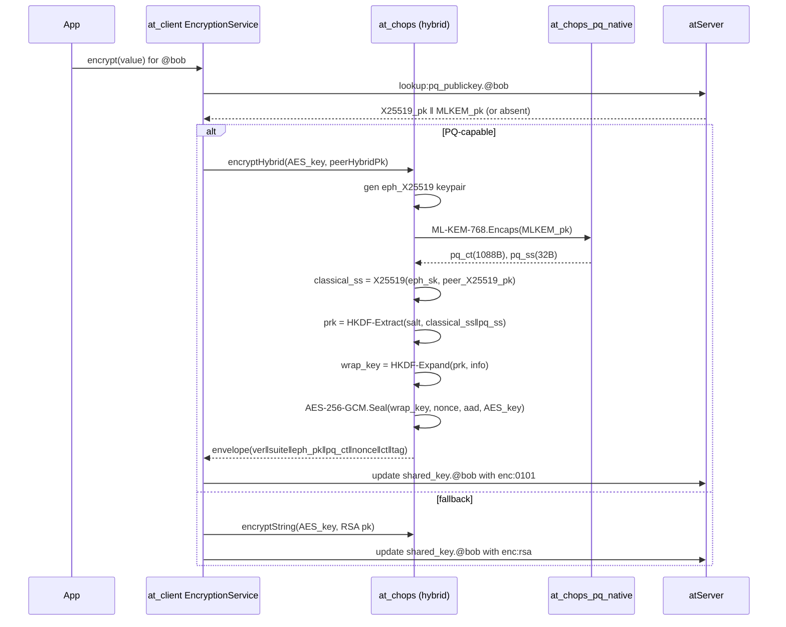
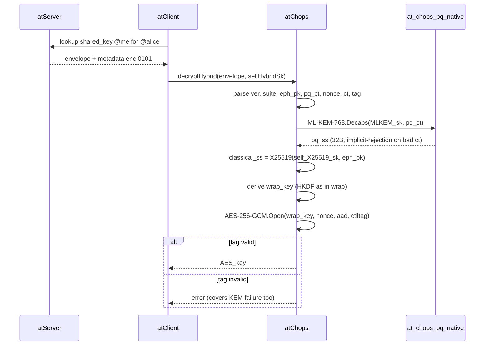
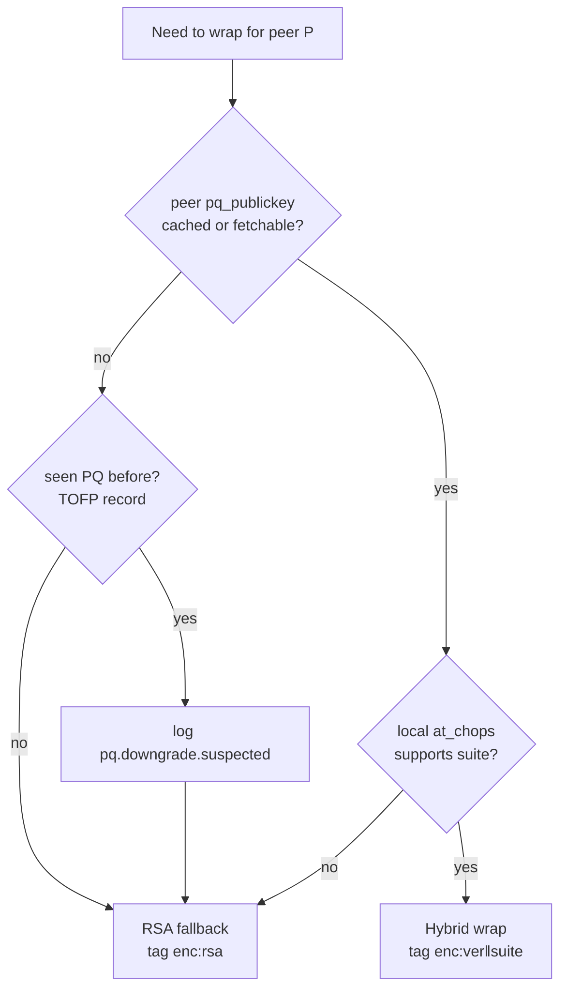
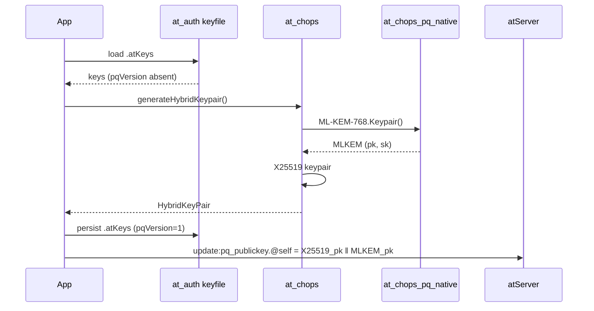
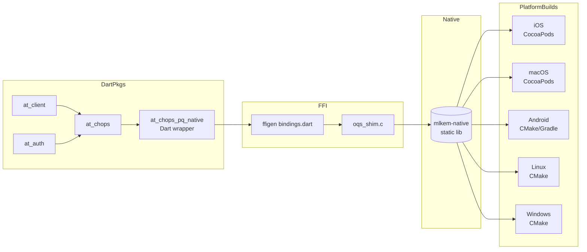
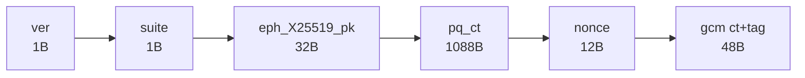

# PQ Migration — Mechanisms, Protocols, Algorithms

**Status: Draft.** Nothing in this file is locked. Algorithm choices, suite IDs, package boundaries, and stage assignments are working proposals.

Catalog of moving parts for Track 1 (hybrid X25519 + ML-KEM-768 KEM replacing RSA-OAEP key-wrap). Cross-references `../pq-migration.md`.

Related drafts: [`components.md`](components.md), [`ML-KEM.md`](ML-KEM.md), [`dependencies.md`](dependencies.md).

> **Two-stage delivery (per issue #1893):** Stage 1 exercises the crypto in-process via an `Actor` harness — no atProtocol. Stage 2 wires the same API into `at_client` / atServer. Diagrams below mark which boxes light up at each stage.

---

## Algorithms

| Algorithm | Role | Spec | New / existing |
|---|---|---|---|
| ML-KEM-768 | PQ KEM — encaps/decaps 32 B shared secret | FIPS 203 | **new** (via liboqs) |
| X25519 | Classical ECDH — 32 B shared secret | RFC 7748 | **new** in this path (pointycastle has it) |
| HKDF-SHA256 | Extract + Expand for combiner | RFC 5869 | existing in `at_chops` |
| AES-256-GCM | AEAD wrap of the AES shared key | NIST SP 800-38D | existing primitive, new use |
| RSA-OAEP-2048 | Fallback wrap for non-PQ peers | RFC 8017 | existing — kept |
| AES-256-CTR | Bulk data symmetric encryption (unchanged) | — | existing |
| Argon2id | `.atKeys` passphrase KDF (unchanged) | RFC 9106 | existing |

## Mechanisms

| Mechanism | Purpose | Lives in |
|---|---|---|
| Hybrid KEM combiner | Bind classical + PQ shared secrets into one wrap key | `at_chops` (new dispatch path) |
| Capability negotiation | Decide hybrid vs RSA fallback per peer | `at_client` `EncryptionService` |
| Suite / version registry | Identify wire format + crypto suite per envelope | `at_protocol` (or `at_commons`) |
| Envelope tag in metadata | Receiver dispatches decrypt path on `enc:<ver><suite>` | shared-key entry metadata |
| `.atKeys` schema migration | Add hybrid keypair fields, generate on first load | `at_auth` keyfile I/O |
| FFI bridge to liboqs | Native ML-KEM-768 keypair/encaps/decaps | new `at_chops_pq_native` |
| Trust-on-first-PQ (TOFP) | Detect/log downgrade after a peer is once seen PQ-capable | `at_client` (new cache) |
| Fallback path | Reuse RSA-OAEP when peer or self lacks PQ | unchanged code path |

## Protocols (atProtocol-level additions)

| Verb / event | Direction | Purpose |
|---|---|---|
| `update:pq_publickey.<atsign>` | self → atServer | Publish hybrid pubkey blob (X25519 ‖ ML-KEM-768) |
| `lookup:pq_publickey.<atsign>` | client → atServer | Fetch peer's hybrid pubkey |
| `from:` response field `"pq": [...]` | atServer → client | Advertise supported suites |
| Shared-key envelope tag `enc:<ver><suite>` | metadata, both sides | Dispatch decrypt path |

---

## Component map

Solid borders = Stage 1 (in-process). Dashed borders = added in Stage 2 (atProtocol wiring).

## Stage 1 actor harness (in-process validation, no atProtocol)

Lives under `packages/at_chops_pq_native/test/actor_harness.dart`. Pure Dart driver; same crypto API that Stage 2 wires into `at_client`.

Exit criterion for Stage 1: actor harness round-trips a wrapped AES key between alice/bob, hybrid KATs pass, mixed-suite (PQ ↔ RSA-fallback) actor pairs interop. No `at_client`, no atServer, no `.atKeys` parsing involved.

## Wrap flow — sender wraps an AES shared key for a peer

## Unwrap flow — recipient decrypts the wrapped shared key

## Negotiation / dispatch

## `.atKeys` post-upgrade migration

## Dependency / build graph

## Wire envelope byte layout

Total = 1182 B.
