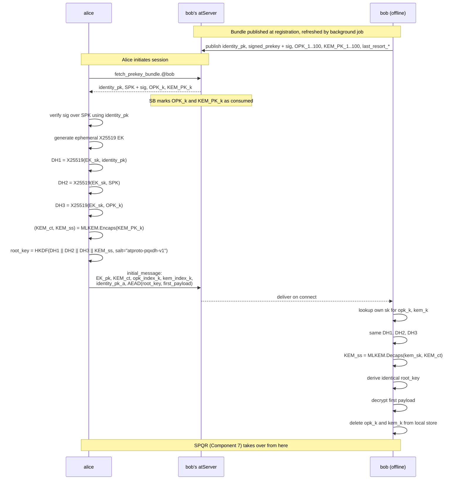
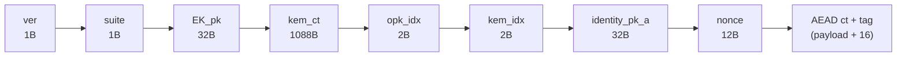
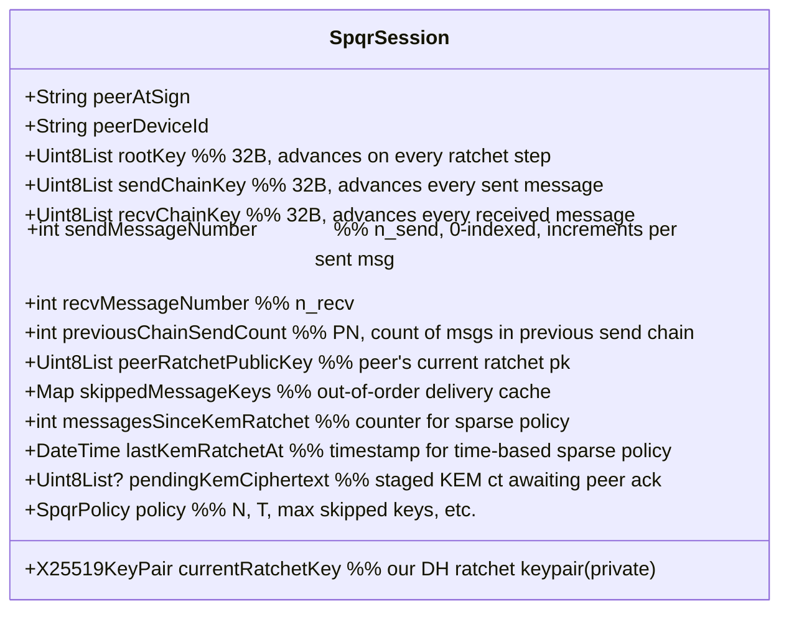
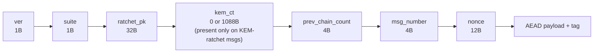

# Goal B Deep Dive — PQXDH + SPQR

**Status: Draft.** Nothing here is locked. State-machine layouts, wire formats, byte sizes, persistence schema, refill policies, and atProtocol mappings are working proposals.

This file is the **implementer-grade reference** for Goal B (forward-secret PQ-safe 1:1 messaging) of issue [#1893](https://github.com/atsign-foundation/at_client_sdk/issues/1893). Companion to:

- [`component-architecture.md`](component-architecture.md) §7 (SPQR) and §12 (PQXDH) — high-level role
- [`crypto-fundamentals.md`](crypto-fundamentals.md) — mental model for KEMs and the bootstrap problem
- [`algorithms-and-protocols.md`](algorithms-and-protocols.md) — catalog of primitives

If you're trying to build Goal B, read this file end-to-end. If you're trying to understand where Goal B fits, read `component-architecture.md` first.

---

## 1. Threat model

The set of adversaries we explicitly defend against, and the set we don't.

### In scope

| Adversary | Capabilities | What PQXDH + SPQR defends |
|---|---|---|
| **Passive eavesdropper** | Records all wire traffic; can store indefinitely | All payloads — wire reveals nothing without sk |
| **Future-quantum eavesdropper** | Same as above + can run Shor's algorithm against archived traffic | Hybrid X25519 + ML-KEM resists Shor; PQ entropy in every root_key step |
| **Active MITM** | Can drop, reorder, inject, modify packets in transit | Signed prekeys (identity binding); AEAD on every message; ratchet pk authenticated by AEAD tag chain |
| **atServer compromise (read-only)** | Reads prekey bundles, encrypted notifications, all stored ciphertext | Prekey bundles only reveal public keys; messages are AEAD-encrypted under per-session keys server never holds |
| **Single-message key compromise** | Attacker recovers one `msg_key` | Forward secrecy: only that one message exposed; chain_key advances by one-way KDF |
| **Long-running compromise — full session state leak** | Attacker steals all current root_key + chain_keys at time T | Post-compromise security: next sparse-KEM ratchet step (bounded by sparse policy, see §4.3) heals the session |

### Out of scope (explicit)

| Adversary | Why not defended |
|---|---|
| **Device theft + unlocked device** | Anyone with the unlocked device sees plaintext; OS-level encryption is the only mitigation |
| **atServer compromise (active)** — server forges/replays | Mostly defended by signatures, but malicious atServer can refuse delivery (DoS); we surface fallback signals but cannot prevent suppression |
| **Endpoint compromise — malware on alice's device** | Reads all keys & plaintext as alice would; not a cryptographic problem |
| **Key escrow / legal compulsion** | atProtocol has no escrow mechanism; user holds keys |
| **Side-channel attacks** (timing, power) | Liboqs / mlkem-native provide constant-time primitives; we assume their guarantees; not independently audited by us |
| **Traffic analysis** | Message timing, frequency, size leak metadata; padding & cover traffic are out of scope for Track 3 |

### Security claims that depend on the threat model

- "Forward secrecy" = compromising future state does **not** expose past messages.
- "Post-compromise security" = compromising past state does **not** expose future messages, **after** the next ratchet step.
- "PQ-safe" = a quantum-equipped adversary attacking today's archived traffic cannot decrypt it, assuming ML-KEM stays unbroken.

---

## 2. Glossary

Used throughout this doc and Components 7 / 12. Pinned in one place so abbreviations don't drift.

| Term | Meaning |
|---|---|
| **IK** | Identity Key — long-term ed25519 keypair, one per atSign-device pair, used to sign prekeys. Distinct from the PKAM key in `.atKeys`. |
| **SPK** | Signed PreKey — medium-term X25519 keypair, rotated every ~week, signed by IK |
| **OPK** | One-Time PreKey — single-use X25519 keypair, consumed on first use by an initiator |
| **KEM-PK** | Post-Quantum KEM PreKey — ML-KEM-768 public key, may be one-time or last-resort |
| **last-resort PK** | Fallback prekey used when all OPKs are exhausted; loses some forward-secrecy guarantees |
| **EK** | Ephemeral Key — X25519 keypair generated by initiator per session start |
| **root_key** | 32-byte symmetric state at the root of an SPQR session; mixed into via every ratchet step |
| **chain_key** | 32-byte derivative of root_key for a single sending or receiving chain |
| **msg_key** | Per-message key derived from chain_key; used for AEAD; deleted immediately after use |
| **ratchet pk** | X25519 public key included in each message header; advances the DH ratchet |
| **PCS** | Post-Compromise Security — see §1 in-scope row |
| **TOFP** | Trust-On-First-PQ — see Component 10 |

---

## 3. PQXDH deep dive

### 3.1 Prekey bundle anatomy

Each atSign publishes a bundle to its atServer. atServer stores it as ordinary public keystore entries. Bundle contents:

| Field | Type | Lifetime | Size | Stored at |
|---|---|---|---|---|
| `identity_pk` | Ed25519 public key | Long-term (rotated only on compromise) | 32 B | `public:pq_identity.@me` |
| `signed_prekey_pk` | X25519 public key | Medium-term, rotated every 7 days (proposed) | 32 B | `public:pq_signed_prekey.@me` |
| `signed_prekey_signature` | Ed25519 signature over `signed_prekey_pk` by `identity_pk` | Same as SPK | 64 B | (bundled with SPK) |
| `one_time_prekeys[]` | Array of X25519 public keys, each consumed once | Single-use; refilled in batches of 100 | 32 B × N | `public:pq_otp_<idx>.@me` (separate keys, indexed) |
| `last_resort_prekey_pk` | X25519 public key, used when OPKs exhausted | Long-term (rotated on compromise) | 32 B | `public:pq_last_resort.@me` |
| `kem_prekey_pk` | ML-KEM-768 public key, one-time | Single-use; refilled with OPKs | 1184 B × N | `public:pq_kem_<idx>.@me` |
| `last_resort_kem_pk` | ML-KEM-768 public key, used when KEM prekeys exhausted | Long-term | 1184 B | `public:pq_kem_last_resort.@me` |

Total typical bundle size (100 OPKs + 100 KEM prekeys): ~125 KB. atServer must accept this; verify before locking.

### 3.2 PQXDH handshake — message flow

### 3.3 Initial-message wire format

Fixed-size header: 1170 B. AAD covers `ver || suite || EK_pk || kem_ct || opk_idx || kem_idx || identity_pk_a`.

### 3.4 OPK & KEM prekey replenishment

Server cannot generate prekeys (no access to sk). Client must replenish. Proposed policy:

- Client maintains a target: 100 OPKs + 100 KEM prekeys available at atServer at all times.
- Background task on at_client polls atServer's prekey count every 6 hours (or on app foreground).
- When count drops below 50, generate a batch of 50 new ones, sign as needed, publish.
- On compromise: rotate identity key first, then re-publish everything signed under the new identity key.

Open questions to lock:
- Should atServer expose a count, or does client track local consumption?
- What happens if alice initiates while bob's bundle is fully exhausted? → fall back to `last_resort_prekey + last_resort_kem`. Lose perfect forward secrecy for that session start, but keep PQ safety.

### 3.5 Failure modes

| Condition | Detected by | Response |
|---|---|---|
| SPK signature verification fails | Initiator (alice) | Abort handshake; log `pqxdh.spk_sig_invalid`; do **not** fall back to RSA |
| Requested OPK already consumed | atServer returns error | atServer skips OPK; returns bundle with next available OPK or with last-resort |
| All OPKs and last-resort exhausted | atServer | Return error; client retries later or alice's at_client logs `pqxdh.peer_no_prekeys` |
| KEM prekey decapsulation produces wrong ss (impossible if ct authentic) | bob | AEAD tag check on initial_message fails → bob discards |
| `identity_pk_a` mismatches previously-cached `identity_pk` for alice | bob | Surface as identity-change warning (like Signal's "safety number changed"); reject by default, accept on user confirmation |
| `ver` or `suite` not supported by recipient | bob | Reject; if alice had TOFP record this is a downgrade-suspected event |

### 3.6 Key-compromise impact

| Compromised | Sessions exposed |
|---|---|
| One OPK (already consumed) | The one session it bootstrapped (still has DH1, DH2 protecting, plus PQ ss) — limited exposure |
| One KEM prekey (sk) | The one session it bootstrapped — PQ-safety of that session collapses; classical DH still holds |
| SPK sk | All sessions initiated against alice during SPK's active window (~7 days) — but only if matching KEM prekey also leaked |
| IK sk | All future sessions; attacker can sign their own SPKs and impersonate alice; **must** rotate IK and notify peers out-of-band |
| Last-resort PKs | Sessions initiated during OPK-exhausted periods — same blast radius as a long-lived SPK |

### 3.7 Comparison to X3DH

X3DH (Signal, 2016) = `DH1 + DH2 + DH3` (no PQ). PQXDH (Signal, 2023) adds one KEM step. Concretely:

- X3DH: `root_key = KDF(DH1 || DH2 || DH3)`
- PQXDH: `root_key = KDF(DH1 || DH2 || DH3 || KEM_ss)`

Everything else (signed prekey, OPK consumption, identity binding) is identical. The wire format gains the KEM ciphertext (1088 B) and KEM prekey index (2 B). All other guarantees of X3DH carry over unchanged.

### 3.8 Deniability properties

Signal X3DH provides **offline deniability** (anyone could forge a transcript) but **not online deniability** (active interaction with alice's keys could in theory be proven). PQXDH preserves these properties; the additional KEM step is non-interactive and adds no signature, so doesn't weaken deniability.

For atProtocol this means: a leaked SPQR transcript does not cryptographically prove alice sent it (assuming no PKAM signatures co-mingled). Useful in adversarial-jurisdiction scenarios.

---

## 4. SPQR deep dive

### 4.1 Per-party ratchet state

Each side maintains the following for each active SPQR session. Persisted to local encrypted storage (Hive box keyed by peer atSign + device-id).

Total state: ~200 B core + skipped-key cache (bounded). Per-session, per-peer-device.

### 4.2 Per-message wire format

Header size: 54 B baseline, 1142 B on KEM-ratchet messages. `kem_ct` presence is encoded in `suite` byte's high bit (suite 0x01 = standard, 0x81 = KEM-bearing).

AAD = `ver || suite || ratchet_pk || kem_ct || prev_chain_count || msg_number || identity_pks_both`.

### 4.3 Sparse KEM ratchet — when does the KEM fire?

The "S" in SPQR. Need to pick a concrete policy. Options:

| Policy | When | Pro | Con |
|---|---|---|---|
| **N-message** (every N msgs) | counter ≥ N | Predictable bandwidth amortization | Doesn't bound PCS healing time |
| **T-time** (every T seconds) | clock - last ≥ T | Bounds PCS healing time | Bursty senders see no KEM for long quiet periods |
| **N-or-T** (whichever first) | combined | Best of both | Two thresholds to tune |
| **On-resume** (when app re-foregrounds, on reconnect) | resumption event | Cheap; correlates with risk | Doesn't help long-running foreground sessions |
| **On-DH-rotation** (KEM fires whenever the DH ratchet steps to a new peer pk) | new peer ratchet_pk seen | Already an existing trigger | KEM-on-every-DH-step is exactly what we wanted to avoid |

Proposed: **N-or-T with on-resume**. Defaults: `N = 100 messages`, `T = 3600 seconds`, plus a forced KEM on every app-foreground or socket reconnect. Tunable per `SpqrPolicy`.

### 4.4 DH ratchet trigger

Symmetric KDF chain per message. DH ratchet steps when:

- Alice receives a message with a `ratchet_pk` different from `peerRatchetPublicKey` → adopt new peer pk, derive new recv chain.
- Alice sends a message after receiving anything → generate fresh `currentRatchetKey`, derive new send chain. Header carries the new pk.

This is identical to classical Double Ratchet. The KEM ratchet runs *on top* (§4.3); the symmetric chain runs *underneath* both.

### 4.5 Out-of-order delivery & skipped-message keys

atProtocol delivery is eventually-consistent but not strictly ordered (especially across atServers / connectivity gaps). Receiver may see message #5 before #3.

Mitigation:

- When receiving message `n` while expecting `n-k`, derive (and cache) the `k-1` msg_keys for the skipped slots. Decrypt #5 immediately.
- When #3 and #4 later arrive, look up cached keys, decrypt, evict from cache.

Bounds:

- `MAX_SKIP_PER_CHAIN = 1000` — refuse messages further out than this; treat as suspicious.
- `MAX_TOTAL_SKIPPED_KEYS = 2000` — global cap across all chains; oldest evicted first.
- `SKIPPED_KEY_TTL = 7 days` — evicted after this even if not yet looked up.

These are Signal's defaults; not yet validated for atProtocol's gap profile.

### 4.6 Header encryption

Signal optionally encrypts message headers (preventing atServer from seeing ratchet_pk, msg_number, etc.). atProtocol notifications transit atServer in plaintext today, so atServer always sees the envelope.

Decision: **no header encryption in Stage 3**. Rationale: atServer needs to read at least the recipient atSign to route; full header encryption requires a separate header key chain which adds complexity. Track 6+ may revisit.

### 4.7 Multi-device per atSign

Signal model: one SPQR session per `(peer_atsign, peer_device_id)` pair. Each device has its own IK, SPK rotation, OPK pool. Sender alice sends N copies of the message (one per bob-device).

For atProtocol this implies:

- atServer must let each device register its own prekey bundle keyed by `device_id`.
- Sender fans out to all of peer's registered devices.
- Group operations (Goal C) reuse this fan-out infra.

Open question: how does atServer currently model multi-device? PKAM is single-key today. Goal B forces this to evolve.

### 4.8 PCS healing time

If alice's full SPQR state is compromised at time T, post-compromise security restores at T + max(sparse-KEM cadence). With N=100 / T=3600s defaults: at most 1 hour or 100 messages before alice's session is PQ-safe again.

If `kem_ct` is stripped by an active MITM, alice's at_client logs `spqr.kem_blocked` and surfaces a degradation signal. Stage 3 policy: log + warn. Future stage: refuse to continue session.

---

## 5. Persistence

All session state must survive app restart, device reboot, and OS-level backup encryption. Proposed layout:

### 5.1 Storage choices

| Layer | Used for | Why |
|---|---|---|
| OS Keychain (Keychain on iOS/macOS, EncryptedSharedPreferences on Android, libsecret on Linux) | Long-term keys: IK sk, last-resort PKs sk, master key for Hive encryption | Hardware-backed, never exits secure enclave on Apple; minimal blast radius |
| Hive box (encrypted) | Per-session SPQR state, OPK sk pool, KEM prekey sk pool, TOFP cache | Already used in at_client; native to project |
| atServer | Public prekeys, identity_pk, public KEM prekeys, encrypted shared_keys | Existing infra |

### 5.2 Atomicity

Ratchet state must be written atomically — a torn write that loses `sendChainKey` mid-step means alice cannot decrypt her own subsequent messages. Use Hive's transaction API or a write-ahead-log pattern.

### 5.3 Rotation safety

When IK rotates, all dependent state must be reissued *before* the old key is destroyed. Sequence:

1. Generate new IK.
2. Sign new SPK with new IK.
3. Publish (new IK, new SPK, new sig) to atServer in one update.
4. Notify peers out-of-band (TOFP "identity changed" warning surfaced).
5. After all peers have acked or 30-day window expires: destroy old IK sk.

Old sessions ratcheted under the old IK keep working — IK is only used at session-init.

---

## 6. atProtocol-specific adaptations

Signal targets a managed central server. atProtocol uses one atServer per atSign. Mappings:

| Signal concept | atProtocol equivalent |
|---|---|
| Server's prekey bundle endpoint | `public:pq_identity.@bob`, `public:pq_signed_prekey.@bob`, etc. at bob's atServer |
| Server-side OPK consumption | Each OPK published as a separately-keyed public entry; deleted on use |
| Server-side message queue | atServer's notification queue, addressed via `notify:<recipient>` |
| Identity registration | atServer accepts updates to `public:pq_identity` only from authenticated owner (existing PKAM) |
| Sealed-sender delivery | atProtocol does not have an equivalent today; out of scope |

Key differences to be aware of:

- atServers are **per-atSign**, so an OPK at bob's server is **only accessible to bob's server's clients** — fetching it requires going through bob's atServer. No global lookup.
- atServer does not guarantee single-consumer semantics on OPK fetch under high concurrency. Open issue: if two initiators both fetch the same OPK simultaneously, both will use it. Mitigation: atServer-side compare-and-delete on OPK lookup, or accept the rare double-use degradation (it doesn't break security, just weakens forward-secrecy for those two sessions).

---

## 7. References

- Signal PQXDH spec: https://signal.org/docs/specifications/pqxdh/
- Signal SPQR announcement (2025): https://signal.org/blog/spqr/
- Signal Double Ratchet spec: https://signal.org/docs/specifications/doubleratchet/
- libsignal-protocol source: https://github.com/signalapp/libsignal (Rust + C++)
- FIPS 203 (ML-KEM): https://csrc.nist.gov/pubs/fips/203/final
- RFC 7748 (X25519): https://datatracker.ietf.org/doc/html/rfc7748
- RFC 5869 (HKDF): https://datatracker.ietf.org/doc/html/rfc5869
- Component context: [`component-architecture.md`](component-architecture.md) §7, §12
- Mental model: [`crypto-fundamentals.md`](crypto-fundamentals.md)
