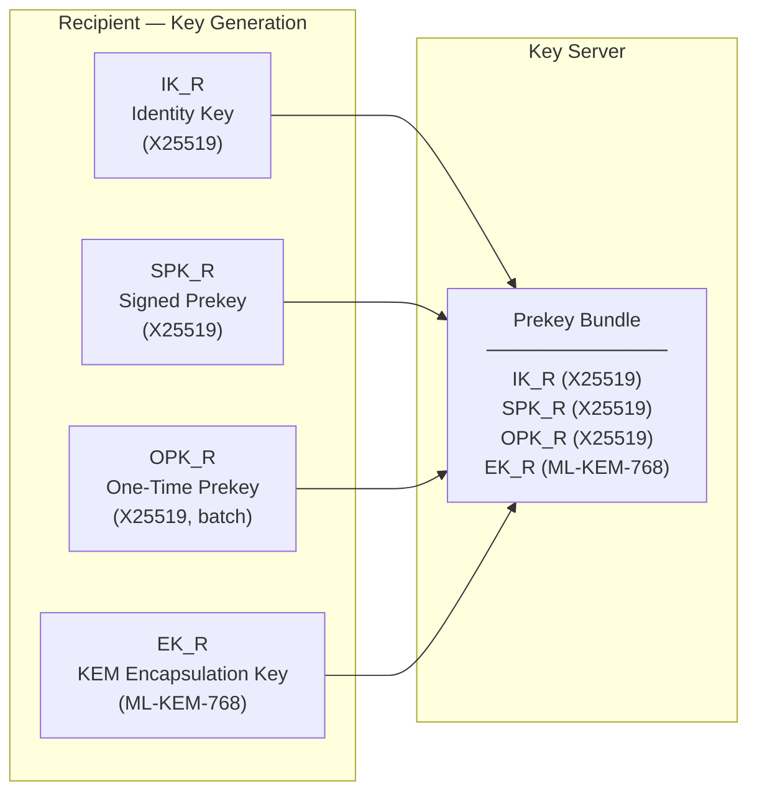
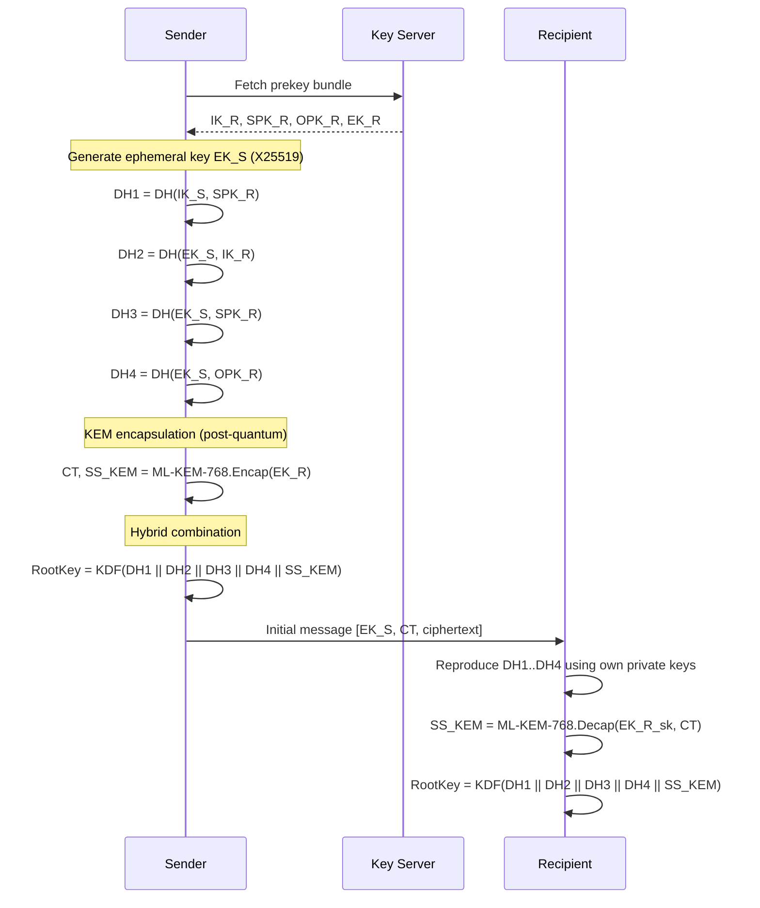
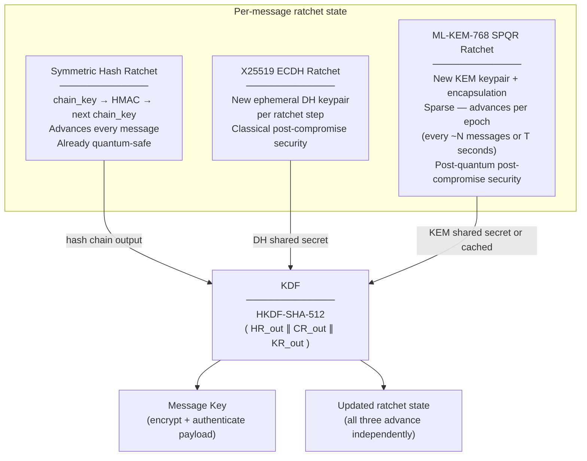
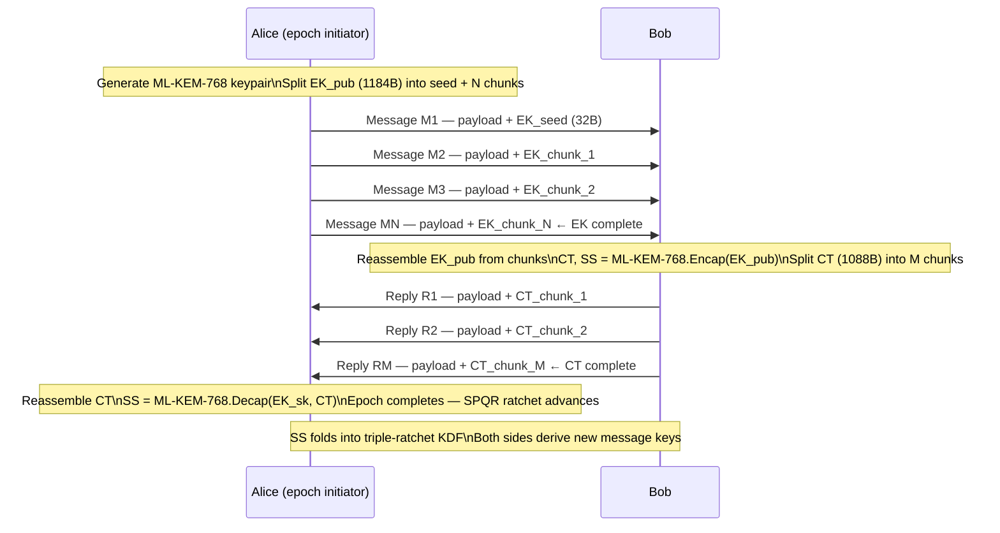

# Signal's Triple Ratchet — How X25519 and ML-KEM-768 Are Combined

A visual explainer of Signal's PQXDH + SPQR (Triple Ratchet) protocol, covering session initiation through ongoing message encryption. For the atProtocol implementer-grade reference, see [`pqxdh-spqr-deep-dive.md`](pqxdh-spqr-deep-dive.md).

Source: https://signal.org/blog/spqr/

---

## Overview

Signal's end-to-end encryption is built in two layers:

1. **Session initiation (PQXDH)** — establishes a shared root key before the first message.
2. **Ongoing messaging (Triple Ratchet)** — derives per-message keys, continuously rotating state.

Both layers use a **hybrid** strategy: X25519 for classical security, ML-KEM-768 for post-quantum security. An attacker must break **both** simultaneously to compromise the session.

---

## Layer 1 — PQXDH (Session Initiation)

PQXDH is Signal's replacement for X3DH. It adds one ML-KEM-768 encapsulation on top of the classical DH operations.

### What the recipient publishes

The ML-KEM-768 encapsulation key (`EK_R`, ~1184 bytes) is published alongside the classical X25519 prekeys.

### How the sender derives the root key

Compared to the classic X3DH formula:

| Protocol | Root key derivation |
|---|---|
| X3DH | `KDF(DH1 \|\| DH2 \|\| DH3)` |
| PQXDH | `KDF(DH1 \|\| DH2 \|\| DH3 \|\| DH4 \|\| SS_KEM)` |

The KEM ciphertext (~1088 bytes) rides in the initial message. Everything else is the same as X3DH.

---

## Layer 2 — Triple Ratchet (Ongoing Messages)

The Double Ratchet that Signal has always used has two sub-ratchets:

| Ratchet | What it provides | Quantum-safe? |
|---|---|---|
| Symmetric hash ratchet | Forward secrecy (FS) — past messages safe after key loss | Yes — just HMAC |
| X25519 ECDH ratchet | Post-compromise security (PCS) — future messages heal after device compromise | **No** — Shor breaks ECDH |

SPQR adds a third ratchet to make PCS quantum-safe:

### The three ratchets combined

A compromise of any one ratchet does not break the others. An attacker with a quantum computer can break the ECDH ratchet but still cannot derive message keys without also breaking ML-KEM-768.

### Why "sparse"

ML-KEM-768 keys are large (~1184-byte public key, ~1088-byte ciphertext). Running a new KEM encapsulation on every message would be prohibitively expensive. Instead, the ML-KEM ratchet advances **once per epoch** (every N messages or T seconds, whichever comes first). Between epochs, the hash and ECDH ratchets continue normally.

### The ML-KEM Braid — chunked key delivery

Because ML-KEM artifacts are too large to fit in a single message, Signal spreads them across several messages using erasure-coded chunks:

Erasure coding means the full key material can be reconstructed from any sufficient subset of chunks — dropped messages don't stall an epoch indefinitely.

---

## Summary — How X25519 and ML-KEM-768 Are Used at Each Layer

| Layer | X25519 role | ML-KEM-768 role | Combined via |
|---|---|---|---|
| Session initiation (PQXDH) | 4× DH operations across prekeys | 1× encapsulation | `KDF(DH1 \|\| DH2 \|\| DH3 \|\| DH4 \|\| SS_KEM)` |
| Ongoing messages (Triple Ratchet) | ECDH ratchet — classical PCS | SPQR ratchet — post-quantum PCS | `KDF(HR_out \|\| ECDH_out \|\| KEM_out)` |
| Individual message keys | Protected by layers above | Protected by layers above | Symmetric hash ratchet (already quantum-safe) |

The guiding principle: **hybrid security**. Neither algorithm is trusted alone. Breaking one gives an attacker nothing.

---

## References

- Signal SPQR announcement: https://signal.org/blog/spqr/
- Signal PQXDH spec: https://signal.org/docs/specifications/pqxdh/
- Signal Double Ratchet spec: https://signal.org/docs/specifications/doubleratchet/
- FIPS 203 (ML-KEM): https://csrc.nist.gov/pubs/fips/fips203/final
- atProtocol implementer reference: [`pqxdh-spqr-deep-dive.md`](pqxdh-spqr-deep-dive.md)
