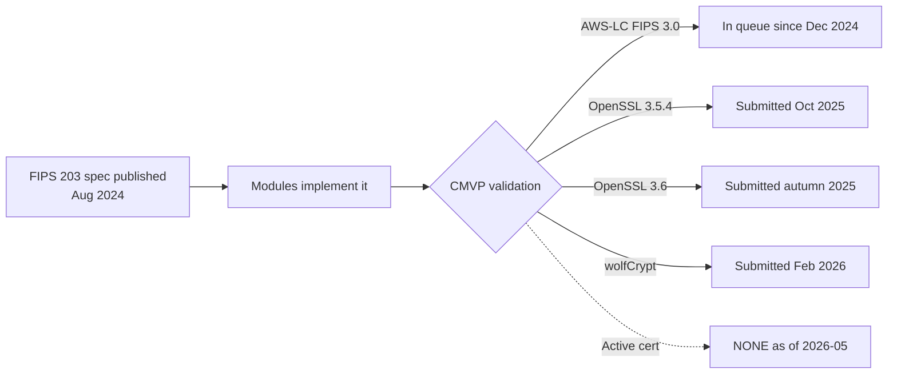
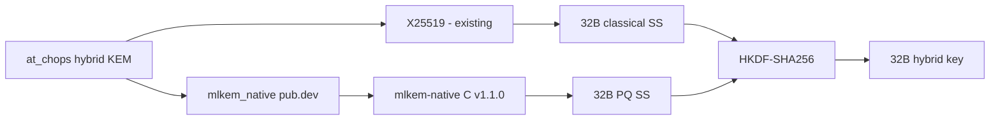

# Post-Quantum Library Selection for at_chops

*State of the world: 2026-05. Re-verify before committing — this domain moves quarterly.*

---

## What we are actually deciding

A self-imposed requirement: **at_chops should be post-quantum safe for key encapsulation**, ahead of any regulatory mandate. There is no FedRAMP, no government customer driving this. The threat model is **Harvest-Now-Decrypt-Later** on atSign traffic.

That framing rules out a lot of noise in the FIPS/NIST discussion. We are not buying a compliance credential; we are buying engineering quality.

---

## Standards landscape, briefly

| Term | What it actually means | Relevance to us |
|---|---|---|
| **FIPS 203** | NIST's published spec for ML-KEM (final, Aug 2024). The *algorithm*. | Yes — any library we pick must implement final FIPS 203, not round-3 Kyber drafts. |
| **ACVP** | NIST's automated test program. Vectors prove the algorithm produces correct outputs. | Yes — minimum bar for "implements the spec correctly." |
| **Wycheproof** | Google's adversarial test vectors. Edge cases, malformed inputs. | Yes — minimum bar for "handles bad input safely." |
| **FIPS 140-3** | Module-level validation standard. Boundaries, RNG, self-tests, zeroization, key management. *Not the algorithm.* | Not required for us. |
| **CMVP** | The lab program that issues FIPS 140-3 certificates. Validates *modules*, not algorithms. | Not required for us. |
| **SP 800-227** | NIST guidance on KEMs and hybrid construction. Final Sep 2025. | Yes — we follow its hybrid guidance. |

### What "FIPS validated ML-KEM" looks like in May 2026

CMVP backlog runs 18–24 months. The earliest an active FIPS 140-3 certificate covering ML-KEM appears is mid-to-late 2026. **You cannot purchase a FIPS-validated ML-KEM module today.** This kills the "we'll use OpenSSL's FIPS provider" path that was in the previous draft.

For our use case it does not matter — but it does mean we should stop framing the candidate set in FIPS-validation terms.

---

## Requirements for at_chops

Ranked by how much each actually reduces our risk:

| # | Requirement | Why it matters |
|---|---|---|
| 1 | **Hybrid X25519 + ML-KEM-768** | Single biggest risk in PQ deployment is a future cryptanalytic break in ML-KEM itself. Hybrid means a break in *either* primitive still leaves us secure. Non-negotiable. |
| 2 | **Constant-time implementation, verified** | Timing leaks on ML-KEM decapsulation can leak the FO-transform branch and recover the key. Realistic attack, more probable than algorithmic break. |
| 3 | **Final FIPS 203 spec conformance** | Round-3 Kyber and final ML-KEM differ. Round-3 KATs do not prove FIPS-203 conformance. |
| 4 | **ACVP + Wycheproof passing** | ACVP for correctness, Wycheproof for malformed-input handling. KATs alone are insufficient. |
| 5 | **Audited or formally verified** | Independent eyes on the code. Formal verification > human audit where available. |
| 6 | **Active maintenance post Aug 2024** | Final-spec landed late; abandoned libraries are stuck on drafts. |
| 7 | **Memory-safe language or verified C** | Mitigates implementation-bug class. Cannot be satisfied by pure-Dart given VM timing behavior. |

Two more constraints from the Dart/Flutter side:

- **Platform CSPRNG only** — `Random.secure()` in Dart, delegating to OS. Never custom RNG.
- **Cross-compiles to** iOS arm64, Android arm64-v8a + x86_64, macOS arm64 + x86_64, Linux x86_64 + arm64, Windows x86_64. This is the at_client_sdk target matrix.

---

## Candidate libraries

### C libraries we'd FFI from

| Library | Final FIPS 203 | Constant-time | Verification | Hybrid built-in | Active | Verdict |
|---|---|---|---|---|---|---|
| **mlkem-native** v1.1.0 (Mar 2026) | Yes | Yes — proved at object code | CBMC (C) + HOL-Light (asm). No third-party audit. | No (KEM only) | Quarterly releases | **Primary candidate.** Used by AWS-LC, liboqs, rustls. |
| **AWS-LC** | Yes | Yes | Internal audit + FIPS submission | Yes (TLS hybrid suites) | Yes | **Strong alternative.** Heavier dep. No Dart binding exists. |
| **OpenSSL ≥ 3.5** | Yes (default provider) | Yes | Audited | Yes (via providers) | Yes | Viable but giant dep for one KEM. |
| **liboqs** | Yes | Partial — varies per alg | Project README says *not for production*; broad-but-shallow | Yes | Yes | Practical for breadth; weaker correctness story per algorithm. |
| **BoringSSL** | Yes | Yes | Google-internal | No external API | Yes | Disqualified — Google says don't depend on it. |
| **PQClean** | Yes | Yes | Code review, no formal proof | No | Yes | Viable backup. |

### Existing Dart bindings on pub.dev

| Package | Publisher | Updated | Wraps | Verdict |
|---|---|---|---|---|
| **`mlkem_native`** | rkz.app (verified) | 2 months ago | mlkem-native | **Primary.** Direct FFI to the formally-verified C lib. No third-party audit of the binding itself. |
| **`liboqs`** v1.2.1 | djx-y-z (unverified) | 4 days ago | liboqs C, prebuilt natives | Active, broader algorithm set. Unverified publisher. |
| **`oqs`** v3.1.0 | bardiakz (unverified) | 3 months ago | liboqs 0.15.x | Older fork of the above. |
| `pqcrypto` (Dart) | unverified | 5 months ago | Pure Dart | **Disqualified.** Pure-Dart ML-KEM cannot be constant-time on the Dart VM. |
| `lattice_crypto`, `xkyber_crypto`, `custom_post_quantum`, `kyber`, `flutter_ever_crypto` | various | various | Pure Dart, mostly round-3 Kyber | **All disqualified** — pure Dart, stale, or pre-FIPS spec. |
| `libsignal` | Signal | recent | Signal Rust FFI | Production-grade, but Signal-protocol-bound, not a generic KEM. |

#### On the pure-Dart `pqcrypto` package specifically

The previous draft of this doc treated it as a serious candidate. It is not.

- Pure Dart, single author, no publisher verification, no audit, 5 months old.
- Claims 3000/3000 KAT vectors. KATs catch algorithm errors on fixed inputs; they say nothing about side channels.
- **Dart VM provides no constant-time guarantees.** Branch prediction, GC pauses, inline caches, JIT/AOT differences — any of these can leak. An implementation can be mathematically correct and still leak the key.
- For a SDK that ships on user devices and handles atSign root keys, this is not acceptable at any quality bar.

Pure-Dart crypto is fine for non-secret operations (encoding, hashing for non-MAC purposes). It is not fine for key material.

---

## Recommendation

**Primary path: `mlkem_native` Dart binding → mlkem-native C library, with hybrid composed in at_chops.**

Rationale:

- **Smallest C surface area.** Tens of KB binary, ~5k LOC of C plus assembly backends. Tractable to vendor and audit.
- **Strongest correctness story available.** CBMC proves memory safety of all C; HOL-Light proves *constant-time at object code* for AArch64 and x86_64. No other ML-KEM implementation has this combination today.
- **Used downstream by AWS-LC, liboqs, rustls.** If something is broken, it gets caught by consumers larger than us.
- **Final FIPS 203, ACVP + Wycheproof in CI.**
- **Dart binding from verified publisher** already exists — we don't write FFI from scratch.

Tradeoffs and risks we accept:

- **No third-party audit** of mlkem-native. Mitigated by formal proofs covering the highest-value properties, plus AWS-LC's internal review on the same upstream.
- **Build system is drop-in C, not CMake.** Upstream README is explicit: their build is for development. We build the cross-compile matrix (iOS/Android/macOS/Linux/Windows) ourselves. Estimate one engineer-week.
- **`mlkem_native` Dart binding has no third-party audit of its own.** Glue layer is small but needs review. Plan to vendor + pin.
- **No hybrid built in.** We compose X25519 + ML-KEM-768 → HKDF-SHA256 ourselves, following SP 800-227. Construction must be written once, reviewed carefully, then frozen.

### Fallback: `liboqs` Dart binding

If the cross-compile work on mlkem-native turns out to be heavier than expected, or if we want a wider algorithm set (ML-DSA for signatures later), `liboqs` is the second choice. Caveats:

- Upstream liboqs README explicitly says **not for production use**. Take that seriously — it means project priorities are breadth and research, not hardening.
- Per-algorithm constant-time guarantees vary. Verify ML-KEM-768 specifically.
- The pub.dev binding maintainer is unverified.

### Disqualified

- Pure-Dart implementations (any): no timing guarantees.
- BoringSSL: no external API contract.
- Anything still on round-3 Kyber: interop-broken, conformance-broken.
- Go libraries (CIRCL, filippo.io/mlkem): no clean Dart FFI path.

---

## What to verify before committing

1. **Build mlkem-native** for each target platform locally. Confirm constant-time assembly assembles under Xcode clang, Android NDK clang, MSVC clang-cl.
2. **Measure binary size impact** on a representative Flutter app build.
3. **Read the `mlkem_native` pub.dev binding source** end-to-end. It's small. Pin a specific commit and vendor.
4. **Specify the hybrid construction in writing** before implementing. Reference SP 800-227 §3.x (concat-then-KDF) or commit to X-Wing draft-10 with the understanding it is not yet an RFC.
5. **Add ACVP + Wycheproof vectors to at_chops's own test suite**, not just upstream's. We want to catch a binding-level bug, not just an upstream regression.

---

## When the FIPS question comes back

It will. A customer with a FedRAMP requirement will ask. At that point, the path is:

- Check the CMVP active certificate list for any module with ML-KEM in scope. Expected to exist by late 2026.
- Most likely candidate: AWS-LC FIPS 3.0 once validated.
- Migration cost: replace the FFI target. Hybrid construction in at_chops is the same. Wire protocol unchanged.

Designing for that migration now is cheap: keep the KEM provider behind an interface, don't leak mlkem-native types into at_chops's public API.
