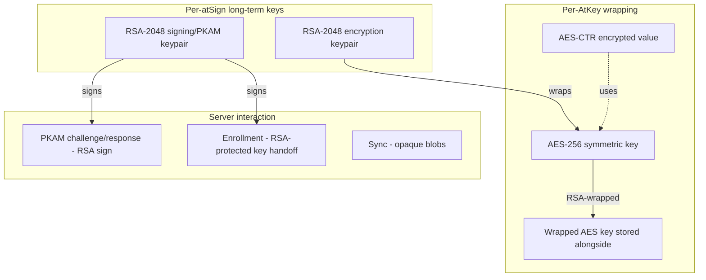
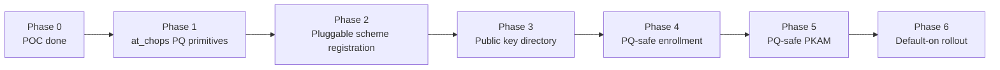

# Quantum-Safe atSign Platform — High-Level Plan

*Premise: the [pluggable encryption PR #1930](https://github.com/atsign-foundation/at_client_sdk/pull/1930) is the unlock. With per-AtKey scheme tags and a scheme registry, PQ stops being a fork of the data path and becomes a new scheme registration.*

---

## Where the cryptography lives today

Five surfaces touch asymmetric crypto. Each needs a PQ story:

| # | Surface | Today | PQ-safe analogue |
|---|---|---|---|
| 1 | Per-key data encryption (AtKey wrapping) | RSA-2048 wraps AES-256, then AES-CTR | Hybrid X25519+ML-KEM-768 → HKDF → AES-256-GCM |
| 2 | PKAM authentication | RSA signature challenge | Hybrid Ed25519 + ML-DSA-65 signature |
| 3 | Enrollment / device onboarding | RSA-protected APKAM key delivery | Same hybrid signature + hybrid KEM for key transport |
| 4 | Public-key directory (atKeys storing peer pubkeys) | RSA public keys published | Publish both classical + PQ public keys |
| 5 | Sync / commit log | Opaque ciphertext, no crypto | No change — schemes are per-key |

The PR #1930 work already restructures #1 to be pluggable. **#2 and #3 are the harder lift** — they involve the secondary server, not just the client SDK.

---

## Scheme naming

Register two new schemes, both fully hybrid:

| Scheme ID | Purpose | Construction |
|---|---|---|
| `pq-hybrid-kem-v1` | Per-AtKey data encryption | X25519 + ML-KEM-768 → HKDF-SHA256 → AES-256-GCM |
| `pq-hybrid-sig-v1` | PKAM + enrollment signatures | Ed25519 + ML-DSA-65 → concat signatures, verify-both |

Hybrid is non-negotiable. A future ML-KEM or ML-DSA break must not break the platform. Same reasoning as TLS, Signal PQXDH, iMessage PQ3.

---

## Phased migration

### Phase 1 — at_chops PQ primitives (SDK only, no protocol change)

- Fork `mlkem_native` Dart binding; pin mlkem-native upstream to a known commit; add ACVP + Wycheproof vectors to the fork's test suite.
- Add ML-DSA-65 binding alongside (similar story — likely via mldsa-native or a verified C library).
- Build `HybridKemAlgorithm` and `HybridSigAlgorithm` in `at_chops/algorithm/`, mirroring existing `rsa_encryption_algo.dart` and the signing algos.
- Wire constant-time-aware secret wrappers — Dart-side zeroization is best-effort; document the limitation.
- **Exit criteria:** at_chops exposes hybrid KEM and hybrid signature with the same surface shape as RSA today; existing tests still pass; new unit + KAT tests pass.

### Phase 2 — Register `pq-hybrid-kem-v1` scheme

- Implement `pq_hybrid_kem_crypto_scheme.dart` in `at_client/lib/src/crypto/` next to `rsa_crypto_scheme.dart`. Same interface, different primitives.
- Register in `scheme_registry.dart`.
- AtKey gains nothing new — the scheme tag from PR #1930 already carries the algorithm choice.
- **Exit criteria:** writing an AtKey with `requestOptions.scheme = 'pq-hybrid-kem-v1'` produces a ciphertext only decryptable by the recipient's PQ keys; legacy keys keep working in parallel.

### Phase 3 — Public-key directory extension

Today an atSign publishes its RSA encryption pubkey under a well-known atKey on its secondary (`publickey@alice`). For PQ we need to publish the *PQ* and *classical* keys both.

- New well-known keys:
  - `pq.publickey.encryption@alice` → `{ "x25519": "...", "mlkem-768": "..." }`
  - `pq.publickey.signing@alice` → `{ "ed25519": "...", "mldsa-65": "..." }`
- Discovery: when Alice's client encrypts for Bob, it looks up both `publickey@bob` (legacy RSA) and `pq.publickey.encryption@bob`. If both present and Alice supports PQ, use `pq-hybrid-kem-v1`. Else fall back to legacy.
- **Exit criteria:** older clients still resolve `publickey@bob` and write legacy ciphertexts; new clients prefer PQ when available; mixed-version pairs interop correctly.

### Phase 4 — PQ-safe enrollment

Enrollment is where new devices receive the atSign's keys. Today this is RSA-protected. Until enrollment is PQ-safe, the *bootstrap moment* is a PQ-unsafe point even if all later traffic is hybrid.

- The enrolling device generates its own hybrid keypair (KEM + sig).
- The approver device signs the enrollment approval with hybrid signatures.
- The encryption keys handed off to the new device are wrapped with the new device's hybrid KEM public key.
- **Server change required.** Secondary server must accept and store hybrid-signed enrollment requests. This is the first place server-side work appears.
- **Exit criteria:** a new device can enroll without any RSA-protected handoff; legacy enrollment path remains for backward compat.

### Phase 5 — PQ-safe PKAM

PKAM is the auth mechanism every atSign uses on every server connection. Server signs a challenge, client signs the response. Today: RSA.

- Add hybrid signature verb support to the secondary server (`from:` / `pkam:` extensions).
- Client signs the PKAM challenge with hybrid signature when the server advertises PQ support.
- **Server change required.** Major surface; needs careful versioning. Both auth paths run in parallel for years.
- **Exit criteria:** clients can authenticate with hybrid signatures; legacy RSA PKAM still works; servers advertise capability via a `from:` response field.

### Phase 6 — Default-on rollout

- New atSign creation defaults to PQ keys.
- Existing atSigns get a key-rotation flow that adds PQ keys without invalidating RSA keys.
- Telemetry: track % of traffic encrypted under PQ schemes per atSign.
- Deprecation horizon for RSA-only: announce, do not enforce. Likely 3–5 year window.

---

## Decisions that need to be made now

| Decision | Options | Recommendation |
|---|---|---|
| ML-KEM parameter set | 512 / 768 / 1024 | **768** — NIST category 3, matches AES-192 equivalent, what TLS/iMessage chose |
| ML-DSA parameter set | 44 / 65 / 87 | **65** — matches ML-KEM-768 in security level |
| Hybrid construction | X-Wing draft vs. SP 800-227 concat-KDF | **SP 800-227 concat-KDF** — final-published guidance vs. expiring Internet-Draft |
| Library | mlkem-native (forked binding) vs. liboqs binding | **mlkem-native forked** — strongest verification, but you own the shim. See `fips-nist-compliance.md` |
| AES mode | Keep AES-CTR or move to AES-GCM | **Move to AES-GCM** — POC already uses it; CTR has no built-in integrity, GCM does |
| Wire format versioning | New scheme tag per construction change | Already solved by PR #1930's scheme field |
| Server changes | Required from Phase 4 onward | Coordinate with secondary server team early; this is the long pole |

---

## Risks and blockers

| Risk | Severity | Mitigation |
|---|---|---|
| mlkem-native Dart binding is single-maintainer, unaudited | High | Fork, vendor, audit the glue ourselves (1–2 engineer-weeks) |
| Server-side hybrid signature support not on the secondary roadmap | High | Engage secondary server team in Phase 1; Phase 5 blocks on their work |
| Mobile binary size impact from native libs | Medium | Measure in Phase 1; ML-KEM is small (~tens of KB), ML-DSA larger |
| Dart VM cannot guarantee zeroization of secret-bearing buffers | Medium | Accept and document; revisit when Dart adds opaque secret types |
| CMVP-validated PQ module not yet available (mid-late 2026) | Low for us | Self-imposed bar doesn't require it; design for swap when a customer demands FIPS |
| ML-KEM / ML-DSA themselves break | Medium-long-term | Hybrid construction mitigates; another scheme version is one registry entry |

---

## Sequencing call

Phases 1–3 are SDK-only and can ship in the 2026 atProtocol releases without server changes. **Start there.** It buys real PQ protection for the data layer — the highest-value target for Harvest-Now-Decrypt-Later — while server-side work on Phases 4–5 catches up.

Phases 4–5 require secondary server changes and a versioned protocol negotiation. These are not a 2026 deliverable unless the secondary team is engaged now.

---

## What's already done

- Hybrid KEM POC (`scripts/pq_poc/`) — proves the construction end-to-end.
- Library evaluation (`plans/pq/fips-nist-compliance.md`) — mlkem-native + Dart binding fork is the path.
- Pluggable scheme infrastructure (PR #1930) — the data-plane integration point.

The next concrete step is **Phase 1: fork the Dart binding and add ML-DSA**, behind which everything else falls into place.
