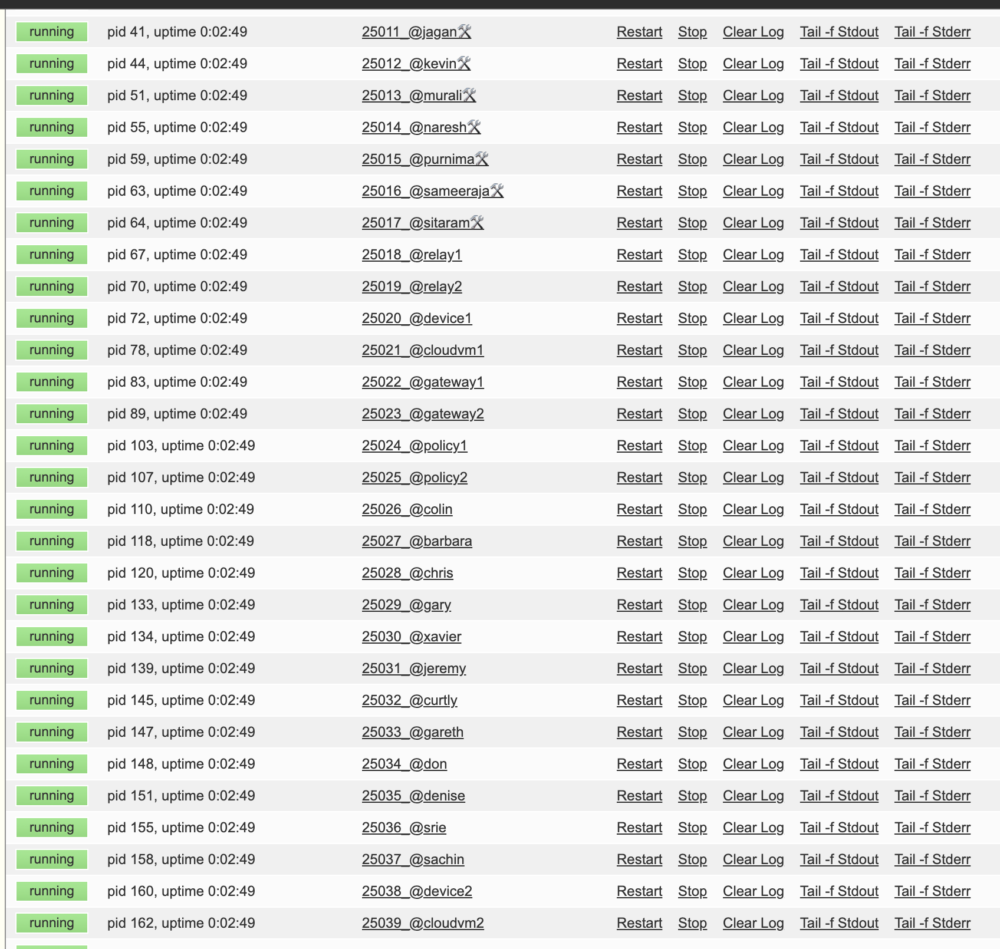

# testing_strategy

## Overview

The testing strategy is to run the Docker Compose file which will run two containers:

1. Virtual Environment
2. Proxy Server

The proxy server gives access to the virtual environment from the outside via `vip.ve.atsign.zone:443`

The virtual environment consists of a couple of things:

- atDirectory server on localhost:64
- atServers running on localhost:25000-25039 (see image below)

Image below is from `localhost:9001` after running virtualenv.

The goal of theses tests are to test at_activate through a proxy server.

### atDirectory

The atDirectory is a server, that when you connect via secure socket, can give it an atSign like "relay1" and it will respond with the address of the atServer that that atSign is hosted on. But since everything is running through the proxy, it will always respond with `vip.ve.atsign.zone:443` which is how the proxy server is accessed. The reason it always returns this is because the proxy is handling all requests and routing them to the appropriate atServer. You can talk to a specific atServer by sending `from:<atSign>` (example `from:@relay1`) and all traffic will be routed through the proxy to that atServer after that message.

### atServer

atServers are just key-value databases. atServers can also talk to other atServers using `notify/monitor` commands which follow the pub-sub pattern.

### Proxy Server

I hope the above descriptions help you understand that in order to talk to the atDirectory, you just send the atSign as normal, but if you want to tlak to a specific atSign in the virtual environment, you gotta do `from:<atSign>` command which will order it to send subsequent traffic to that exact atServer.

### at_demo_data

A **CRAM Key** is just a string of alphanumeric characters that is used to do the initial onboarding of an atSign. Once a CRAM key is used to onboard an atSign, the cram key can no longer be used and subsequent authentication can only be done through PKAM.

To access CRAM keys for atSigns, they are hard coded in the virtual environment.
